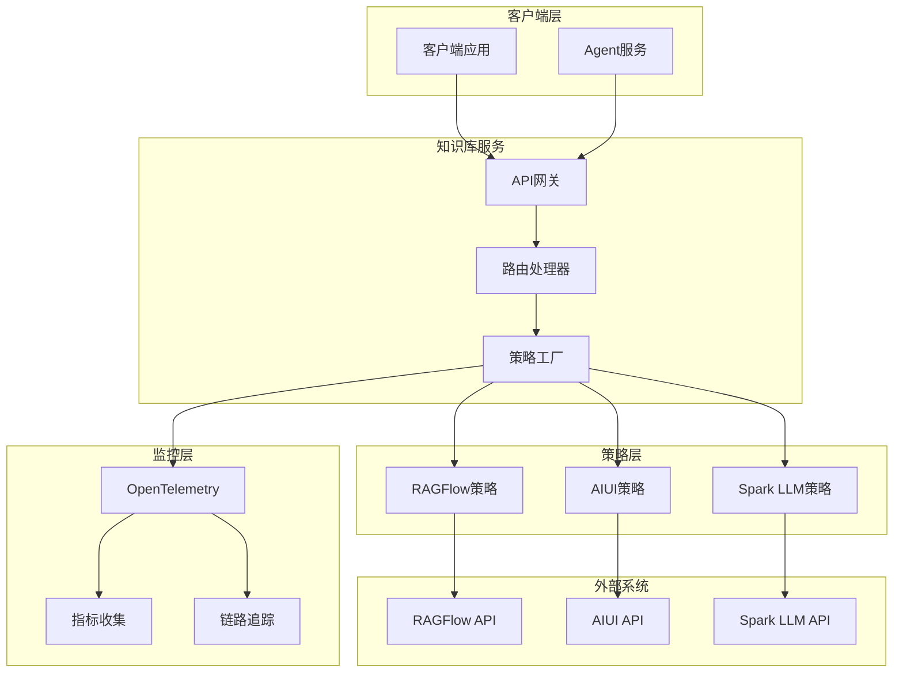
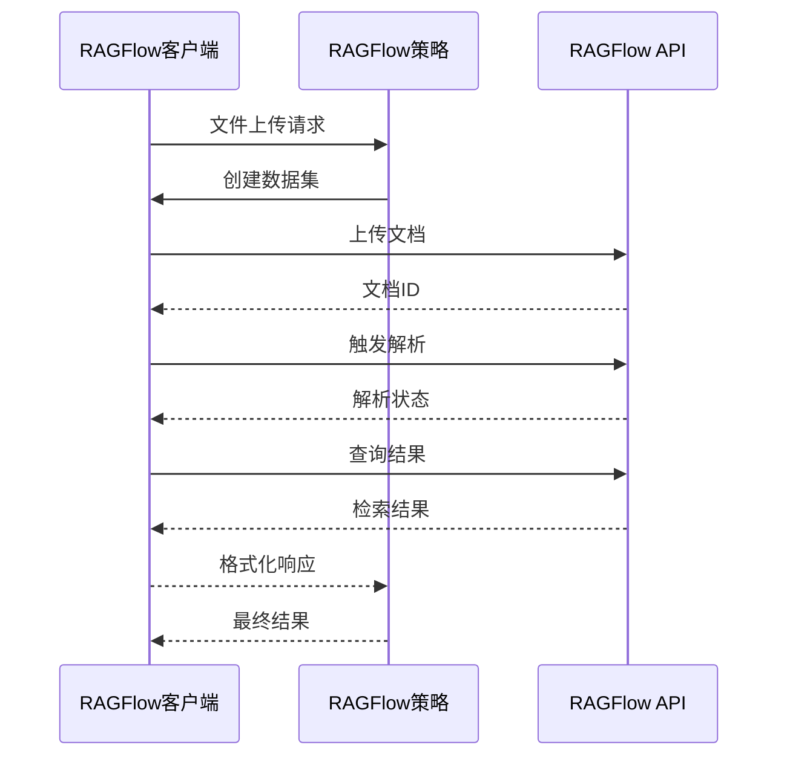
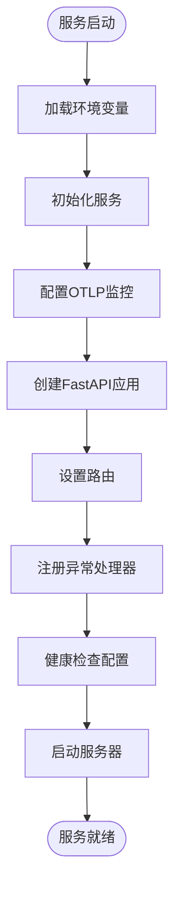
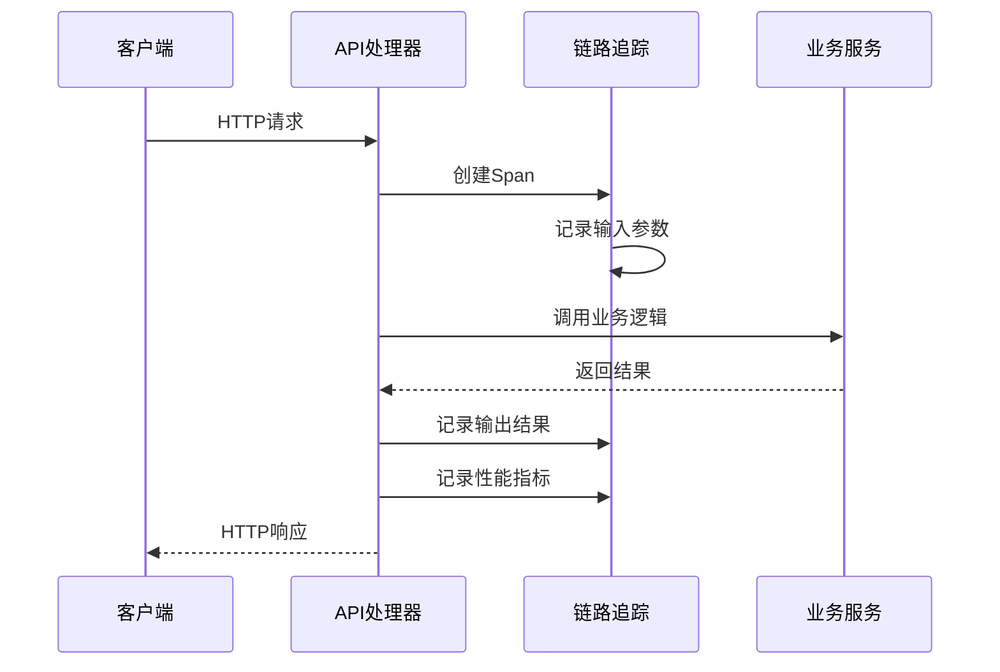
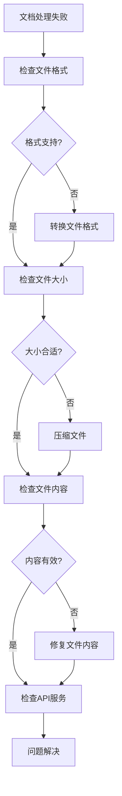

# 知识库服务部署指南

<cite>
**本文档引用的文件**
- [core/knowledge/Dockerfile](file://core/knowledge/Dockerfile)
- [core/knowledge/main.py](file://core/knowledge/main.py)
- [core/knowledge/pyproject.toml](file://core/knowledge/pyproject.toml)
- [core/knowledge/api/v1/api.py](file://core/knowledge/api/v1/api.py)
- [core/knowledge/service/impl/ragflow_strategy.py](file://core/knowledge/service/impl/ragflow_strategy.py)
- [core/knowledge/service/impl/aiui_strategy.py](file://core/knowledge/service/impl/aiui_strategy.py)
- [core/knowledge/service/impl/cbg_strategy.py](file://core/knowledge/service/impl/cbg_strategy.py)
- [core/knowledge/infra/ragflow/ragflow_client.py](file://core/knowledge/infra/ragflow/ragflow_client.py)
- [core/knowledge/infra/aiui/aiui.py](file://core/knowledge/infra/aiui/aiui.py)
- [core/knowledge/infra/xinghuo/xinghuo.py](file://core/knowledge/infra/xinghuo/xinghuo.py)
- [core/common/otlp/metrics/meter.py](file://core/common/otlp/metrics/meter.py)
- [core/common/otlp/trace/span.py](file://core/common/otlp/trace/span.py)
</cite>

## 目录
1. [概述](#概述)
2. [系统架构](#系统架构)
3. [Docker部署配置](#docker部署配置)
4. [外部知识库系统集成](#外部知识库系统集成)
5. [服务初始化与健康检查](#服务初始化与健康检查)
6. [API接口与路由](#api接口与路由)
7. [性能监控与指标](#性能监控与指标)
8. [故障排查指南](#故障排查指南)
9. [最佳实践](#最佳实践)

## 概述

知识库服务是astron-agent项目的核心组件之一，负责提供RAG（检索增强生成）功能。该服务支持多种外部知识库系统的集成，包括RAGFlow、AIUI和Spark LLM（CBG），并通过统一的API接口对外提供文档处理、知识检索和语义查询能力。

### 主要特性

- **多策略支持**：支持RAGFlow、AIUI、Spark LLM三种不同的知识库策略
- **异步处理**：基于aiohttp的异步HTTP客户端，支持高并发请求
- **分布式追踪**：集成OpenTelemetry进行分布式链路追踪
- **性能监控**：内置指标收集和Prometheus兼容的监控端点
- **容错机制**：完善的异常处理和重试逻辑

## 系统架构



**图表来源**
- [core/knowledge/api/v1/api.py](file://core/knowledge/api/v1/api.py#L1-L50)
- [core/knowledge/service/impl/ragflow_strategy.py](file://core/knowledge/service/impl/ragflow_strategy.py#L1-L50)

## Docker部署配置

### 基础Dockerfile配置

知识库服务使用Python 3.11 Slim作为基础镜像，通过uv包管理器进行依赖管理：

```dockerfile
FROM python:3.11-slim

WORKDIR /opt/core

ENV PATH=$PATH:/opt/core
ENV PYTHONPATH /opt/core
ENV UV_NO_CACHE=1

RUN pip install uv --no-cache-dir -i https://pypi.tuna.tsinghua.edu.cn/simple/

COPY core/knowledge/pyproject.toml ./
COPY core/knowledge/uv.lock ./

RUN uv sync -i https://pypi.tuna.tsinghua.edu.cn/simple/

COPY core/common ./common
COPY core/knowledge ./knowledge

CMD ["uv", "run", "knowledge/main.py"]
```

### 环境变量配置

| 变量名 | 默认值 | 描述 |
|--------|--------|------|
| `SERVICE_PORT` | 20010 | 服务监听端口 |
| `WORKERS` | 1 | 工作进程数量 |
| `RAGFLOW_BASE_URL` | - | RAGFlow服务基础URL |
| `RAGFLOW_API_TOKEN` | - | RAGFlow API访问令牌 |
| `RAGFLOW_DEFAULT_GROUP` | Stellar Knowledge Base | 默认数据集名称 |
| `RAGFLOW_TIMEOUT` | 30 | RAGFlow请求超时时间（秒） |
| `AIUI_API_KEY` | - | AIUI API密钥 |
| `AIUI_API_SECRET` | - | AIUI API密钥 |
| `AIUI_URL_V2` | - | AIUI服务地址 |
| `XINGHUO_APP_ID` | - | 星火认知大模型APP ID |
| `XINGHUO_APP_SECRET` | - | 星火认知大模型密钥 |
| `XINGHUO_RAG_URL` | - | 星火RAG服务地址 |

### 部署命令

```bash
# 构建镜像
docker build -t astron-knowledge:latest -f core/knowledge/Dockerfile .

# 运行容器
docker run -d \
  --name astron-knowledge \
  -p 20010:20010 \
  -e SERVICE_PORT=20010 \
  -e WORKERS=4 \
  -e RAGFLOW_BASE_URL=https://ragflow.example.com \
  -e RAGFLOW_API_TOKEN=your_api_token \
  -e AIUI_API_KEY=your_aiui_key \
  -e AIUI_API_SECRET=your_aiui_secret \
  -e XINGHUO_APP_ID=your_app_id \
  -e XINGHUO_APP_SECRET=your_app_secret \
  astron-knowledge:latest
```

**章节来源**
- [core/knowledge/Dockerfile](file://core/knowledge/Dockerfile#L1-L19)
- [core/knowledge/main.py](file://core/knowledge/main.py#L95-L113)

## 外部知识库系统集成

### RAGFlow集成配置

RAGFlow是主要的知识库管理系统，提供了完整的文档处理和向量检索功能。

#### 连接配置

```python
# RAGFlow客户端配置
base_url = os.getenv("RAGFLOW_BASE_URL", "")
api_key = os.getenv("RAGFLOW_API_TOKEN", "")
timeout = int(os.getenv("RAGFLOW_TIMEOUT", "30"))
default_group = os.getenv("RAGFLOW_DEFAULT_GROUP", "Stellar Knowledge Base")
```

#### 核心功能实现

RAGFlow策略实现了完整的RAG操作流程：

1. **文档解析**：支持多种文件格式的自动解析
2. **向量化处理**：自动生成文本向量表示
3. **相似度检索**：基于向量的语义搜索
4. **增量更新**：支持文档的增量修改



**图表来源**
- [core/knowledge/service/impl/ragflow_strategy.py](file://core/knowledge/service/impl/ragflow_strategy.py#L150-L250)
- [core/knowledge/infra/ragflow/ragflow_client.py](file://core/knowledge/infra/ragflow/ragflow_client.py#L400-L500)

### AIUI集成配置

AIUI提供了专业的文档理解和语义检索能力。

#### 认证机制

AIUI采用基于HMAC-SHA256的签名认证：

```python
async def assemble_auth_url(request_path: str, method: str = "POST") -> str:
    api_key = os.getenv("AIUI_API_KEY", "")
    api_secret = os.getenv("AIUI_API_SECRET", "")
    request_url = os.getenv("AIUI_URL_V2", "") + request_path
    
    # 生成签名
    signature_origin = f"host: {host}\ndate: {date}\n{method} {path} HTTP/1.1"
    signature_bytes = hmac.new(
        api_secret.encode("utf-8"),
        signature_origin.encode("utf-8"),
        digestmod=hashlib.sha256,
    ).digest()
```

#### 支持的操作类型

| 操作类型 | 功能描述 | 参数要求 |
|----------|----------|----------|
| `chunk_query` | 语义查询 | query, doc_ids, top_k, threshold |
| `document_parse` | 文档解析 | file_url, resource_type |
| `chunk_split` | 文本切分 | document, length_range, overlap |
| `chunk_save` | 块保存 | doc_id, group, chunks |
| `chunk_delete` | 块删除 | doc_id, chunk_ids |

### Spark LLM（CBG）集成

星火认知大模型提供了强大的语言理解和知识检索能力。

#### 认证流程

```python
async def assemble_spark_auth_headers_async() -> Dict[str, str]:
    timestamp = int(time.time())
    signature = get_signature(
        os.getenv("XINGHUO_APP_ID", ""), 
        timestamp, 
        os.getenv("XINGHUO_APP_SECRET", "")
    )
    
    return {
        "Accept": "application/json",
        "appId": os.getenv("XINGHUO_APP_ID", ""),
        "timestamp": str(timestamp),
        "signature": signature,
    }
```

#### 核心功能

- **混合检索**：结合关键词和语义的双重检索
- **实时处理**：支持在线文档的实时解析
- **智能切分**：基于内容结构的智能文本分割

**章节来源**
- [core/knowledge/service/impl/ragflow_strategy.py](file://core/knowledge/service/impl/ragflow_strategy.py#L1-L100)
- [core/knowledge/service/impl/aiui_strategy.py](file://core/knowledge/service/impl/aiui_strategy.py#L1-L50)
- [core/knowledge/service/impl/cbg_strategy.py](file://core/knowledge/service/impl/cbg_strategy.py#L1-L50)

## 服务初始化与健康检查

### 初始化流程

服务启动时执行以下初始化步骤：



**图表来源**
- [core/knowledge/main.py](file://core/knowledge/main.py#L25-L50)

### 异常处理机制

服务实现了全局异常处理机制，确保所有请求都能得到适当的响应：

```python
@app.exception_handler(RequestValidationError)
async def global_validation_exception_handler(
    _request: Request, exc: RequestValidationError
) -> JSONResponse:
    error_details = [
        f"field: {'.'.join(map(str, err['loc']))}, message: {err['msg']}"
        for err in exc.errors()
    ]
    error_response = ErrorResponse(
        code_enum=CodeEnum.ParameterInvalid,
        message=f"Request parameter error: {error_details}",
    )
    return JSONResponse(content=error_response.model_dump())
```

### 关闭钩子

服务在优雅关闭时会执行清理操作：

```python
@app.on_event("shutdown")
async def shutdown() -> None:
    try:
        from knowledge.infra.ragflow import cleanup_session
        await cleanup_session()
    except Exception as e:
        logger.warning(f"Failed to cleanup RAGFlow session: {e}")
    print("🧹 Final shutdown hook executed.")
```

**章节来源**
- [core/knowledge/main.py](file://core/knowledge/main.py#L35-L85)

## API接口与路由

### 核心API端点

知识库服务提供了完整的RESTful API接口：

| 端点 | 方法 | 功能描述 | 请求参数 |
|------|------|----------|----------|
| `/knowledge/v1/document/split` | POST | 文件切分处理 | fileUrl, lengthRange, overlap |
| `/knowledge/v1/document/upload` | POST | 文件上传处理 | file, ragType, lengthRange |
| `/knowledge/v1/chunks/save` | POST | 块保存 | docId, group, chunks |
| `/knowledge/v1/chunk/update` | POST | 块更新 | docId, group, chunks |
| `/knowledge/v1/chunk/delete` | POST | 块删除 | docId, chunkIds |
| `/knowledge/v1/chunk/query` | POST | 语义查询 | query, doc_ids, top_k |
| `/knowledge/v1/document/chunk` | POST | 获取文档块 | docId |
| `/knowledge/v1/document/name` | POST | 获取文档名称 | docId |

### 统一处理机制

所有API请求都通过统一的处理函数进行处理，确保一致的错误处理和监控：

```python
async def handle_rag_operation(
    *,
    span_context: Span,
    metric: Meter,
    operation_callable: Callable[..., Any],
    **operation_kwargs: Any,
) -> Union[SuccessDataResponse, ErrorResponse]:
    try:
        result_data = await operation_callable(**operation_kwargs, span=span_context)
        
        # 记录成功输出和指标
        span_context.add_info_events({
            "usr_output": json.dumps(result_data, ensure_ascii=False, default=str)
        })
        metric.in_success_count()
        
        return SuccessDataResponse(data=result_data, sid=span_context.sid)
        
    except Exception as e:
        # 统一异常处理
        error_msg = f"{operation_callable.__name__} err (Unexpected), reason {e}"
        logger.error(error_msg)
        span_context.record_exception(e)
        metric.in_error_count(code=CodeEnum.ServiceException.code)
        return ErrorResponse(
            code_enum=CodeEnum.ServiceException,
            message=f"Internal server error:{error_msg}",
        )
```

### 分布式追踪

每个API请求都会生成唯一的跟踪ID，并记录详细的执行信息：



**图表来源**
- [core/knowledge/api/v1/api.py](file://core/knowledge/api/v1/api.py#L60-L120)

**章节来源**
- [core/knowledge/api/v1/api.py](file://core/knowledge/api/v1/api.py#L1-L100)

## 性能监控与指标

### 监控指标体系

服务集成了OpenTelemetry进行全方位的性能监控：

#### 核心指标类型

| 指标类型 | 描述 | 示例 |
|----------|------|------|
| 计数器 | 请求成功率/失败率 | `success_count`, `error_count` |
| 直方图 | 响应时间分布 | `response_time_histogram` |
| 标签 | 环境和功能标识 | `dc`, `server_host`, `func` |

#### 指标收集实现

```python
class Meter:
    def in_success_count(self, lables: Optional[dict] = None, count: int = 1) -> None:
        """上报成功次数"""
        self.in_error_count(0, lables, count)
    
    def in_error_count(self, code: int, labels: Optional[dict] = None, 
                      count: int = 1, is_in_histogram: bool = True) -> None:
        """上报错误次数，同时记录耗时"""
        attr = self._get_default_labels()
        attr["ret"] = code
        
        if labels:
            attr.update(labels)
            
        metric.counter.add(count, attr)
        if is_in_histogram:
            self.in_histogram(labels)
```

### 分布式追踪

服务使用OpenTelemetry进行分布式链路追踪：

```python
class Span:
    def add_info_events(self, attributes: Optional[types.Attributes] = None) -> None:
        """添加INFO级别事件，记录详细执行信息"""
        value_bytes = json.dumps(attributes, ensure_ascii=False).encode("utf-8")
        
        if len(value_bytes) >= SPAN_SIZE_LIMIT:
            # 大于限制时尝试上传到对象存储
            try:
                if self.oss_service is not None:
                    trace_link = self.oss_service.upload_file(
                        f"{str(uuid.uuid4())}", value_bytes
                    )
                    attributes = {"trace_link": trace_link}
            except Exception:
                attributes = {"error": "日志内容过大，上传失败"}
        
        self.get_otlp_span().add_event(
            SpanLevel.INFO.value, attributes=attributes
        )
```

### 健康检查端点

服务提供了标准的健康检查接口，支持Prometheus监控：

```python
# 在docker/ragflow目录中有相关的健康检查配置
# 可以通过 /api/metrics 获取Prometheus格式的指标
```

### 性能优化建议

1. **连接池管理**：合理配置HTTP连接池大小
2. **超时控制**：根据网络状况调整请求超时时间
3. **重试机制**：对临时性错误实施指数退避重试
4. **资源监控**：定期检查内存和CPU使用情况

**章节来源**
- [core/common/otlp/metrics/meter.py](file://core/common/otlp/metrics/meter.py#L1-L50)
- [core/common/otlp/trace/span.py](file://core/common/otlp/trace/span.py#L1-L50)

## 故障排查指南

### 常见问题诊断

#### 1. 外部服务连接问题

**症状**：API请求返回超时或连接错误

**排查步骤**：
```bash
# 检查网络连通性
curl -I $RAGFLOW_BASE_URL/ping

# 检查认证信息
echo "API Token: $RAGFLOW_API_TOKEN"

# 检查服务状态
curl -H "Authorization: Bearer $RAGFLOW_API_TOKEN" \
     $RAGFLOW_BASE_URL/api/v1/datasets
```

**解决方案**：
- 验证API密钥的有效性
- 检查网络防火墙设置
- 确认服务端点的可用性

#### 2. 文档处理失败

**症状**：文件上传后无法正常解析

**排查流程**：


**图表来源**
- [core/knowledge/service/impl/ragflow_strategy.py](file://core/knowledge/service/impl/ragflow_strategy.py#L200-L300)

#### 3. 内存和性能问题

**监控指标**：
- CPU使用率 > 80%
- 内存使用率 > 85%
- 响应时间 > 5秒
- 错误率 > 5%

**优化措施**：
```bash
# 增加工作进程数量
export WORKERS=4

# 调整超时时间
export RAGFLOW_TIMEOUT=60

# 监控资源使用
docker stats astron-knowledge
```

### 日志分析

#### 日志级别配置

| 级别 | 用途 | 示例 |
|------|------|------|
| ERROR | 严重错误 | API调用失败 |
| WARNING | 警告信息 | 连接重试 |
| INFO | 一般信息 | 请求处理完成 |
| DEBUG | 调试信息 | 详细执行流程 |

#### 关键日志模式

```bash
# 查找错误日志
docker logs astron-knowledge 2>&1 | grep -i error

# 查找性能问题
docker logs astron-knowledge | grep -E "(timeout|slow|exceed)"

# 实时监控
docker logs -f astron-knowledge
```

### 故障恢复策略

#### 自动恢复机制

1. **连接重试**：对临时性网络错误实施重试
2. **降级处理**：外部服务不可用时使用本地缓存
3. **熔断保护**：连续失败时暂停外部调用

#### 手动恢复步骤

```bash
# 重启服务
docker restart astron-knowledge

# 清理会话缓存
docker exec astron-knowledge python -c "
from knowledge.infra.ragflow import cleanup_session
await cleanup_session()
"

# 重新加载配置
docker exec astron-knowledge python -c "
from knowledge.infra.ragflow import reload_config
reload_config()
"
```

**章节来源**
- [core/knowledge/service/impl/ragflow_strategy.py](file://core/knowledge/service/impl/ragflow_strategy.py#L400-L500)
- [core/knowledge/infra/ragflow/ragflow_client.py](file://core/knowledge/infra/ragflow/ragflow_client.py#L600-L700)

## 最佳实践

### 部署最佳实践

#### 1. 环境隔离

```yaml
# docker-compose.yml 示例
version: '3.8'
services:
  knowledge:
    image: astron-knowledge:latest
    environment:
      - RAGFLOW_BASE_URL=https://ragflow.prod.company.com
      - RAGFLOW_API_TOKEN_FILE=/run/secrets/ragflow_token
      - AIUI_API_KEY_FILE=/run/secrets/aiui_key
    secrets:
      - ragflow_token
      - aiui_key
    networks:
      - astron-net
    deploy:
      replicas: 3
      restart_policy:
        condition: on-failure
        delay: 5s
        max_attempts: 3
```

#### 2. 安全配置

```bash
# 密钥管理
mkdir -p /etc/astron-secrets
chmod 600 /etc/astron-secrets/*

# 网络安全
docker network create astron-net

# 资源限制
docker run --memory=2g --cpus=2 \
  --ulimit nofile=65536:65536 \
  astron-knowledge:latest
```

#### 3. 监控配置

```yaml
# Prometheus监控配置
scrape_configs:
  - job_name: 'astron-knowledge'
    static_configs:
      - targets: ['knowledge:20010']
    metrics_path: '/api/metrics'
    scrape_interval: 15s
```

### 性能优化建议

#### 1. 并发处理优化

```python
# 合理配置工作进程数
workers = min(4, multiprocessing.cpu_count())

# 连接池配置
connector = aiohttp.TCPConnector(
    limit=100,           # 总连接池大小
    limit_per_host=30,   # 每个主机的最大连接数
    keepalive_timeout=600,
    enable_cleanup_closed=True,
)
```

#### 2. 缓存策略

- **会话缓存**：复用HTTP连接会话
- **配置缓存**：缓存外部服务配置
- **结果缓存**：缓存频繁查询的结果

#### 3. 错误处理优化

```python
# 指数退避重试
async def exponential_backoff_retry(func, max_retries=3):
    for attempt in range(max_retries):
        try:
            return await func()
        except TemporaryError as e:
            if attempt == max_retries - 1:
                raise
            await asyncio.sleep(2 ** attempt)  # 1s, 2s, 4s
```

### 集成测试

#### 1. 单元测试

```python
# 测试RAGFlow策略
@pytest.mark.asyncio
async def test_ragflow_strategy_query():
    strategy = RagflowRAGStrategy()
    result = await strategy.query("测试查询", top_k=5)
    assert "results" in result
    assert len(result["results"]) <= 5
```

#### 2. 集成测试

```bash
# API端点测试
curl -X POST "http://localhost:20010/knowledge/v1/document/split" \
  -H "Content-Type: application/json" \
  -d '{"ragType":"RAGFlow","file":"test.pdf"}'

# 健康检查测试
curl -f "http://localhost:20010/api/metrics" || exit 1
```

### 运维自动化

#### 1. CI/CD流水线

```yaml
# GitHub Actions示例
name: Deploy Knowledge Service
on:
  push:
    branches: [main]
jobs:
  deploy:
    runs-on: ubuntu-latest
    steps:
      - uses: actions/checkout@v2
      - name: Build and push
        run: |
          docker build -t astron-knowledge:${GITHUB_SHA} .
          docker push astron-knowledge:${GITHUB_SHA}
      - name: Deploy
        run: |
          ssh user@server "docker pull astron-knowledge:${GITHUB_SHA}"
          ssh user@server "docker restart astron-knowledge"
```

#### 2. 健康检查脚本

```bash
#!/bin/bash
# health-check.sh

SERVICE_URL="http://localhost:20010"
TIMEOUT=30

# 检查服务是否响应
response=$(curl -s -w "%{http_code}" -o /dev/null "$SERVICE_URL/api/metrics" -m $TIMEOUT)
if [ $response -eq 200 ]; then
    echo "Service is healthy"
    exit 0
else
    echo "Service is unhealthy (HTTP $response)"
    exit 1
fi
```

通过遵循这些最佳实践，可以确保知识库服务的稳定运行、高性能表现和良好的可维护性。定期监控和优化将帮助您在生产环境中获得最佳的服务质量。