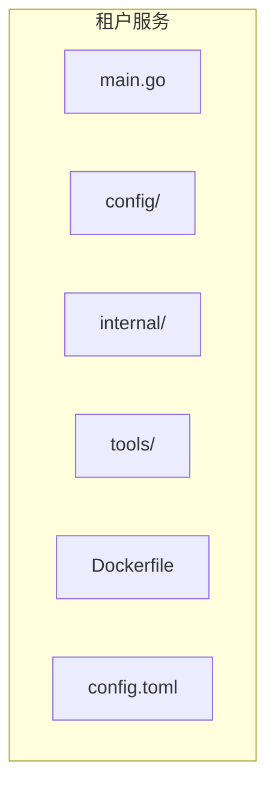
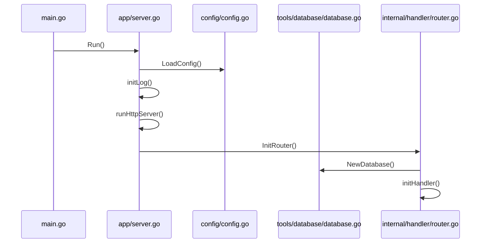
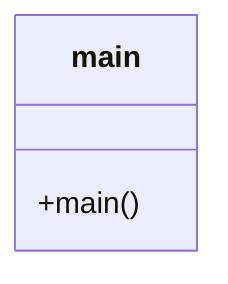
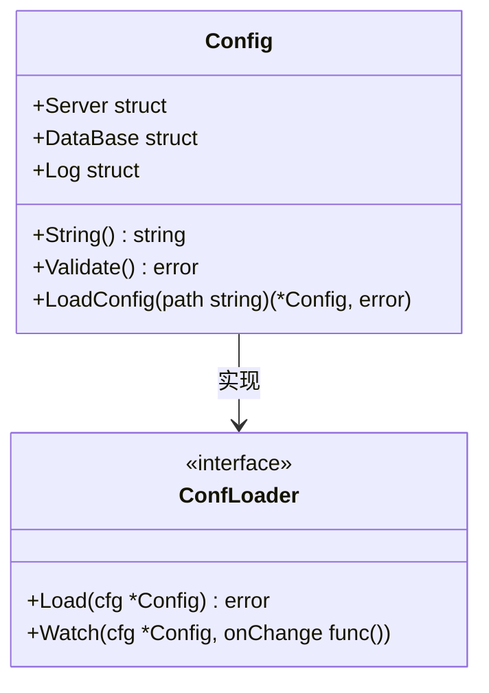
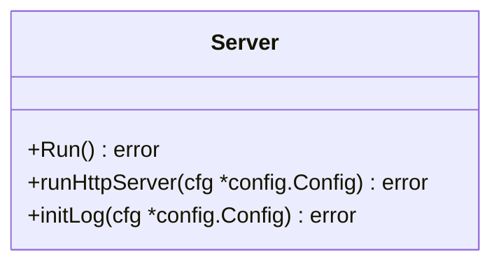
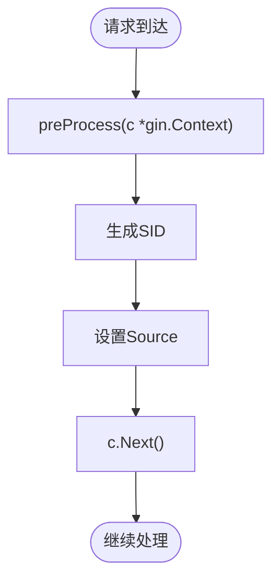
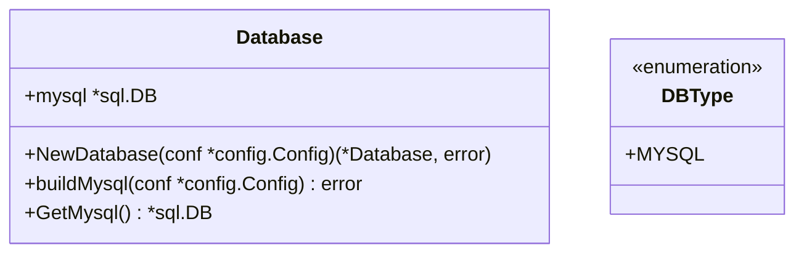
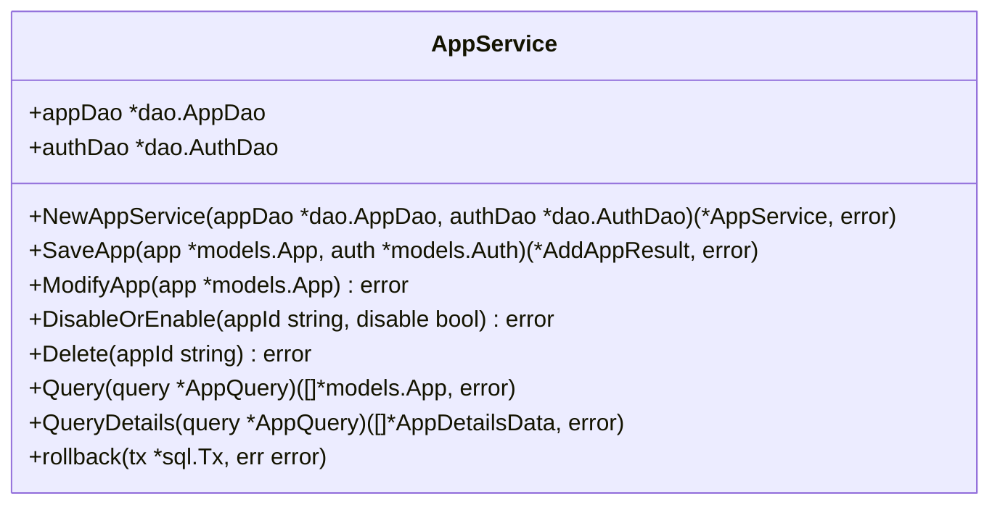
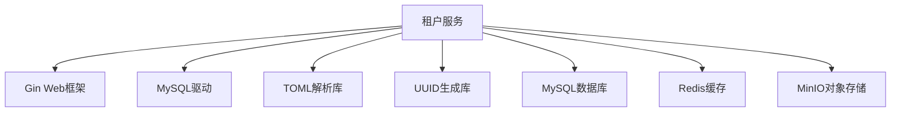

# 租户服务部署

<cite>
**本文档引用的文件**
- [main.go](file://core/tenant/main.go)
- [Dockerfile](file://core/tenant/Dockerfile)
- [config.toml](file://core/tenant/config.toml)
- [config.go](file://core/tenant/config/config.go)
- [server.go](file://core/tenant/app/server.go)
- [router.go](file://core/tenant/internal/handler/router.go)
- [database.go](file://core/tenant/tools/database/database.go)
- [app_service.go](file://core/tenant/internal/service/app_service.go)
- [docker-compose.yaml](file://docker/astronAgent/docker-compose.yaml)
- [config.toml](file://docker/astronAgent/config/tenant/config.toml)
</cite>

## 目录
1. [简介](#简介)
2. [项目结构](#项目结构)
3. [核心组件](#核心组件)
4. [架构概述](#架构概述)
5. [详细组件分析](#详细组件分析)
6. [依赖分析](#依赖分析)
7. [性能考虑](#性能考虑)
8. [故障排除指南](#故障排除指南)
9. [结论](#结论)

## 简介
本文档详细介绍了租户服务的部署过程，包括Go语言服务的Docker镜像构建、配置文件参数说明、身份验证和授权机制、高可用性部署建议以及服务扩展和负载均衡指导。

## 项目结构
租户服务位于`core/tenant/`目录下，包含主要的Go源代码文件、配置文件和Dockerfile。该服务通过Docker容器化部署，并与其他微服务协同工作。

**图示来源**
- [main.go](file://core/tenant/main.go)
- [Dockerfile](file://core/tenant/Dockerfile)
- [config.toml](file://core/tenant/config.toml)

**章节来源**
- [main.go](file://core/tenant/main.go)
- [Dockerfile](file://core/tenant/Dockerfile)

## 核心组件
租户服务的核心组件包括主程序入口、配置管理、HTTP服务器、数据库连接和业务逻辑处理。这些组件共同实现了租户管理功能。

**章节来源**
- [main.go](file://core/tenant/main.go#L1-L15)
- [server.go](file://core/tenant/app/server.go#L1-L90)

## 架构概述
租户服务采用典型的微服务架构，通过HTTP API提供租户管理功能。服务启动时加载配置，初始化日志，然后启动HTTP服务器监听指定端口。

**图示来源**
- [main.go](file://core/tenant/main.go#L1-L15)
- [server.go](file://core/tenant/app/server.go#L1-L90)
- [config.go](file://core/tenant/config/config.go#L1-L65)
- [database.go](file://core/tenant/tools/database/database.go#L1-L72)
- [router.go](file://core/tenant/internal/handler/router.go#L1-L98)

## 详细组件分析

### 主程序分析
主程序负责启动租户服务，调用`app.Run()`函数来初始化和运行服务。

**图示来源**
- [main.go](file://core/tenant/main.go#L1-L15)

**章节来源**
- [main.go](file://core/tenant/main.go#L1-L15)

### 配置管理分析
配置管理组件负责从文件和环境变量中加载配置，并验证配置的完整性。

**图示来源**
- [config.go](file://core/tenant/config/config.go#L1-L65)
- [loader.go](file://core/tenant/config/loader.go#L1-L7)

**章节来源**
- [config.go](file://core/tenant/config/config.go#L1-L65)

### HTTP服务器分析
HTTP服务器组件使用Gin框架处理HTTP请求，实现了优雅启动和关闭。

**图示来源**
- [server.go](file://core/tenant/app/server.go#L1-L90)

**章节来源**
- [server.go](file://core/tenant/app/server.go#L1-L90)

### 路由和处理器分析
路由和处理器组件定义了API端点，并在请求处理前进行预处理，生成会话ID。

**图示来源**
- [router.go](file://core/tenant/internal/handler/router.go#L1-L98)

**章节来源**
- [router.go](file://core/tenant/internal/handler/router.go#L1-L98)

### 数据库连接分析
数据库连接组件负责创建和管理与MySQL数据库的连接。

**图示来源**
- [database.go](file://core/tenant/tools/database/database.go#L1-L72)

**章节来源**
- [database.go](file://core/tenant/tools/database/database.go#L1-L72)

### 业务逻辑分析
业务逻辑组件处理租户应用的增删改查操作，包括保存、修改、禁用和删除应用。

**图示来源**
- [app_service.go](file://core/tenant/internal/service/app_service.go#L1-L298)

**章节来源**
- [app_service.go](file://core/tenant/internal/service/app_service.go#L1-L298)

## 依赖分析
租户服务依赖于多个外部组件和库，包括数据库驱动、Web框架和UUID生成库。

**图示来源**
- [go.mod](file://core/tenant/go.mod#L1-L42)
- [docker-compose.yaml](file://docker/astronAgent/docker-compose.yaml#L1-L614)

**章节来源**
- [go.mod](file://core/tenant/go.mod#L1-L42)
- [docker-compose.yaml](file://docker/astronAgent/docker-compose.yaml#L1-L614)

## 性能考虑
租户服务在性能方面考虑了数据库连接池配置、日志输出优化和HTTP服务器的优雅关闭。通过配置最大打开连接数和最大空闲连接数，可以有效管理数据库连接资源。

## 故障排除指南
当租户服务出现问题时，可以检查以下方面：
1. 配置文件是否正确
2. 数据库连接是否正常
3. 环境变量是否设置正确
4. 日志文件是否有错误信息

**章节来源**
- [config.go](file://core/tenant/config/config.go#L1-L65)
- [server.go](file://core/tenant/app/server.go#L1-L90)

## 结论
租户服务是一个功能完整的微服务，通过Docker容器化部署，提供了租户管理的API接口。服务具有良好的架构设计和错误处理机制，可以满足高可用性部署的需求。