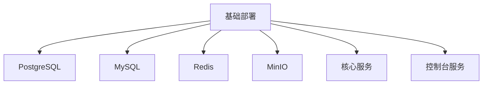
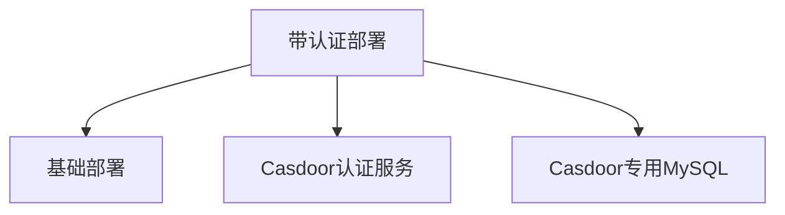
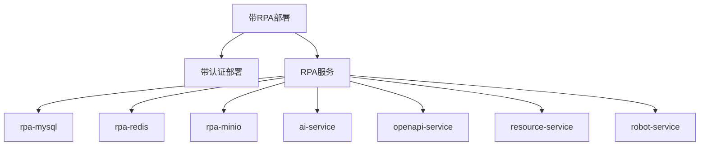

# 环境准备

<cite>
**本文档中引用的文件**  
- [README.md](file://README.md)
- [README-zh.md](file://README-zh.md)
- [Makefile](file://Makefile)
- [docker/astronAgent/docker-compose.yaml](file://docker/astronAgent/docker-compose.yaml)
- [docker/astronAgent/docker-compose-with-auth.yaml](file://docker/astronAgent/docker-compose-with-auth.yaml)
- [docker/astronAgent/docker-compose-with-auth-rpa.yaml](file://docker/astronAgent/docker-compose-with-auth-rpa.yaml)
- [docker/astronAgent/.env.example](file://docker/astronAgent/.env.example)
- [docker/astronAgent/docker-compose-auth.yml](file://docker/astronAgent/docker-compose-auth.yml)
- [docker/astronAgent/astronRPA/docker-compose.yml](file://docker/astronAgent/astronRPA/docker-compose.yml)
- [makefiles/localci.toml](file://makefiles/localci.toml)
- [CONTRIBUTING.md](file://CONTRIBUTING.md)
</cite>

## 目录
1. [简介](#简介)
2. [Docker与Docker Compose安装](#docker与docker-compose安装)
3. [系统资源要求](#系统资源要求)
4. [网络配置建议](#网络配置建议)
5. [不同docker-compose文件的使用场景](#不同docker-compose文件的使用场景)
6. [环境变量配置](#环境变量配置)
7. [多平台配置方法](#多平台配置方法)
8. [环境验证步骤](#环境验证步骤)
9. [通过Makefile进行本地CI环境准备](#通过makefile进行本地ci环境准备)
10. [故障排除](#故障排除)

## 简介

星辰Agent是一个企业级、商业友好的Agentic Workflow开发平台，支持高可用部署。本指南将详细介绍如何搭建部署所需的基础设施环境，包括Docker和Docker Compose的安装与配置、系统资源要求、网络配置建议以及环境验证步骤。

**Section sources**
- [README.md](file://README.md#L1-L129)
- [README-zh.md](file://README-zh.md#L1-L129)

## Docker与Docker Compose安装

### Linux系统安装

在Linux系统上安装Docker和Docker Compose：

```bash
# 安装Docker
sudo apt-get update
sudo apt-get install docker.io docker-compose

# 将当前用户添加到docker组，避免每次使用sudo
sudo usermod -aG docker $USER

# 重启Docker服务
sudo systemctl start docker
sudo systemctl enable docker
```

### macOS系统安装

在macOS系统上，推荐使用Docker Desktop：

1. 访问[Docker官网](https://www.docker.com/products/docker-desktop)下载Docker Desktop for Mac
2. 安装并启动Docker Desktop
3. Docker Desktop会自动包含Docker Compose

### Windows系统安装

在Windows系统上，同样推荐使用Docker Desktop：

1. 访问[Docker官网](https://www.docker.com/products/docker-desktop)下载Docker Desktop for Windows
2. 安装并启动Docker Desktop
3. 确保已启用WSL 2（Windows Subsystem for Linux 2）
4. Docker Desktop会自动包含Docker Compose

### 验证安装

安装完成后，验证Docker和Docker Compose是否正常工作：

```bash
# 验证Docker版本
docker --version

# 验证Docker Compose版本
docker-compose --version

# 测试Docker是否正常运行
docker run hello-world
```

**Section sources**
- [CONTRIBUTING.md](file://CONTRIBUTING.md#L20-L27)

## 系统资源要求

### 最低配置要求

为了确保星辰Agent平台能够正常运行，建议满足以下最低系统资源要求：

- **CPU**: 4核及以上
- **内存**: 8GB RAM
- **存储**: 50GB可用磁盘空间

### 推荐配置

对于生产环境或需要处理复杂工作流的场景，建议使用以下配置：

- **CPU**: 8核及以上
- **内存**: 16GB RAM或更高
- **存储**: 100GB以上SSD存储

### 服务资源分配

根据docker-compose.yaml文件中的配置，各服务的资源需求如下：

- **PostgreSQL**: 建议分配至少512MB内存
- **MySQL**: 建议分配至少512MB内存
- **Redis**: 建议分配至少256MB内存
- **MinIO**: 建议分配至少512MB内存
- **核心服务**: 每个核心服务建议分配至少1GB内存

**Section sources**
- [docker/astronAgent/docker-compose.yaml](file://docker/astronAgent/docker-compose.yaml#L1-L614)

## 网络配置建议

### 端口配置

星辰Agent平台使用多个端口进行服务通信，建议在防火墙中开放以下端口：

- **80**: Nginx反向代理端口，用于访问前端应用
- **8000**: Casdoor认证服务管理界面
- **9000**: MinIO对象存储服务
- **9001**: MinIO控制台服务
- **5432**: PostgreSQL数据库服务
- **3306**: MySQL数据库服务
- **6379**: Redis缓存服务

### 网络隔离

建议为星辰Agent平台创建独立的Docker网络，以实现服务间的网络隔离：

```bash
# 创建专用网络
docker network create astron-agent-network
```

所有服务都将运行在`astron-agent-network`桥接网络中，确保服务间的安全通信。

### 健康检查配置

平台配置了详细的健康检查机制，确保服务的可用性：

- **检查间隔**: 30秒
- **超时时间**: 10秒
- **重试次数**: 60次

这些配置确保了服务在启动时能够正确初始化，并在运行时保持健康状态。

**Section sources**
- [docker/astronAgent/docker-compose.yaml](file://docker/astronAgent/docker-compose.yaml#L1-L614)

## 不同docker-compose文件的使用场景

### 基础部署 (docker-compose.yaml)

`docker-compose.yaml`文件提供了星辰Agent平台的基础部署配置，包含以下核心服务：

- **PostgreSQL**: 用于存储工作流数据
- **MySQL**: 用于存储租户和应用数据
- **Redis**: 作为缓存服务
- **MinIO**: 作为对象存储服务
- **核心服务**: 包括agent、workflow、knowledge等核心组件
- **控制台服务**: 包括前端和hub服务

此配置适用于不需要认证功能的开发和测试环境。



**Diagram sources**
- [docker/astronAgent/docker-compose.yaml](file://docker/astronAgent/docker-compose.yaml#L1-L614)

### 带认证部署 (docker-compose-with-auth.yaml)

`docker-compose-with-auth.yaml`文件在基础部署的基础上增加了Casdoor认证服务，适用于需要用户认证和权限管理的生产环境。

该文件通过`include`指令包含了两个配置文件：

```yaml
include:
  - docker-compose-auth.yml
  - docker-compose.yaml
```

其中：
- `docker-compose-auth.yml`: 定义了Casdoor认证服务和其专用的MySQL数据库
- `docker-compose.yaml`: 定义了星辰Agent的核心服务

此配置提供了完整的用户认证功能，包括：
- 用户注册和登录
- 应用管理
- 权限控制



**Diagram sources**
- [docker/astronAgent/docker-compose-with-auth.yaml](file://docker/astronAgent/docker-compose-with-auth.yaml#L1-L15)
- [docker/astronAgent/docker-compose-auth.yml](file://docker/astronAgent/docker-compose-auth.yml#L1-L50)

### 带RPA部署 (docker-compose-with-auth-rpa.yaml)

`docker-compose-with-auth-rpa.yaml`文件提供了最完整的部署配置，集成了星辰RPA功能，适用于需要自动化流程的企业场景。

该配置文件包含了三个部分：

```yaml
include:
  - path: docker-compose-auth.yml
  - path: docker-compose.yaml
  - path: astronRPA/docker-compose.yml
```

其中`astronRPA/docker-compose.yml`定义了RPA相关的服务：

- **rpa-mysql**: RPA专用的MySQL数据库
- **rpa-redis**: RPA专用的Redis服务
- **rpa-minio**: RPA专用的对象存储
- **ai-service**: AI服务
- **openapi-service**: OpenAPI服务
- **resource-service**: 资源服务
- **robot-service**: 机器人服务

此配置实现了"从决策到动作"的完整闭环，让智能体具备跨系统自动化执行能力。



**Diagram sources**
- [docker/astronAgent/docker-compose-with-auth-rpa.yaml](file://docker/astronAgent/docker-compose-with-auth-rpa.yaml#L1-L35)
- [docker/astronAgent/astronRPA/docker-compose.yml](file://docker/astronAgent/astronRPA/docker-compose.yml#L1-L260)

## 环境变量配置

### 配置文件准备

首先，复制示例环境变量文件：

```bash
# 进入astronAgent目录
cd docker/astronAgent

# 复制环境变量配置
cp .env.example .env
```

### 关键环境变量

#### 基础配置

- `ASTRON_AGENT_VERSION`: 镜像版本标签，默认为`latest`
- `SERVICE_LOCATION`: 服务可用区，可选值：`dx`, `hf`, `gz`

#### 中间件配置

- `POSTGRES_USER` 和 `POSTGRES_PASSWORD`: PostgreSQL数据库用户名和密码
- `MYSQL_ROOT_PASSWORD`: MySQL数据库root用户密码
- `REDIS_PASSWORD`: Redis密码，为空表示无密码
- `MINIO_ROOT_USER` 和 `MINIO_ROOT_PASSWORD`: MinIO对象存储的管理员用户名和密码

#### 端口配置

- `EXPOSE_NGINX_PORT`: Nginx暴露的端口，默认为80
- `EXPOSE_MINIO_PORT`: MinIO服务端口，默认为18998
- `EXPOSE_MINIO_CONSOLE_PORT`: MinIO控制台端口，默认为18999

#### 认证配置

- `CONSOLE_CASDOOR_URL`: Casdoor服务URL
- `CONSOLE_CASDOOR_ID`: Casdoor客户端ID
- `CONSOLE_CASDOOR_APP`: Casdoor应用名称
- `CONSOLE_CASDOOR_ORG`: Casdoor组织名称

#### 平台API配置

- `PLATFORM_APP_ID`: 讯飞开放平台应用ID
- `PLATFORM_API_KEY`: 讯飞开放平台API密钥
- `PLATFORM_API_SECRET`: 讯飞开放平台API密钥

这些配置对于平台的正常运行至关重要，特别是讯飞开放平台的API密钥，用于访问大模型和其他AI能力。

**Section sources**
- [docker/astronAgent/.env.example](file://docker/astronAgent/.env.example#L1-L306)

## 多平台配置方法

### Linux配置方法

在Linux系统上，除了安装Docker外，还需要配置Docker守护进程以优化性能：

```bash
# 创建Docker配置目录
sudo mkdir -p /etc/docker

# 配置Docker守护进程
cat << EOF | sudo tee /etc/docker/daemon.json
{
  "exec-opts": ["native.cgroupdriver=systemd"],
  "log-driver": "json-file",
  "log-opts": {
    "max-size": "100m"
  },
  "storage-driver": "overlay2"
}
EOF

# 重启Docker服务
sudo systemctl restart docker
```

### macOS配置方法

在macOS上使用Docker Desktop时，建议调整以下设置：

1. 打开Docker Desktop设置
2. 在"Resources"选项卡中：
   - 分配至少4GB内存
   - 分配至少2个CPU核心
   - 分配至少50GB磁盘空间
3. 在"General"选项卡中：
   - 启用"Start Docker Desktop when you log in"
   - 启用"Use Docker Compose V2"

### Windows配置方法

在Windows上使用Docker Desktop时，需要注意以下配置：

1. 确保已启用Hyper-V和WSL 2
2. 在Docker Desktop设置中：
   - 在"Resources"中分配足够的内存和CPU
   - 在"General"中启用"Use the WSL 2 based engine"
   - 在"Advanced"中配置文件共享路径

**Section sources**
- [CONTRIBUTING.md](file://CONTRIBUTING.md#L20-L27)

## 环境验证步骤

### 启动服务

根据不同的使用场景，选择合适的docker-compose文件启动服务：

```bash
# 基础部署
docker compose -f docker-compose.yaml up -d

# 带认证部署
docker compose -f docker-compose-with-auth.yaml up -d

# 带RPA部署
docker compose -f docker-compose-with-auth-rpa.yaml up -d
```

### 验证服务状态

启动服务后，验证所有容器是否正常运行：

```bash
# 查看所有容器状态
docker ps

# 查看特定容器的日志
docker logs astron-agent-nginx
docker logs astron-agent-postgres
```

### 访问服务

根据README中的说明，访问以下服务地址：

- **Casdoor管理界面**: http://localhost:8000
  - 默认登录账户：`admin`
  - 默认密码：`123`
- **应用前端**: http://localhost/

### 健康检查

平台配置了健康检查机制，可以通过以下方式验证服务健康状态：

```bash
# 检查PostgreSQL健康状态
docker exec astron-agent-postgres pg_isready -U spark -d sparkdb_manager

# 检查MySQL健康状态
docker exec astron-agent-mysql mysqladmin ping -u root -p

# 检查Redis健康状态
docker exec astron-agent-redis redis-cli ping
```

### 依赖服务验证

确保所有依赖服务正常运行：

1. **数据库服务**: 验证PostgreSQL和MySQL能够正常连接
2. **缓存服务**: 验证Redis能够正常读写
3. **对象存储**: 验证MinIO能够正常访问
4. **认证服务**: 验证Casdoor能够正常提供认证功能

**Section sources**
- [README.md](file://README.md#L1-L129)
- [README-zh.md](file://README-zh.md#L1-L129)

## 通过Makefile进行本地CI环境准备

### Makefile概述

项目根目录下的Makefile提供了一套智能化的CI/CD工具链，简化了环境准备和验证流程。

### 本地环境准备

使用Makefile进行本地CI环境准备：

```bash
# 显示帮助信息和项目状态
make help

# 一次性环境设置（工具+钩子+分支策略）
make setup

# 格式化代码
make format

# 质量检查
make check

# 运行测试
make test

# 构建项目
make build
```

### CI流程

完整的CI流程可以通过以下命令执行：

```bash
# 完整的CI流水线（格式化+检查+测试+构建）
make ci
```

### 核心命令

Makefile提供了15个核心命令，分为三个层级：

#### 日常核心命令（8个）

- `make setup`: 一次性环境设置
- `make format`: 代码格式化
- `make check`: 质量检查
- `make test`: 运行测试
- `make build`: 构建项目
- `make push`: 安全推送到远程
- `make clean`: 清理构建产物
- `make status`: 显示详细项目状态

#### 专业命令（5个）

- `make info`: 显示工具和依赖信息
- `make lint`: 代码linting
- `make fix`: 自动修复代码问题
- `make ci`: 完整CI流水线
- `make hooks`: Git钩子管理菜单

#### 高级命令（2个）

- `make enable-legacy`: 启用完整的传统命令集

### 本地CI配置

`makefiles/localci.toml`文件定义了本地CI的配置，包括各个应用模块的路径和启用状态：

```toml
[[java.apps]]
name = "console-backend"
dir = "console/backend"
enabled = true

[[typescript.apps]]
name = "console-frontend"
dir = "console/frontend"
enabled = true

[[go.apps]]
name = "core-tenant"
dir = "core/tenant"
enabled = true

# 其他Python应用...
```

此配置确保了多语言项目的统一构建和测试流程。

**Section sources**
- [Makefile](file://Makefile#L1-L146)
- [makefiles/localci.toml](file://makefiles/localci.toml#L1-L58)

## 故障排除

### 常见问题

#### 服务无法启动

如果服务无法启动，请检查以下事项：

1. 确保Docker和Docker Compose已正确安装
2. 检查端口是否被其他进程占用
3. 验证环境变量配置是否正确
4. 查看容器日志以获取详细错误信息

#### 数据库连接问题

如果遇到数据库连接问题：

1. 检查数据库服务是否正常运行
2. 验证数据库用户名和密码是否正确
3. 确认数据库网络配置是否正确

#### 认证服务问题

如果Casdoor认证服务出现问题：

1. 检查`CONSOLE_CASDOOR_URL`等环境变量配置
2. 验证Casdoor容器是否正常运行
3. 检查网络连接是否正常

### 调试技巧

使用以下命令进行调试：

```bash
# 查看所有容器的日志
docker-compose logs

# 进入容器内部进行调试
docker exec -it astron-agent-nginx sh

# 查看容器的资源使用情况
docker stats
```

**Section sources**
- [README.md](file://README.md#L1-L129)
- [CONTRIBUTING.md](file://CONTRIBUTING.md#L20-L27)