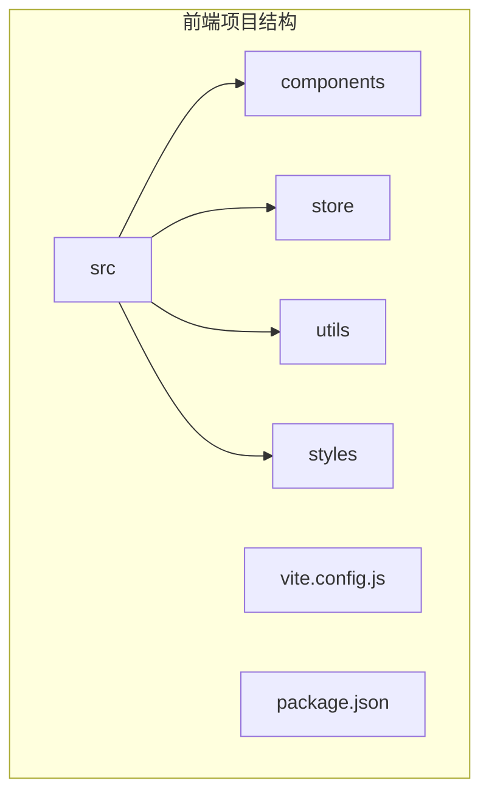
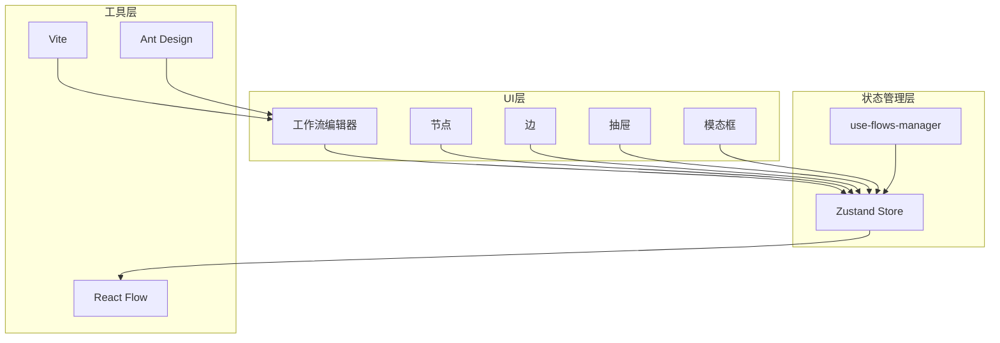
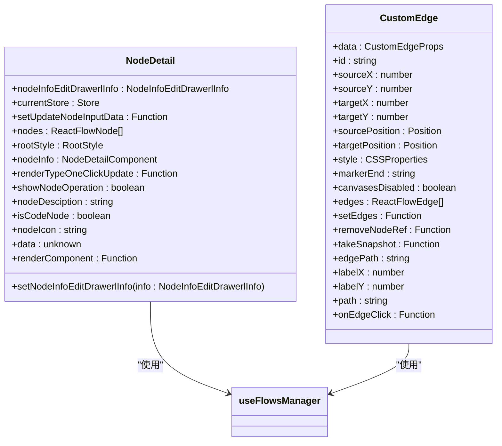
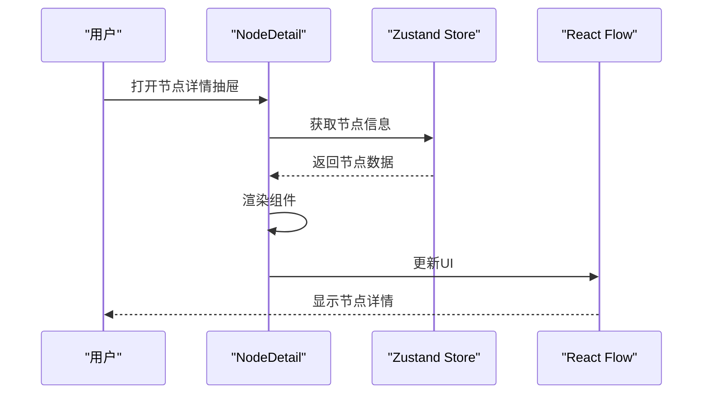
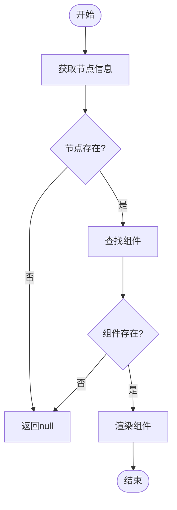
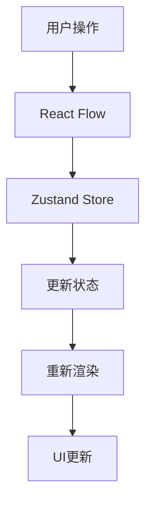
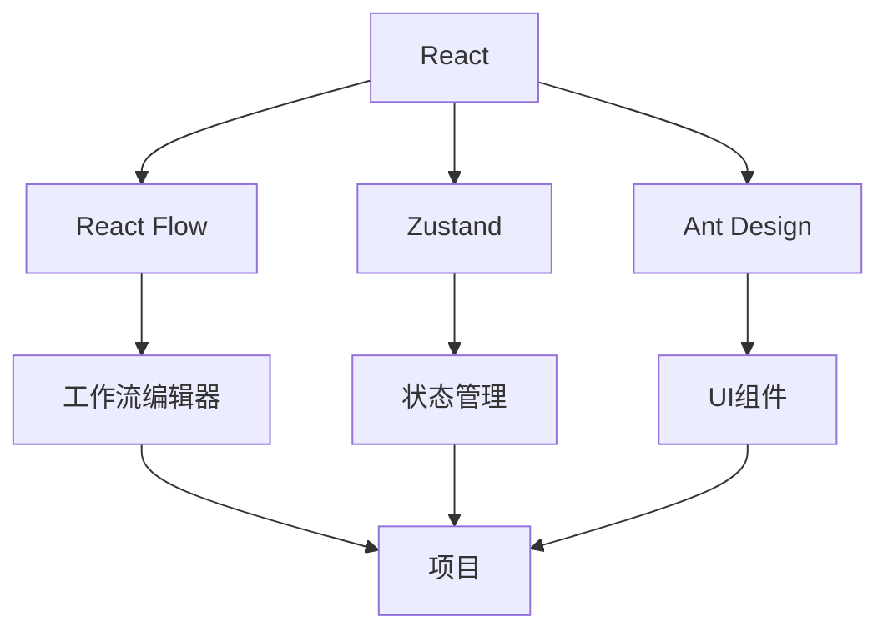

# 前端性能优化

<cite>
**本文档引用的文件**
- [package.json](file://console/frontend/package.json)
- [vite.config.js](file://console/frontend/vite.config.js)
- [flow.scss](file://console/frontend/src/styles/flow.scss)
- [use-flows-manager.ts](file://console/frontend/src/components/workflow/store/use-flows-manager.ts)
- [reactflow-utils.ts](file://console/frontend/src/utils/reactflow-utils.ts)
- [node-detail/index.tsx](file://console/frontend/src/components/workflow/drawer/node-detail/index.tsx)
- [edges/index.tsx](file://console/frontend/src/components/workflow/edges/index.tsx)
- [use-node-common.tsx](file://console/frontend/src/components/workflow/hooks/use-node-common.tsx)
- [index.ts](file://console/frontend/src/components/workflow/types/index.ts)
- [constant/index.tsx](file://console/frontend/src/components/workflow/constant/index.tsx)
</cite>

## 目录
1. [简介](#简介)
2. [项目结构](#项目结构)
3. [核心组件](#核心组件)
4. [架构概述](#架构概述)
5. [详细组件分析](#详细组件分析)
6. [依赖分析](#依赖分析)
7. [性能考虑](#性能考虑)
8. [故障排除指南](#故障排除指南)
9. [结论](#结论)
10. [附录](#附录)（如有必要）

## 简介
本文档旨在为astron-agent项目的前端性能优化提供全面指南。重点分析React组件渲染性能、状态管理效率和资源加载策略，特别是针对工作流编辑器（基于React Flow）的性能优化。文档将详细说明如何优化渲染性能，包括节点虚拟化、防抖处理和状态更新优化。同时，解释Vite构建配置的优化选项，如代码分割、懒加载和Tree Shaking。此外，提供CSS性能优化建议，特别是flow.scss中的样式规则，并指导如何减少包体积、优化图片和字体加载。最后，包含使用浏览器开发者工具进行性能分析的方法和常见性能问题的解决方案。

## 项目结构
项目前端部分采用现代React技术栈，主要包含以下关键目录和文件：
- `src/components/workflow/`: 工作流编辑器核心组件，包括节点、边、抽屉、模态框等
- `src/store/`: 使用Zustand进行状态管理
- `src/utils/`: 工具函数，包括reactflow-utils.ts
- `src/styles/`: 样式文件，特别是flow.scss
- `vite.config.js`: Vite构建配置
- `package.json`: 项目依赖和脚本

**Diagram sources**
- [vite.config.js](file://console/frontend/vite.config.js)
- [package.json](file://console/frontend/package.json)

**Section sources**
- [vite.config.js](file://console/frontend/vite.config.js)
- [package.json](file://console/frontend/package.json)

## 核心组件
核心组件主要包括工作流编辑器的各个部分，如节点、边、抽屉和模态框。这些组件通过React Flow库实现，利用Zustand进行状态管理，确保高效的数据流和渲染性能。

**Section sources**
- [node-detail/index.tsx](file://console/frontend/src/components/workflow/drawer/node-detail/index.tsx)
- [edges/index.tsx](file://console/frontend/src/components/workflow/edges/index.tsx)

## 架构概述
系统架构基于React和Vite，使用Zustand进行状态管理，React Flow实现工作流编辑器。整体架构分为UI层、状态管理层和工具层。

**Diagram sources**
- [use-flows-manager.ts](file://console/frontend/src/components/workflow/store/use-flows-manager.ts)
- [node-detail/index.tsx](file://console/frontend/src/components/workflow/drawer/node-detail/index.tsx)

## 详细组件分析
### 工作流编辑器组件分析
工作流编辑器是项目的核心，基于React Flow实现，包含多种节点类型和复杂的交互逻辑。

#### 对象导向组件

**Diagram sources**
- [node-detail/index.tsx](file://console/frontend/src/components/workflow/drawer/node-detail/index.tsx)
- [edges/index.tsx](file://console/frontend/src/components/workflow/edges/index.tsx)

#### API/服务组件

**Diagram sources**
- [node-detail/index.tsx](file://console/frontend/src/components/workflow/drawer/node-detail/index.tsx)
- [use-flows-manager.ts](file://console/frontend/src/components/workflow/store/use-flows-manager.ts)

#### 复杂逻辑组件

**Diagram sources**
- [node-detail/index.tsx](file://console/frontend/src/components/workflow/drawer/node-detail/index.tsx)
- [constant/index.tsx](file://console/frontend/src/components/workflow/constant/index.tsx)

**Section sources**
- [node-detail/index.tsx](file://console/frontend/src/components/workflow/drawer/node-detail/index.tsx)
- [constant/index.tsx](file://console/frontend/src/components/workflow/constant/index.tsx)

### 概念概述
工作流编辑器通过React Flow库实现，支持拖拽、连接、删除等操作。状态管理使用Zustand，确保高效的数据流和渲染性能。

## 依赖分析
项目依赖主要包括React、React Flow、Zustand、Ant Design等库，通过Vite进行构建和优化。

**Diagram sources**
- [package.json](file://console/frontend/package.json)
- [vite.config.js](file://console/frontend/vite.config.js)

**Section sources**
- [package.json](file://console/frontend/package.json)
- [vite.config.js](file://console/frontend/vite.config.js)

## 性能考虑
### React组件渲染性能
- 使用`memo`进行组件记忆化，避免不必要的重新渲染
- 使用`useMemo`和`useCallback`优化计算和回调函数
- 避免在渲染函数中创建新的对象或数组

### 状态管理效率
- 使用Zustand进行状态管理，确保高效的数据流
- 避免不必要的状态更新，使用`immer`进行不可变更新

### 资源加载策略
- 使用Vite进行代码分割和懒加载
- 优化图片和字体加载，减少包体积

## 故障排除指南
### 常见性能问题
- **组件重新渲染过多**: 检查是否正确使用`memo`、`useMemo`和`useCallback`
- **状态更新频繁**: 检查状态更新逻辑，避免不必要的更新
- **包体积过大**: 检查依赖，移除未使用的库，使用Tree Shaking

### 使用浏览器开发者工具
- 使用Performance面板分析渲染性能
- 使用Memory面板检查内存泄漏
- 使用Network面板分析资源加载

**Section sources**
- [node-detail/index.tsx](file://console/frontend/src/components/workflow/drawer/node-detail/index.tsx)
- [edges/index.tsx](file://console/frontend/src/components/workflow/edges/index.tsx)

## 结论
本文档提供了astron-agent项目前端性能优化的全面指南，涵盖了React组件渲染性能、状态管理效率和资源加载策略。通过优化工作流编辑器的渲染性能、Vite构建配置和CSS样式，可以显著提升应用性能。同时，使用浏览器开发者工具进行性能分析，可以快速定位和解决性能问题。

## 附录
### Vite构建配置优化
- `maxParallelFileOps`: 限制并行文件操作数，避免资源竞争
- `strictRequires`: 强制所有CommonJS模块都被严格处理

### CSS性能优化
- 避免使用复杂的CSS选择器
- 减少重排和重绘
- 使用CSS变量和预处理器