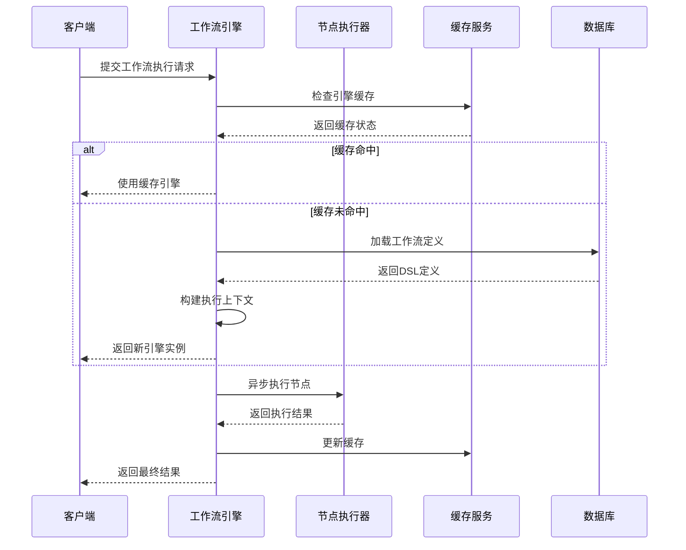
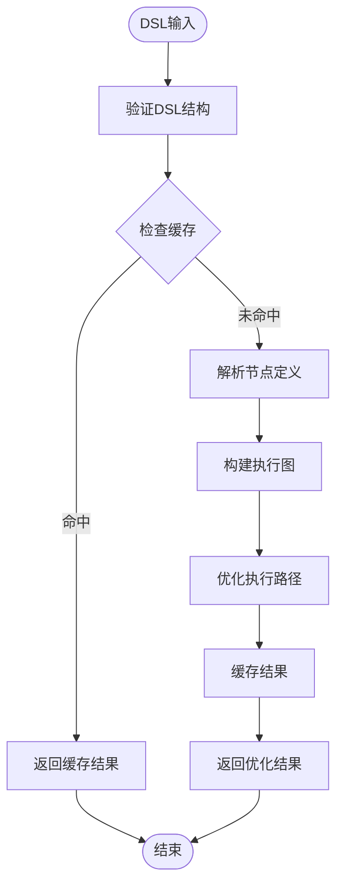
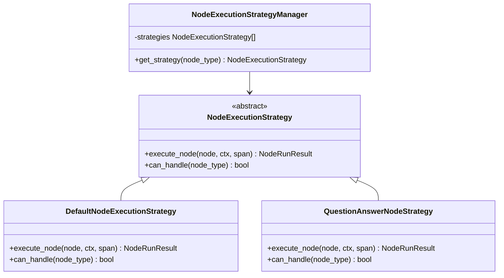
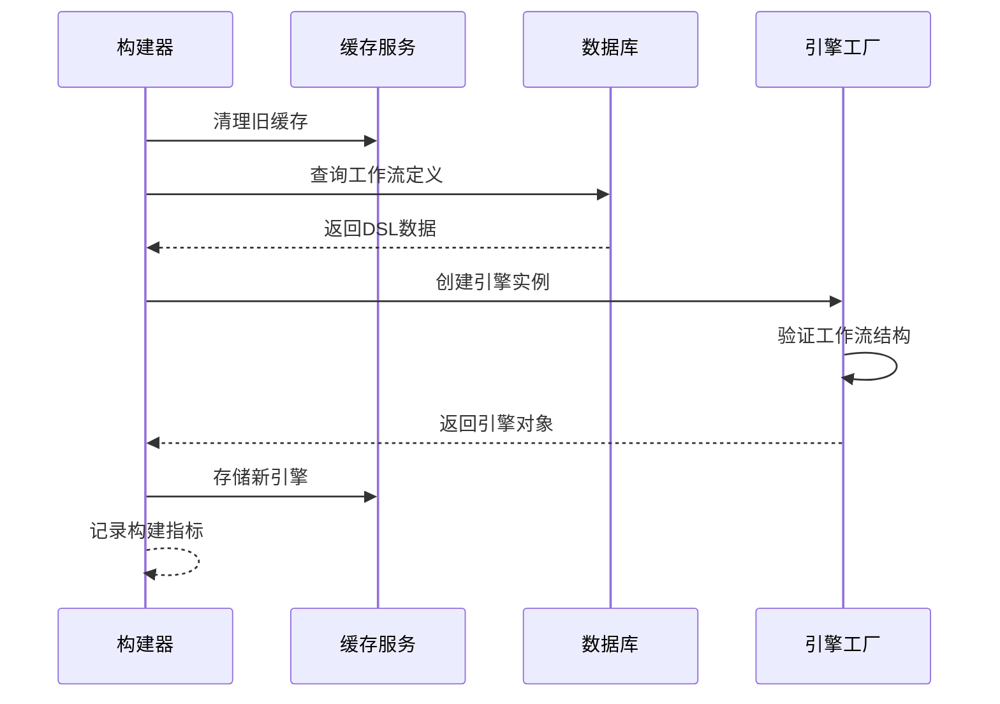
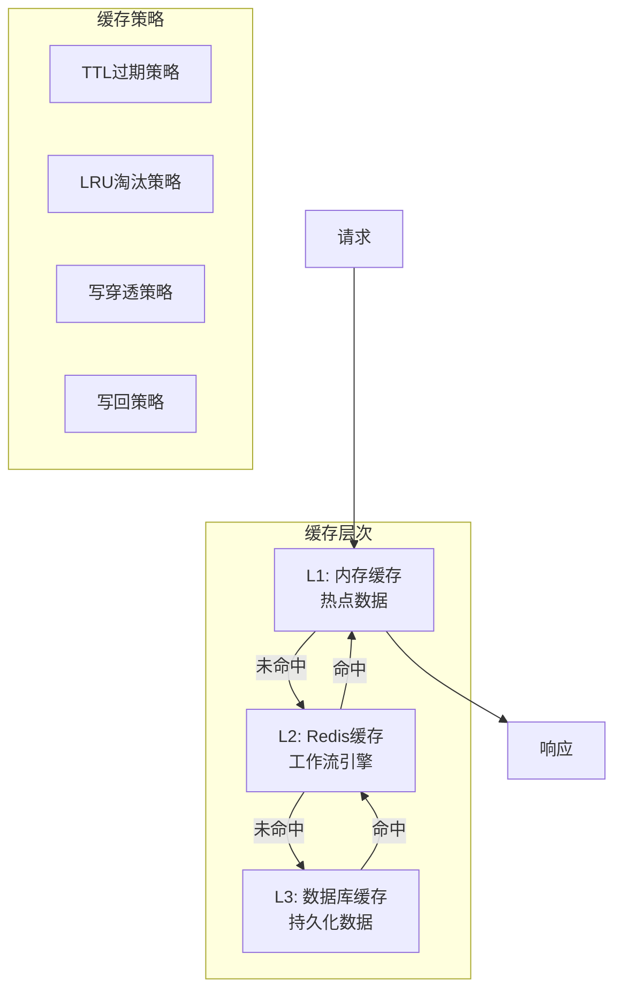
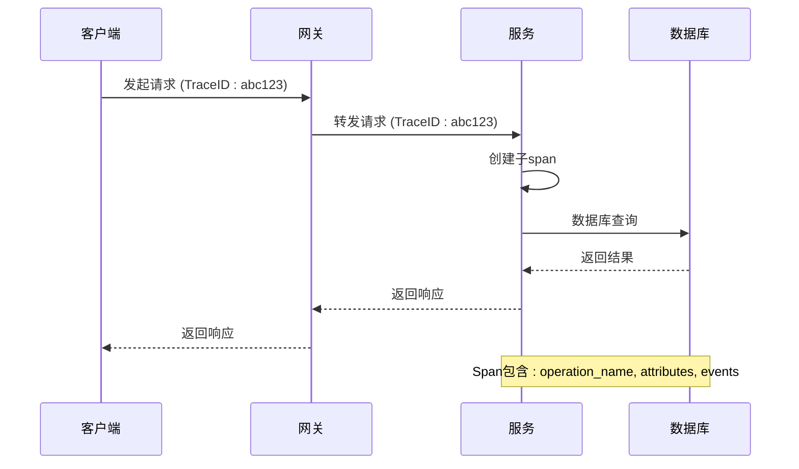

# 后端性能优化指南

<cite>
**本文档引用的文件**
- [workflow_agent_runner.py](file://core/workflow/engine/workflow_agent_runner.py)
- [dsl_engine.py](file://core/workflow/engine/dsl_engine.py)
- [workflow_agent_builder.py](file://core/agent/service/builder/workflow_agent_builder.py)
- [app_service.py](file://core/workflow/service/app_service.py)
- [flow_service.py](file://core/workflow/service/flow_service.py)
- [engine.py](file://core/workflow/cache/engine.py)
- [flow_dao.py](file://core/workflow/repository/flow_dao.py)
- [db_service.py](file://core/common/service/db/db_service.py)
- [redis_client.py](file://core/agent/cache/redis_client.py)
- [node.py](file://core/workflow/engine/node.py)
- [span.py](file://core/workflow/extensions/otlp/trace/span.py)
</cite>

## 目录
1. [概述](#概述)
2. [工作流执行引擎性能分析](#工作流执行引擎性能分析)
3. [DSL解析优化策略](#dsl解析优化策略)
4. [节点执行优化](#节点执行优化)
5. [工作流构建优化](#工作流构建优化)
6. [数据库性能优化](#数据库性能优化)
7. [缓存策略优化](#缓存策略优化)
8. [微服务通信优化](#微服务通信优化)
9. [监控与诊断](#监控与诊断)
10. [最佳实践建议](#最佳实践建议)

## 概述

本指南针对astron-agent后端系统的性能瓶颈进行全面分析和优化建议。系统采用Python开发，包含复杂的工作流执行引擎、分布式缓存、数据库访问层等核心组件。通过深入分析关键模块的实现机制，提出针对性的性能优化策略。

## 工作流执行引擎性能分析

### 异步执行模型

工作流执行引擎采用基于asyncio的异步执行模型，通过深度优先搜索算法遍历节点图结构。

**图表来源**
- [dsl_engine.py](file://core/workflow/engine/dsl_engine.py#L1-L100)
- [workflow_agent_runner.py](file://core/workflow/engine/workflow_agent_runner.py#L1-L100)

### 并发控制策略

系统实现了多层次的并发控制机制：

1. **节点级别并发控制**：使用`asyncio.Lock`确保question-answer节点的串行执行
2. **引擎级别并发控制**：通过`asyncio.Event`协调工作流完成信号
3. **资源级别并发控制**：限制同时运行的工作流数量

**章节来源**
- [dsl_engine.py](file://core/workflow/engine/dsl_engine.py#L150-L250)

### 性能瓶颈识别

主要性能瓶颈包括：

- **节点依赖解析**：复杂的节点依赖关系导致执行路径计算开销
- **变量池操作**：频繁的变量读写影响执行效率
- **错误处理链**：多层异常处理器增加额外开销

## DSL解析优化策略

### 解析流程优化

DSL解析是系统的核心组件，直接影响工作流启动性能：

**图表来源**
- [dsl_engine.py](file://core/workflow/engine/dsl_engine.py#L300-L400)

### 优化建议

1. **预编译缓存**：对常用工作流模式进行预编译和缓存
2. **增量解析**：只解析变更部分，避免全量重新解析
3. **并行验证**：使用多线程验证多个节点定义

**章节来源**
- [dsl_engine.py](file://core/workflow/engine/dsl_engine.py#L400-L500)

## 节点执行优化

### 执行策略模式

系统采用策略模式实现不同类型的节点执行策略：

**图表来源**
- [dsl_engine.py](file://core/workflow/engine/dsl_engine.py#L600-L700)
- [node.py](file://core/workflow/engine/node.py#L1-L100)

### 优化策略

1. **执行策略缓存**：缓存节点类型到执行策略的映射关系
2. **参数策略优化**：针对不同类型节点使用专用参数构建策略
3. **模板方法优化**：减少模板方法调用的开销

**章节来源**
- [node.py](file://core/workflow/engine/node.py#L100-L200)

## 工作流构建优化

### 构建流程分析

工作流构建过程涉及多个步骤，每个环节都有潜在的性能瓶颈：

**图表来源**
- [workflow_agent_builder.py](file://core/agent/service/builder/workflow_agent_builder.py#L1-L100)
- [flow_service.py](file://core/workflow/service/flow_service.py#L200-L300)

### 优化建议

1. **并行知识查询**：使用`asyncio.gather`并行执行多个知识库查询
2. **批量插件加载**：一次性加载所有必要的插件
3. **延迟初始化**：只在真正需要时才初始化某些组件

**章节来源**
- [workflow_agent_builder.py](file://core/agent/service/builder/workflow_agent_builder.py#L100-L200)

## 数据库性能优化

### 连接池配置

数据库连接池是系统性能的关键因素：

| 参数 | 默认值 | 推荐值 | 说明 |
|------|--------|--------|------|
| pool_size | 200 | 256-512 | 根据并发需求调整 |
| max_overflow | 800 | 400-600 | 控制最大溢出连接 |
| pool_recycle | 3600 | 1800-2700 | 避免连接超时 |
| connect_timeout | 10 | 5-8 | 减少连接等待时间 |

**章节来源**
- [db_service.py](file://core/common/service/db/db_service.py#L1-L50)

### 查询优化策略

1. **索引优化**：为常用查询字段建立复合索引
2. **查询计划分析**：定期分析慢查询日志
3. **分页查询**：对大数据集使用分页查询
4. **连接复用**：使用连接池避免频繁重建连接

**章节来源**
- [flow_dao.py](file://core/workflow/repository/flow_dao.py#L1-L74)

## 缓存策略优化

### 多层缓存架构

系统采用多层缓存策略提升性能：

**图表来源**
- [engine.py](file://core/workflow/cache/engine.py#L1-L69)
- [redis_client.py](file://core/agent/cache/redis_client.py#L1-L100)

### 缓存优化策略

1. **智能预热**：根据访问模式预热热点数据
2. **分层淘汰**：不同层级使用不同的淘汰策略
3. **缓存穿透防护**：使用布隆过滤器防止缓存穿透
4. **缓存雪崩防护**：设置随机过期时间

**章节来源**
- [engine.py](file://core/workflow/cache/engine.py#L20-L69)

## 微服务通信优化

### 序列化格式选择

系统支持多种序列化格式，选择合适的格式对性能至关重要：

| 格式 | 优势 | 劣势 | 适用场景 |
|------|------|------|----------|
| JSON | 可读性好，通用性强 | 文件较大，解析较慢 | 开发调试，跨语言通信 |
| Protobuf | 文件小，解析快 | 不可读，需要定义schema | 高性能内部通信 |
| MessagePack | 介于JSON和二进制之间 | 生态相对较小 | 平衡性能和可读性 |

### 连接复用策略

1. **HTTP连接池**：复用TCP连接减少握手开销
2. **长连接维护**：保持WebSocket长连接
3. **连接健康检查**：定期检测连接可用性
4. **故障转移**：自动切换到备用服务节点

**章节来源**
- [app_service.py](file://core/workflow/service/app_service.py#L1-L50)

## 监控与诊断

### 分布式追踪

系统集成OpenTelemetry实现分布式追踪：

**图表来源**
- [span.py](file://core/workflow/extensions/otlp/trace/span.py#L1-L100)

### 性能指标监控

关键性能指标包括：

1. **响应时间**：各组件的平均响应时间和P99延迟
2. **吞吐量**：每秒处理的请求数
3. **错误率**：各类错误的发生频率
4. **资源利用率**：CPU、内存、网络带宽使用情况

**章节来源**
- [span.py](file://core/workflow/extensions/otlp/trace/span.py#L100-L200)

## 最佳实践建议

### 开发阶段优化

1. **代码审查**：重点关注性能相关的代码模式
2. **单元测试**：编写性能测试用例
3. **基准测试**：建立性能基准线
4. **静态分析**：使用工具检测潜在性能问题

### 部署阶段优化

1. **资源配置**：根据实际负载调整资源配置
2. **环境隔离**：开发、测试、生产环境分离
3. **容量规划**：基于历史数据进行容量预测
4. **弹性伸缩**：配置自动扩缩容策略

### 运维阶段优化

1. **持续监控**：建立完善的监控体系
2. **告警机制**：设置合理的告警阈值
3. **性能分析**：定期进行性能分析和调优
4. **版本管理**：建立规范的版本发布流程

### 故障排查指南

当系统出现性能问题时，可以按照以下步骤进行排查：

1. **确认问题范围**：判断是局部还是全局问题
2. **收集性能数据**：查看相关指标和日志
3. **定位瓶颈点**：使用性能分析工具
4. **制定解决方案**：根据瓶颈类型选择优化策略
5. **验证优化效果**：对比优化前后的性能指标

通过实施这些优化策略，可以显著提升astron-agent后端系统的整体性能，为用户提供更好的服务体验。