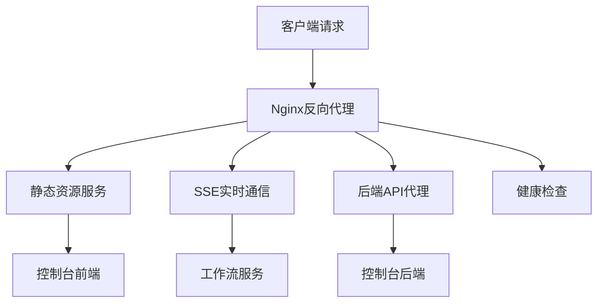
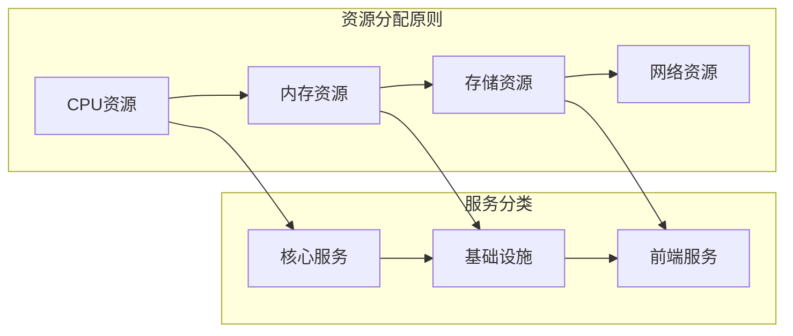
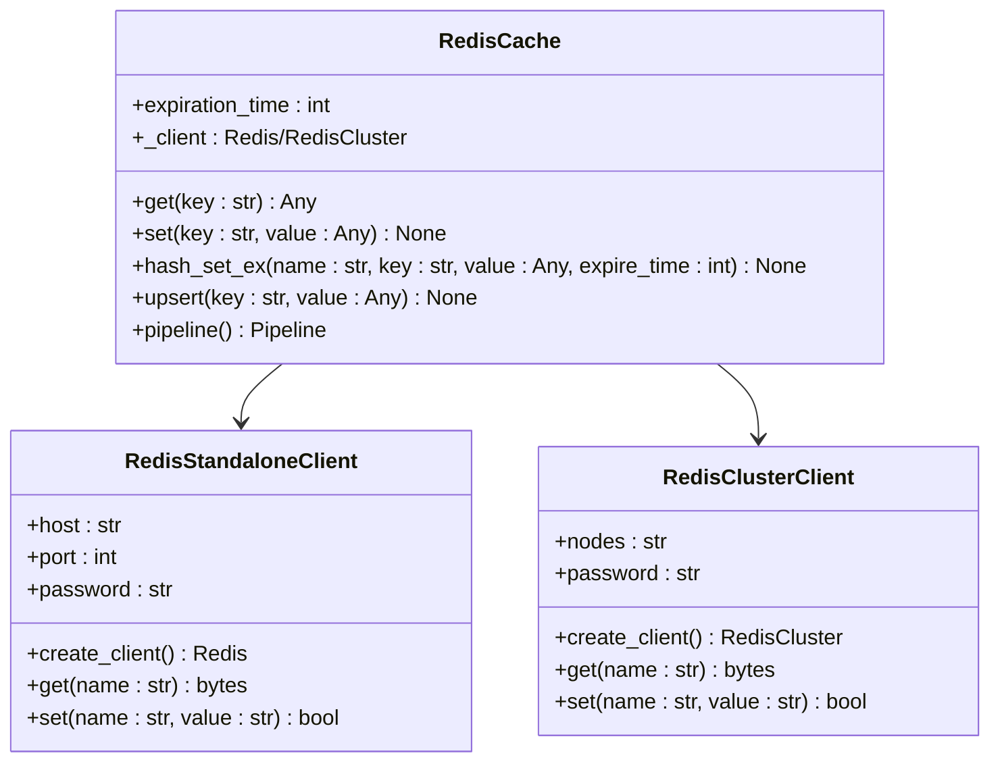
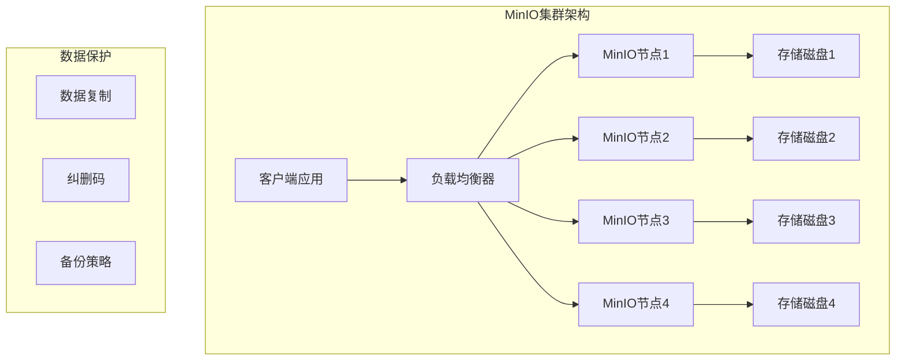
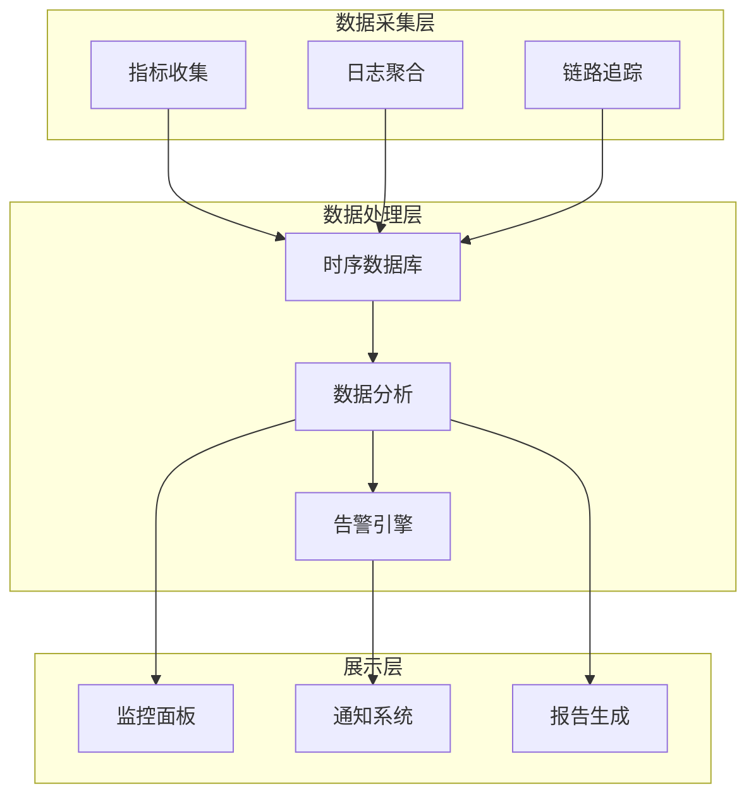

# 基础设施优化

<cite>
**本文档中引用的文件**
- [nginx.conf](file://docker/astronAgent/nginx/nginx.conf)
- [docker-compose.yaml](file://docker/astronAgent/docker-compose.yaml)
- [redis_cache.py](file://core/common/service/cache/redis_cache.py)
- [redis_client.py](file://core/agent/cache/redis_client.py)
- [infinity_conf.toml](file://docker/ragflow/infinity_conf.toml)
- [docker-compose-base.yml](file://docker/ragflow/docker-compose-base.yml)
- [config.toml](file://docker/astronAgent/config/tenant/config.toml)
- [docker-compose-with-auth.yaml](file://docker/astronAgent/docker-compose-with-auth.yaml)
- [docker-compose-with-auth-rpa.yaml](file://docker/astronAgent/docker-compose-with-auth-rpa.yaml)
</cite>

## 目录
1. [概述](#概述)
2. [Nginx反向代理配置优化](#nginx反向代理配置优化)
3. [Docker容器资源分配](#docker容器资源分配)
4. [Redis缓存策略优化](#redis缓存策略优化)
5. [MinIO对象存储性能调优](#minio对象存储性能调优)
6. [监控指标与自动伸缩](#监控指标与自动伸缩)
7. [最佳实践建议](#最佳实践建议)
8. [故障排除指南](#故障排除指南)

## 概述

astron-agent项目采用微服务架构，包含多个核心组件：Nginx反向代理、PostgreSQL/MySQL数据库、Redis缓存、MinIO对象存储等。本指南详细介绍了这些基础设施组件的性能优化策略，帮助提升系统整体性能和可靠性。

## Nginx反向代理配置优化

### 核心配置参数分析

Nginx作为系统的入口网关，其配置直接影响整个系统的性能表现。

**图表来源**
- [nginx.conf](file://docker/astronAgent/nginx/nginx.conf#L1-L150)

### 关键性能配置

#### Worker进程设置
- **worker_processes**: 自动检测CPU核心数，充分利用多核处理器
- **worker_connections**: 设置为1024，支持高并发连接
- **multi_accept**: 启用多连接接受模式

#### 连接超时优化
- **keepalive_timeout**: 65秒，保持长连接减少握手开销
- **client_max_body_size**: 1024M，支持大文件上传
- **proxy_connect_timeout**: 30秒，合理设置上游连接超时

#### 缓冲区配置
- **sendfile**: 启用零拷贝传输
- **tcp_nopush**: 在发送数据包时启用TCP_NOPUSH选项
- **tcp_nodelay**: 禁用Nagle算法，降低延迟

#### Gzip压缩优化
- **gzip_min_length**: 1000字节，避免小文件压缩开销
- **gzip_types**: 针对文本和JavaScript文件启用压缩
- **gzip_comp_level**: 6级压缩平衡性能和压缩比

### 特殊场景配置

#### Server-Sent Events (SSE) 优化
对于实时通信场景，配置专门的SSE处理规则：
- **proxy_buffering off**: 禁用缓冲，确保实时性
- **proxy_cache off**: 禁用缓存
- **proxy_set_header Connection**: 保持持久连接
- **proxy_read_timeout**: 30分钟，支持长时间连接

**章节来源**
- [nginx.conf](file://docker/astronAgent/nginx/nginx.conf#L1-L150)

## Docker容器资源分配

### 容器资源配置策略

### 数据库服务优化

#### PostgreSQL配置
- **内存分配**: PGDATA目录挂载到持久化卷
- **连接池**: 最大连接数配置为5-10
- **健康检查**: 30秒间隔，10秒超时，60次重试

#### MySQL配置
- **最大连接数**: 1000个并发连接
- **字符集**: utf8mb4_unicode_ci
- **认证插件**: mysql_native_password
- **二进制日志**: 7天自动清理

### 缓存服务优化

#### Redis集群配置
- **内存策略**: allkeys-lru，智能淘汰策略
- **最大内存**: 128MB，根据实际需求调整
- **密码保护**: 启用访问认证
- **持久化**: 根据业务需求选择RDB或AOF

### 对象存储优化

#### MinIO配置
- **版本**: RELEASE.2025-07-23T15-54-02Z，使用最新稳定版本
- **端口映射**: 9000(API)和9001(控制台)
- **数据持久化**: 挂载到本地卷
- **健康检查**: 30秒间隔，20秒超时

### 服务间通信优化

#### 网络配置
- **桥接网络**: 使用自定义网络隔离服务
- **端口映射**: 外部访问端口可配置
- **健康检查**: 统一的健康检查机制

**章节来源**
- [docker-compose.yaml](file://docker/astronAgent/docker-compose.yaml#L1-L614)
- [docker-compose-base.yml](file://docker/ragflow/docker-compose-base.yml#L1-L228)

## Redis缓存策略优化

### 缓存架构设计

**图表来源**
- [redis_cache.py](file://core/common/service/cache/redis_cache.py#L1-L246)
- [redis_client.py](file://core/agent/cache/redis_client.py#L1-L213)

### 键设计优化

#### 命名规范
- **前缀策略**: 使用有意义的命名空间
- **分隔符**: 使用冒号(:)分隔不同层次
- **版本控制**: 支持键的版本管理

#### 数据结构选择
- **字符串**: 简单键值对存储
- **哈希**: 对象属性存储
- **列表**: 消息队列
- **集合**: 去重数据
- **有序集合**: 排序和范围查询

### 过期策略配置

#### TTL管理
- **默认过期时间**: 1小时（可根据业务调整）
- **动态过期**: 支持运行时修改过期时间
- **批量操作**: 支持批量设置和删除过期键

#### 内存管理
- **LRU策略**: 最近最少使用算法
- **内存监控**: 实时监控内存使用情况
- **自动清理**: 定期清理过期键

### 性能优化技术

#### 连接池管理
- **连接复用**: 复用Redis连接减少开销
- **管道操作**: 批量执行命令提高效率
- **异步操作**: 支持非阻塞操作

#### 序列化优化
- **pickle序列化**: 支持复杂对象存储
- **压缩存储**: 对大数据进行压缩
- **类型安全**: 确保数据类型一致性

**章节来源**
- [redis_cache.py](file://core/common/service/cache/redis_cache.py#L1-L246)
- [redis_client.py](file://core/agent/cache/redis_client.py#L1-L213)

## MinIO对象存储性能调优

### 存储架构优化

### 分片配置优化

#### 存储分片策略
- **分片大小**: 根据文件类型和访问频率调整
- **冗余级别**: 平衡存储成本和数据安全
- **地理位置**: 考虑数据分布和延迟要求

#### 性能参数调优
- **读写缓存**: 启用适当的缓存策略
- **压缩算法**: 选择合适的压缩比和CPU开销平衡
- **并发连接**: 优化并发上传下载数量

### 网络优化配置

#### 网络带宽优化
- **传输协议**: 使用HTTP/2提高传输效率
- **连接复用**: 启用HTTP连接池
- **压缩传输**: 对文本内容启用压缩

#### 延迟优化
- **CDN集成**: 与CDN服务配合使用
- **边缘计算**: 将计算任务靠近数据源
- **预取策略**: 预测性加载常用数据

### 监控和维护

#### 性能监控指标
- **吞吐量**: 每秒处理的请求数
- **延迟**: 请求响应时间分布
- **错误率**: 系统错误和超时比例
- **存储利用率**: 磁盘空间使用情况

#### 自动化运维
- **健康检查**: 定期检查服务状态
- **自动扩容**: 基于负载自动调整资源
- **数据迁移**: 平滑的数据迁移策略

**章节来源**
- [docker-compose-base.yml](file://docker/ragflow/docker-compose-base.yml#L120-L140)
- [infinity_conf.toml](file://docker/ragflow/infinity_conf.toml#L25-L45)

## 监控指标与自动伸缩

### 监控体系架构

### 关键性能指标

#### 系统级指标
- **CPU使用率**: 监控各服务的CPU占用情况
- **内存使用率**: 跟踪内存消耗趋势
- **磁盘I/O**: 监控存储设备的读写性能
- **网络带宽**: 跟踪网络流量和连接数

#### 应用级指标
- **请求响应时间**: API接口的平均响应时间
- **错误率**: 4xx和5xx错误的比例
- **并发用户数**: 同时在线用户的数量
- **缓存命中率**: Redis缓存的命中统计

#### 业务级指标
- **事务成功率**: 关键业务流程的成功率
- **数据处理速度**: ETL和批处理的速度
- **用户体验指标**: 页面加载时间和交互响应

### 自动伸缩策略

#### 基于负载的伸缩
- **水平扩展**: 增加服务实例数量
- **垂直扩展**: 提升单个实例的资源配置
- **预测性伸缩**: 基于历史数据预测未来负载

#### 伸缩触发条件
- **CPU阈值**: 当CPU使用率超过80%时触发
- **内存阈值**: 内存使用率达到90%时预警
- **队列长度**: 消息队列积压超过阈值
- **响应时间**: 平均响应时间超过设定值

#### 伸缩执行策略
- **渐进式扩容**: 避免一次性大量扩缩容
- **资源预留**: 预留一定的资源应对突发流量
- **成本优化**: 平衡性能和资源成本

### 告警和通知机制

#### 告警级别划分
- **严重**: 系统不可用或核心功能失效
- **警告**: 性能下降或资源接近上限
- **信息**: 正常但需要关注的状态变化

#### 通知渠道配置
- **邮件通知**: 关键告警发送邮件
- **短信通知**: 紧急情况发送短信
- **即时通讯**: 使用企业微信或钉钉推送
- **电话告警**: 重大故障时电话通知

## 最佳实践建议

### 硬件配置建议

#### CPU配置
- **核心数**: 至少4核，推荐8核以上
- **主频**: 3.0GHz以上
- **架构**: 支持AVX指令集

#### 内存配置
- **容量**: 最小16GB，推荐32GB以上
- **类型**: DDR4 3200MHz或更高
- **通道**: 双通道或四通道配置

#### 存储配置
- **SSD**: 使用NVMe SSD提升I/O性能
- **RAID**: RAID 10提供更好的性能和冗余
- **缓存**: 启用Write Back缓存模式

### 网络配置优化

#### 网络拓扑
- **千兆网络**: 至少千兆网卡
- **万兆升级**: 高负载环境考虑万兆网络
- **网络隔离**: 不同业务使用独立网络段

#### 网络参数调优
- **MTU**: 设置为9000（巨型帧）
- **TCP窗口**: 调整TCP窗口大小
- **连接复用**: 启用HTTP/2连接复用

### 安全配置

#### 访问控制
- **防火墙规则**: 仅开放必要端口
- **VPN接入**: 敏感服务通过VPN访问
- **多因素认证**: 启用双因子认证

#### 数据保护
- **加密传输**: TLS 1.3加密所有网络通信
- **数据备份**: 定期备份重要数据
- **审计日志**: 记录所有敏感操作

## 故障排除指南

### 常见问题诊断

#### 性能问题排查
1. **CPU瓶颈**: 检查进程CPU使用率，优化算法或增加实例
2. **内存泄漏**: 使用内存分析工具定位泄漏点
3. **磁盘I/O**: 监控磁盘使用率和IOPS
4. **网络延迟**: 检查网络连接质量和带宽

#### 服务异常处理
1. **服务启动失败**: 检查配置文件语法和依赖服务
2. **连接超时**: 调整超时参数和网络配置
3. **内存不足**: 增加内存或优化内存使用
4. **磁盘空间**: 清理日志文件和临时文件

### 性能测试方法

#### 压力测试
- **并发用户**: 模拟真实用户并发访问
- **数据量**: 测试大数据量处理能力
- **持续时间**: 长时间稳定性测试
- **资源监控**: 全面监控系统资源使用

#### 性能基准测试
- **响应时间**: 测量关键接口的响应时间
- **吞吐量**: 测试系统最大处理能力
- **并发能力**: 测试系统最大并发用户数
- **资源效率**: 评估资源使用效率

### 维护和更新

#### 定期维护
- **系统更新**: 及时安装安全补丁
- **配置优化**: 根据实际使用情况调整配置
- **性能监控**: 持续监控系统性能指标
- **容量规划**: 预测未来资源需求

#### 版本升级策略
- **测试环境验证**: 在测试环境充分测试
- **灰度发布**: 逐步推广新版本
- **回滚准备**: 准备快速回滚方案
- **数据迁移**: 规划数据迁移步骤

通过实施这些基础设施优化措施，可以显著提升astron-agent系统的整体性能、可靠性和可维护性。建议根据实际业务需求和硬件环境，选择合适的优化策略并持续监控系统表现。