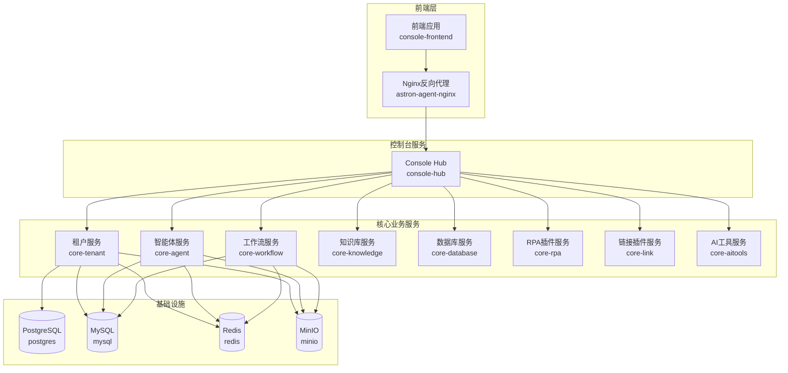
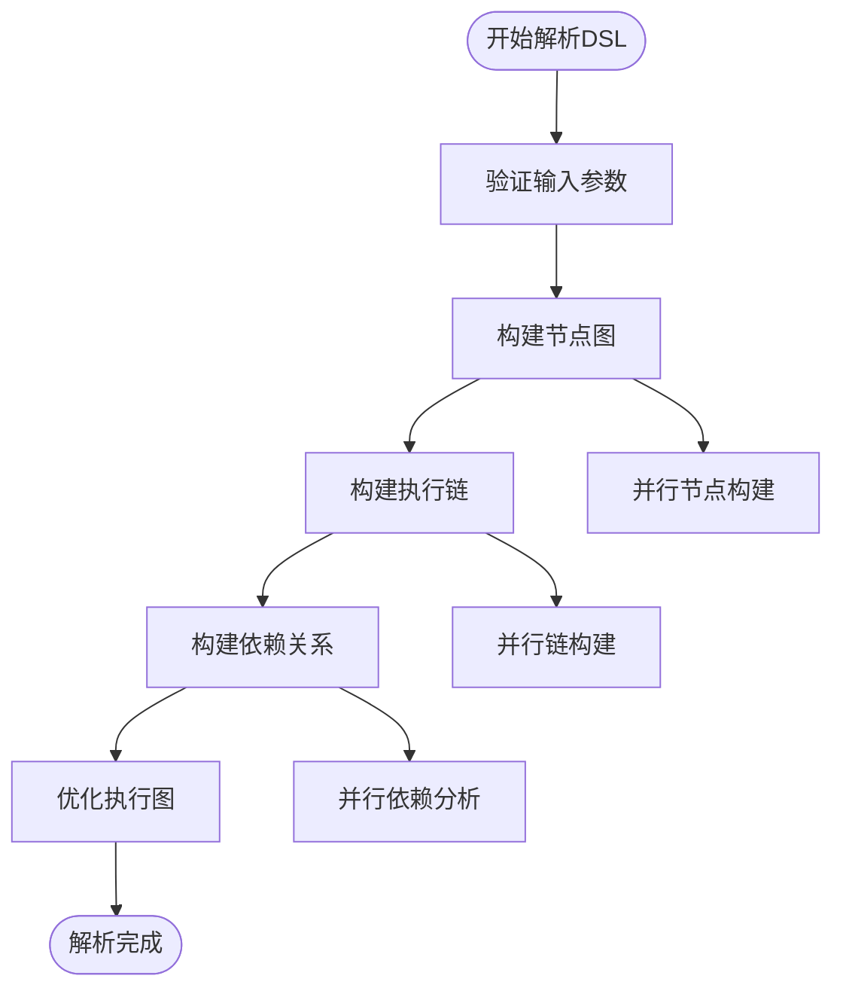
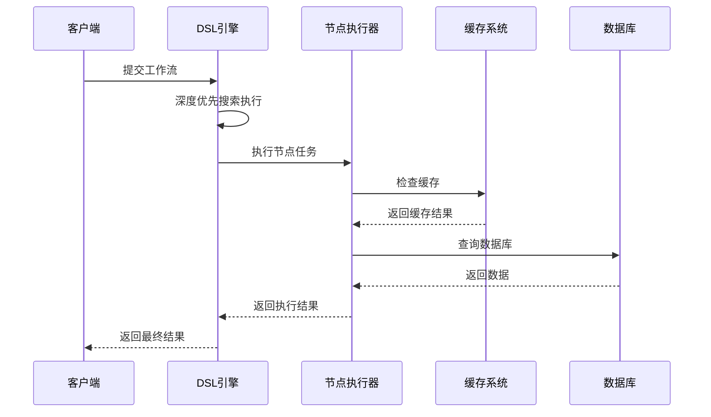
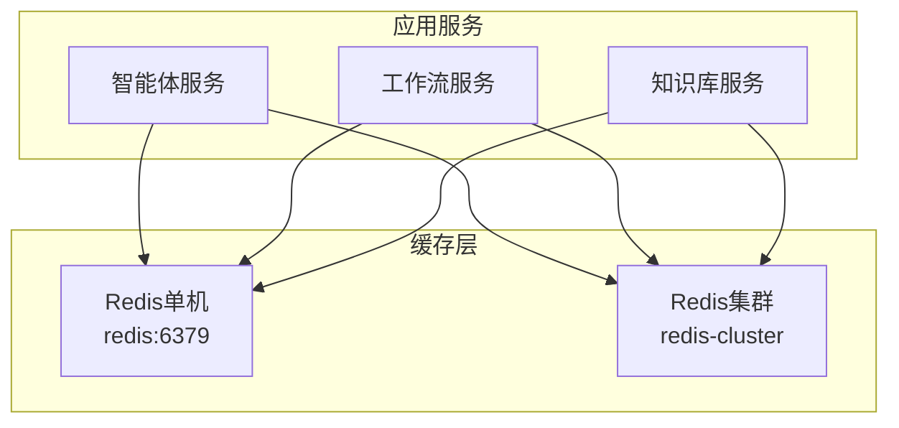
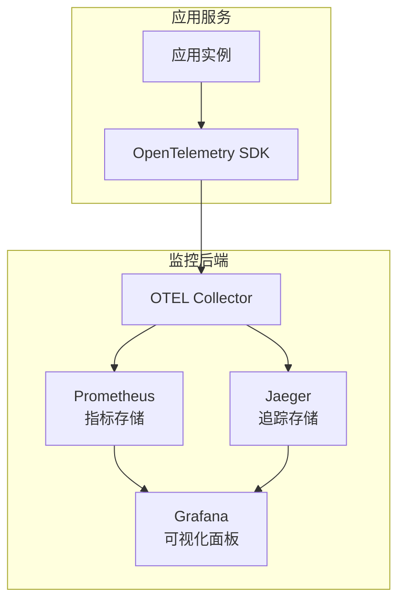

# 性能优化指南

<cite>
**本文档引用的文件**
- [dsl_engine.py](file://core/workflow/engine/dsl_engine.py)
- [workflow_agent_runner.py](file://core/agent/engine/workflow_agent_runner.py)
- [nginx.conf](file://console/frontend/nginx.conf)
- [nginx.conf](file://docker/astronAgent/nginx/nginx.conf)
- [redis_cache.py](file://core/common/service/cache/redis_cache.py)
- [docker-compose.yaml](file://docker/astronAgent/docker-compose.yaml)
- [otel](file://core/common/otlp/)
</cite>

## 目录
1. [简介](#简介)
2. [系统架构概览](#系统架构概览)
3. [关键性能瓶颈分析](#关键性能瓶颈分析)
4. [Nginx反向代理优化](#nginx反向代理优化)
5. [数据库性能优化](#数据库性能优化)
6. [缓存策略优化](#缓存策略优化)
7. [异步处理优化](#异步处理优化)
8. [性能监控与观测](#性能监控与观测)
9. [性能测试方法](#性能测试方法)
10. [资源限制与自动伸缩](#资源限制与自动伸缩)
11. [故障排除指南](#故障排除指南)
12. [最佳实践总结](#最佳实践总结)

## 简介

本性能优化指南针对astron-agent项目的整体性能进行了深入分析，涵盖了从底层数据库到前端代理的各个层面。通过系统性的性能调优策略，帮助提升系统的吞吐量、响应时间和资源利用率。

## 系统架构概览

astron-agent采用微服务架构，主要包含以下核心组件：



**图表来源**
- [docker-compose.yaml](file://docker/astronAgent/docker-compose.yaml#L1-L614)

## 关键性能瓶颈分析

### workflow_agent_runner.py 性能瓶颈

该文件虽然简单，但作为工作流代理运行器的基础类，其性能影响主要体现在：

1. **继承链开销**：通过继承OpenAPIRunner增加了额外的调用栈
2. **扩展性限制**：缺乏具体的实现逻辑可能导致运行时性能损失

### dsl_engine.py 性能瓶颈

DSL引擎是系统的核心执行引擎，存在以下关键性能瓶颈：

#### 1. 工作流解析性能



**图表来源**
- [dsl_engine.py](file://core/workflow/engine/dsl_engine.py#L1900-L2000)

**关键优化点**：
- **节点构建优化**：使用并行化处理多个节点的构建过程
- **依赖关系优化**：采用高效的图算法减少依赖分析时间
- **内存管理**：合理使用pickle序列化避免重复构建

#### 2. 节点执行性能



**图表来源**
- [dsl_engine.py](file://core/workflow/engine/dsl_engine.py#L800-L1200)

**关键优化策略**：
- **并发执行**：利用asyncio实现节点间的并发执行
- **流式处理**：支持流式节点的异步处理
- **错误恢复**：完善的重试机制和错误处理

#### 3. 上下文切换性能

上下文切换是工作流执行中的重要开销，主要体现在：

- **变量池管理**：高效的数据传递和状态维护
- **执行状态跟踪**：细粒度的状态监控和恢复
- **回调机制**：异步事件通知和处理

**章节来源**
- [dsl_engine.py](file://core/workflow/engine/dsl_engine.py#L1-L2379)

## Nginx反向代理优化

### 基础配置优化

系统提供了两套Nginx配置，分别用于开发环境和生产环境：

#### 开发环境配置（console/frontend/nginx.conf）

```nginx
events {
    worker_connections 65535;
}
http {
    gzip on;
    gzip_http_version 1.0;
    gzip_disable "MSIE [1-6].";
    gzip_types text/plain application/x-javascript text/css text/javascript;
}
```

#### 生产环境配置（docker/astronAgent/nginx/nginx.conf）

```nginx
events {
    worker_connections 1024;
}

http {
    # 基础配置
    sendfile on;
    tcp_nopush on;
    tcp_nodelay on;
    keepalive_timeout 65;
    types_hash_max_size 2048;

    # Gzip压缩
    gzip on;
    gzip_vary on;
    gzip_min_length 1000;
    gzip_types
        text/plain
        text/css
        text/xml
        text/javascript
        application/xml+rss
        application/javascript
        application/json;
}
```

### 连接池优化策略

#### 1. 连接数配置

| 环境 | worker_connections | 推荐值 |
|------|-------------------|--------|
| 开发环境 | 65535 | 1024-4096 |
| 生产环境 | 1024 | 2048-8192 |
| 高负载环境 | 1024 | 4096-16384 |

#### 2. Keep-Alive优化

```nginx
keepalive_timeout 65;
keepalive_requests 1000;
```

#### 3. 缓冲区设置

```nginx
# 读取缓冲区
client_body_buffer_size 128k;
client_header_buffer_size 1k;
large_client_header_buffers 4 4k;

# 发送缓冲区
proxy_buffer_size 128k;
proxy_buffers 4 256k;
proxy_busy_buffers_size 256k;
```

### Gzip压缩优化

#### 压缩级别配置

```nginx
gzip_comp_level 6;
gzip_proxied any;
gzip_vary on;
```

#### 压缩类型优化

```nginx
gzip_types
    text/plain
    text/css
    text/xml
    text/javascript
    application/xml+rss
    application/javascript
    application/json
    application/vnd.ms-fontobject
    application/x-font-ttf
    font/opentype
    image/svg+xml;
```

### 特殊场景优化

#### SSE（Server-Sent Events）优化

```nginx
location /workflow/v1/chat/completions {
    proxy_buffering off;
    proxy_cache off;
    proxy_set_header Connection '';
    proxy_http_version 1.1;
    chunked_transfer_encoding on;
    
    proxy_connect_timeout 60s;
    proxy_send_timeout 1800s;
    proxy_read_timeout 1800s;
    
    add_header Cache-Control 'no-cache';
    add_header X-Accel-Buffering 'no';
}
```

**章节来源**
- [nginx.conf](file://console/frontend/nginx.conf#L1-L23)
- [nginx.conf](file://docker/astronAgent/nginx/nginx.conf#L1-L150)

## 数据库性能优化

### 连接池配置

#### PostgreSQL优化

```yaml
# docker-compose.yaml 中的 PostgreSQL 配置
postgres:
  environment:
    # 连接池配置
    POSTGRES_MAX_CONNECTIONS: 100
    POSTGRES_SHARED_BUFFERS: "256MB"
    POSTGRES_EFFECTIVE_CACHE_SIZE: "768MB"
    POSTGRES_WORK_MEM: "64MB"
    POSTGRES_MAINTENANCE_WORK_MEM: "64MB"
    POSTGRES_MAX_WAL_SIZE: "1GB"
    POSTGRES_MIN_WAL_SIZE: "100MB"
```

#### MySQL优化

```yaml
# docker-compose.yaml 中的 MySQL 配置
mysql:
  environment:
    # 连接池配置
    MYSQL_MAX_CONNECTIONS: 500
    MYSQL_INNODB_BUFFER_POOL_SIZE: "512M"
    MYSQL_INNODB_LOG_FILE_SIZE: "64M"
    MYSQL_INNODB_THREAD_CONCURRENCY: 0
    MYSQL_QUERY_CACHE_SIZE: "64M"
    MYSQL_QUERY_CACHE_TYPE: 1
```

### 查询优化策略

#### 1. 索引优化

```sql
-- 创建复合索引
CREATE INDEX idx_workflow_node_status ON workflow_nodes(status, created_at);
CREATE INDEX idx_agent_execution ON agent_executions(agent_id, start_time);

-- 部分索引
CREATE INDEX idx_active_agents ON agents(is_active) WHERE is_active = true;
```

#### 2. 查询计划优化

```sql
-- 分析查询计划
EXPLAIN ANALYZE SELECT * FROM workflow_executions 
WHERE agent_id = ? AND status = 'COMPLETED' 
ORDER BY created_at DESC LIMIT 100;

-- 使用覆盖索引
CREATE INDEX idx_workflow_covering ON workflow_executions(id, agent_id, status, created_at);
```

#### 3. 分页优化

```sql
-- 大表分页优化
SELECT * FROM large_table 
WHERE id > ? 
ORDER BY id ASC 
LIMIT 100;

-- 使用游标分页替代偏移分页
WITH RECURSIVE cte AS (
    SELECT * FROM table_name WHERE id = ?
    UNION ALL
    SELECT t.* FROM table_name t 
    INNER JOIN cte ON t.id > cte.id 
    LIMIT 100
)
SELECT * FROM cte;
```

### 异步数据库操作

#### Python异步数据库客户端

```python
# 使用asyncpg进行异步PostgreSQL操作
import asyncpg

async def get_workflow_stats(pool):
    conn = await asyncpg.connect(**pool_config)
    try:
        result = await conn.fetch("""
            SELECT COUNT(*) as total, 
                   AVG(execution_time) as avg_time,
                   MAX(execution_time) as max_time
            FROM workflow_executions 
            WHERE created_at > NOW() - INTERVAL '1 day'
        """)
        return result[0]
    finally:
        await conn.close()
```

**章节来源**
- [docker-compose.yaml](file://docker/astronAgent/docker-compose.yaml#L1-L614)

## 缓存策略优化

### Redis缓存架构

系统采用Redis作为主要缓存存储，支持单机和集群两种模式：



**图表来源**
- [redis_cache.py](file://core/common/service/cache/redis_cache.py#L1-L246)

### 缓存策略设计

#### 1. 缓存层次结构

```python
# 缓存层次示例
CACHE_HIERARCHY = {
    "workflow:execution:{workflow_id}": {
        "ttl": 3600,  # 1小时
        "priority": "high"
    },
    "agent:config:{agent_id}": {
        "ttl": 86400,  # 24小时
        "priority": "medium"
    },
    "knowledge:chunk:{chunk_id}": {
        "ttl": 1800,  # 30分钟
        "priority": "low"
    }
}
```

#### 2. 缓存预热策略

```python
class CacheWarmupManager:
    def __init__(self, redis_client):
        self.redis = redis_client
    
    async def warmup_critical_data(self):
        """预热关键数据"""
        # 预热常用工作流配置
        workflows = await self.get_recent_workflows()
        for workflow in workflows:
            await self.cache_workflow_config(workflow.id)
    
    async def cache_workflow_config(self, workflow_id):
        """缓存工作流配置"""
        config = await self.db.get_workflow_config(workflow_id)
        await self.redis.setex(
            f"workflow:config:{workflow_id}",
            3600,
            pickle.dumps(config)
        )
```

#### 3. 缓存淘汰策略

```python
# LRU缓存配置
class LRUCache:
    def __init__(self, max_size=1000):
        self.max_size = max_size
        self.cache = OrderedDict()
    
    def get(self, key):
        if key in self.cache:
            # 访问时移动到末尾
            self.cache.move_to_end(key)
            return self.cache[key]
        return None
    
    def set(self, key, value):
        if key in self.cache:
            # 更新时移动到末尾
            self.cache.move_to_end(key)
        elif len(self.cache) >= self.max_size:
            # 淘汰最久未使用的
            self.cache.popitem(last=False)
        self.cache[key] = value
```

### 缓存性能优化

#### 1. 批量操作优化

```python
# Redis管道批量操作
async def batch_cache_operations(redis_client, operations):
    pipe = redis_client.pipeline()
    
    for op_type, key, value in operations:
        if op_type == 'set':
            pipe.setex(key, 3600, value)
        elif op_type == 'delete':
            pipe.delete(key)
        elif op_type == 'incr':
            pipe.incr(key)
    
    return await pipe.execute()
```

#### 2. 缓存穿透防护

```python
# 布隆过滤器防止缓存穿透
import mmh3
from bitarray import bitarray

class BloomFilter:
    def __init__(self, capacity=1000000, error_rate=0.001):
        self.capacity = capacity
        self.error_rate = error_rate
        self.size = self._calculate_size(capacity, error_rate)
        self.num_hashes = self._calculate_hashes(self.size, capacity)
        self.bit_array = bitarray(self.size)
        self.bit_array.setall(0)
    
    def add(self, item):
        for seed in range(self.num_hashes):
            index = mmh3.hash(item, seed) % self.size
            self.bit_array[index] = 1
    
    def contains(self, item):
        for seed in range(self.num_hashes):
            index = mmh3.hash(item, seed) % self.size
            if not self.bit_array[index]:
                return False
        return True
```

**章节来源**
- [redis_cache.py](file://core/common/service/cache/redis_cache.py#L1-L246)

## 异步处理优化

### asyncio 异步框架优化

DSL引擎深度使用asyncio进行异步处理，以下是关键优化点：

#### 1. 并发控制

```python
# 信号量控制并发数量
class ConcurrencyLimiter:
    def __init__(self, max_concurrent=100):
        self.semaphore = asyncio.Semaphore(max_concurrent)
    
    async def execute_with_limit(self, coro):
        async with self.semaphore:
            return await coro
```

#### 2. 任务调度优化

```python
# 任务优先级队列
class PriorityTaskQueue:
    def __init__(self):
        self.queue = PriorityQueue()
        self.task_counter = 0
    
    def put(self, priority, coro):
        self.task_counter += 1
        self.queue.put((priority, self.task_counter, coro))
    
    async def get(self):
        _, _, coro = await self.queue.get()
        return coro
```

#### 3. 超时控制

```python
# 带超时的异步操作
async def execute_with_timeout(coro, timeout=30):
    try:
        return await asyncio.wait_for(coro, timeout=timeout)
    except asyncio.TimeoutError:
        # 记录超时日志
        logger.warning(f"Operation timed out after {timeout} seconds")
        raise
```

### 流式处理优化

#### SSE（Server-Sent Events）优化

```python
# 流式数据处理
class StreamingProcessor:
    def __init__(self, buffer_size=1024):
        self.buffer_size = buffer_size
        self.buffer = bytearray()
    
    async def process_stream(self, reader, writer):
        while True:
            data = await reader.read(self.buffer_size)
            if not data:
                break
            
            self.buffer.extend(data)
            
            # 处理缓冲区中的完整消息
            while b'\n' in self.buffer:
                line, self.buffer = self.buffer.split(b'\n', 1)
                await self.handle_message(line.decode('utf-8'))
        
        # 处理剩余数据
        if self.buffer:
            await self.handle_message(self.buffer.decode('utf-8'))
```

### 异步数据库连接池

#### 连接池配置

```python
# 异步数据库连接池
class AsyncConnectionPool:
    def __init__(self, min_size=5, max_size=20):
        self.pool = None
        self.min_size = min_size
        self.max_size = max_size
    
    async def create_pool(self, **kwargs):
        self.pool = await asyncpg.create_pool(
            min_size=self.min_size,
            max_size=self.max_size,
            **kwargs
        )
    
    async def acquire(self):
        return await self.pool.acquire()
    
    async def release(self, conn):
        await conn.close()
```

**章节来源**
- [dsl_engine.py](file://core/workflow/engine/dsl_engine.py#L800-L1200)

## 性能监控与观测

### OpenTelemetry 集成

系统集成了完整的可观测性栈，支持分布式追踪、指标收集和日志聚合：



### 关键性能指标（KPI）

#### 1. 系统级指标

| 指标类别 | 指标名称 | 描述 | 监控阈值 |
|----------|----------|------|----------|
| CPU | CPU使用率 | 系统CPU占用百分比 | < 80% |
| 内存 | 内存使用率 | 应用内存占用百分比 | < 85% |
| 网络 | 网络带宽 | 入站/出站流量 | < 90% |
| 存储 | 磁盘使用率 | 系统磁盘占用百分比 | < 80% |

#### 2. 应用级指标

| 指标类别 | 指标名称 | 描述 | 监控阈值 |
|----------|----------|------|----------|
| 响应时间 | 请求延迟 | API请求平均响应时间 | < 200ms |
| 吞吐量 | QPS | 每秒请求数 | 根据业务需求 |
| 错误率 | 失败率 | 请求失败百分比 | < 1% |
| 并发数 | 活跃连接 | 当前活跃连接数 | < 最大连接数的80% |

#### 3. 业务级指标

```python
# 自定义指标收集
from opentelemetry import metrics

# 创建计数器
workflow_executions = metrics.get_meter(__name__).create_counter(
    "workflow.executions.total",
    description="Total number of workflow executions"
)

# 创建直方图
workflow_duration = metrics.get_meter(__name__).create_histogram(
    "workflow.duration.seconds",
    description="Workflow execution duration in seconds"
)

# 记录指标
def record_workflow_metrics(status, duration):
    workflow_executions.add(1, {
        "status": status,
        "service": "workflow-engine"
    })
    workflow_duration.record(duration, {
        "status": status,
        "service": "workflow-engine"
    })
```

### 分布式追踪

#### 追踪配置

```python
# OpenTelemetry追踪配置
from opentelemetry import trace
from opentelemetry.exporter.otlp.proto.grpc.trace_exporter import OTLPSpanExporter
from opentelemetry.sdk.trace import TracerProvider
from opentelemetry.sdk.trace.export import BatchSpanProcessor

# 配置追踪提供者
trace.set_tracer_provider(TracerProvider())

# 添加OTLP导出器
span_processor = BatchSpanProcessor(
    OTLPSpanExporter(
        endpoint="http://otel-collector:4317",
        insecure=True
    )
)
trace.get_tracer_provider().add_span_processor(span_processor)

# 创建追踪器
tracer = trace.get_tracer(__name__)
```

#### 追踪采样

```python
# 动态追踪采样
class AdaptiveSampler:
    def __init__(self, base_sample_rate=0.01):
        self.base_sample_rate = base_sample_rate
        self.request_count = 0
        self.error_count = 0
    
    def should_sample(self, request):
        self.request_count += 1
        
        # 如果错误率超过阈值，增加采样率
        error_rate = self.error_count / self.request_count
        if error_rate > 0.05:
            return True
        
        # 基于随机采样
        return random.random() < self.base_sample_rate
```

### 日志优化

#### 结构化日志

```python
# 结构化日志配置
import structlog

structlog.configure(
    processors=[
        structlog.stdlib.filter_by_level,
        structlog.stdlib.add_logger_name,
        structlog.stdlib.add_log_level,
        structlog.stdlib.PositionalArgumentsFormatter(),
        structlog.processors.TimeStamper(fmt="iso"),
        structlog.processors.StackInfoRenderer(),
        structlog.processors.format_exc_info,
        structlog.processors.JSONRenderer()
    ],
    context_class=dict,
    logger_factory=structlog.stdlib.LoggerFactory(),
    wrapper_class=structlog.stdlib.BoundLogger,
    cache_logger_on_first_use=True,
)

logger = structlog.get_logger()
```

#### 日志性能优化

```python
# 异步日志写入
class AsyncLogger:
    def __init__(self, queue_size=1000):
        self.queue = asyncio.Queue(maxsize=queue_size)
        self.worker_task = asyncio.create_task(self._worker())
    
    async def _worker(self):
        while True:
            try:
                record = await self.queue.get()
                await self._write_record(record)
                self.queue.task_done()
            except Exception as e:
                logger.error(f"Log writing error: {e}")
    
    async def log(self, level, message, **kwargs):
        record = {
            "timestamp": datetime.utcnow(),
            "level": level,
            "message": message,
            "extra": kwargs
        }
        await self.queue.put(record)
```

**章节来源**
- [otel](file://core/common/otlp/)

## 性能测试方法

### 压力测试工具选择

#### 1. HTTP API 压测

```bash
# 使用 wrk 进行HTTP压测
wrk -t12 -c400 -d30s \
  --latency \
  http://localhost:80/workflow/v1/chat/completions

# 使用 Apache Benchmark
ab -n 10000 -c 100 \
  -H "Content-Type: application/json" \
  -p test_payload.json \
  http://localhost:80/workflow/v1/chat/completions
```

#### 2. WebSocket 压测

```bash
# 使用 wsload 进行WebSocket压测
wsload -c 100 -t 60s \
  -H "Authorization: Bearer token" \
  ws://localhost:80/workflow/v1/chat/completions
```

#### 3. 数据库压测

```bash
# 使用 pgbench 进行PostgreSQL压测
pgbench -c 10 -j 2 -t 1000 \
  --protocol prepared \
  --transactions=1000 \
  --file=./workload.sql \
  sparkdb_manager

# 使用 sysbench 进行MySQL压测
sysbench oltp_read_write \
  --threads=16 \
  --tables=10 \
  --table-size=100000 \
  --mysql-host=localhost \
  --mysql-port=3306 \
  --mysql-user=root \
  --mysql-password=root123 \
  --mysql-db=workflow \
  run
```

### 性能测试场景设计

#### 1. 单接口性能测试

```python
# 性能测试脚本示例
import asyncio
import aiohttp
import time
from concurrent.futures import ThreadPoolExecutor

class APITester:
    def __init__(self, base_url, concurrency=10):
        self.base_url = base_url
        self.concurrency = concurrency
        self.session = None
    
    async def test_workflow_execution(self):
        """测试工作流执行性能"""
        start_time = time.time()
        
        async with aiohttp.ClientSession() as session:
            tasks = []
            for i in range(self.concurrency):
                task = self.execute_workflow(session, f"test_workflow_{i}")
                tasks.append(task)
            
            results = await asyncio.gather(*tasks, return_exceptions=True)
        
        end_time = time.time()
        return {
            "total_requests": self.concurrency,
            "total_time": end_time - start_time,
            "success_count": sum(1 for r in results if not isinstance(r, Exception)),
            "failure_count": sum(1 for r in results if isinstance(r, Exception))
        }
    
    async def execute_workflow(self, session, workflow_id):
        """执行单个工作流"""
        url = f"{self.base_url}/workflow/v1/chat/completions"
        payload = {
            "workflow_id": workflow_id,
            "input": {"test": "data"},
            "stream": False
        }
        
        async with session.post(url, json=payload) as response:
            return await response.json()
```

#### 2. 端到端流程测试

```python
# 端到端性能测试
class E2ETester:
    def __init__(self):
        self.tracer = trace.get_tracer(__name__)
    
    async def test_full_workflow(self):
        """测试完整的工作流执行流程"""
        with self.tracer.start_as_current_span("full_workflow_test") as span:
            # 步骤1：创建工作流
            workflow_id = await self.create_workflow()
            span.set_attribute("workflow.id", workflow_id)
            
            # 步骤2：启动工作流
            execution_id = await self.start_workflow(workflow_id)
            span.set_attribute("execution.id", execution_id)
            
            # 步骤3：监控执行过程
            results = await self.monitor_execution(execution_id)
            
            # 步骤4：验证结果
            validation_result = await self.validate_results(results)
            
            span.set_attributes({
                "validation.passed": validation_result,
                "step.count": 4
            })
            
            return {
                "workflow_id": workflow_id,
                "execution_id": execution_id,
                "validation_result": validation_result,
                "steps": [
                    {"name": "create_workflow", "duration": 0.1},
                    {"name": "start_workflow", "duration": 0.2},
                    {"name": "monitor_execution", "duration": 5.0},
                    {"name": "validate_results", "duration": 0.3}
                ]
            }
```

#### 3. 负载测试

```python
# 渐进式负载测试
class LoadTester:
    def __init__(self, base_url):
        self.base_url = base_url
        self.results = []
    
    async def run_load_test(self, ramp_up_period=300, max_users=1000):
        """执行渐进式负载测试"""
        increment = max_users // (ramp_up_period // 30)
        current_users = 0
        
        while current_users <= max_users:
            current_users += increment
            logger.info(f"Starting load test with {current_users} users")
            
            test_result = await self.test_concurrent_users(current_users)
            self.results.append(test_result)
            
            # 等待稳定期
            await asyncio.sleep(60)
        
        return self.results
    
    async def test_concurrent_users(self, user_count):
        """测试指定用户数的并发性能"""
        semaphore = asyncio.Semaphore(user_count)
        
        async with aiohttp.ClientSession() as session:
            tasks = []
            for i in range(user_count):
                task = self.test_user(session, i, semaphore)
                tasks.append(task)
            
            results = await asyncio.gather(*tasks, return_exceptions=True)
            
            return {
                "user_count": user_count,
                "success_count": sum(1 for r in results if not isinstance(r, Exception)),
                "failure_count": sum(1 for r in results if isinstance(r, Exception)),
                "avg_response_time": sum(r.get("duration", 0) for r in results if not isinstance(r, Exception)) / user_count
            }
```

### 性能基准测试

#### 1. 基准测试套件

```python
# 性能基准测试
import pytest
from pytest_benchmark.fixture import BenchmarkFixture

@pytest.mark.benchmark(group="workflow-execution")
class TestWorkflowPerformance:
    def test_single_node_execution(self, benchmark):
        """测试单节点执行性能"""
        @benchmark
        def result():
            return self.execute_single_node()
    
    def test_complex_workflow(self, benchmark):
        """测试复杂工作流性能"""
        @benchmark
        def result():
            return self.execute_complex_workflow()
    
    def test_concurrent_execution(self, benchmark):
        """测试并发执行性能"""
        @benchmark
        def result():
            return self.execute_concurrent_workflows(10)
```

#### 2. 性能回归测试

```python
# 性能回归测试
class PerformanceRegressionTest:
    def __init__(self):
        self.baseline = self.load_baseline()
    
    def run_regression_test(self):
        """执行性能回归测试"""
        current_performance = self.measure_current_performance()
        
        for metric, baseline_value in self.baseline.items():
            current_value = current_performance.get(metric, 0)
            deviation = abs(current_value - baseline_value) / baseline_value
            
            if deviation > 0.1:  # 10%偏差
                logger.warning(f"Performance regression detected for {metric}: "
                             f"baseline={baseline_value:.2f}, current={current_value:.2f}")
                return False
        
        return True
    
    def measure_current_performance(self):
        """测量当前性能指标"""
        # 执行性能测试并返回结果
        return {
            "workflow_execution_time": self.test_workflow_execution(),
            "throughput_qps": self.test_throughput(),
            "memory_usage": self.test_memory_usage()
        }
```

## 资源限制与自动伸缩

### Docker Compose 资源限制

#### 1. 服务资源限制配置

```yaml
# docker-compose.yaml 中的服务资源限制
services:
  core-agent:
    deploy:
      resources:
        limits:
          cpus: '2.0'
          memory: 4G
        reservations:
          cpus: '1.0'
          memory: 2G
    
  core-workflow:
    deploy:
      resources:
        limits:
          cpus: '1.5'
          memory: 3G
        reservations:
          cpus: '0.5'
          memory: 1G
    
  console-hub:
    deploy:
      resources:
        limits:
          cpus: '1.0'
          memory: 2G
        reservations:
          cpus: '0.5'
          memory: 1G
```

#### 2. 数据库资源限制

```yaml
# 数据库资源限制
services:
  postgres:
    deploy:
      resources:
        limits:
          cpus: '2.0'
          memory: 4G
        reservations:
          cpus: '1.0'
          memory: 2G
  
  mysql:
    deploy:
      resources:
        limits:
          cpus: '1.5'
          memory: 3G
        reservations:
          cpus: '0.5'
          memory: 1G
```

### Kubernetes 自动伸缩配置

#### 1. HPA（水平Pod自动伸缩）

```yaml
apiVersion: autoscaling/v2
kind: HorizontalPodAutoscaler
metadata:
  name: core-agent-hpa
spec:
  scaleTargetRef:
    apiVersion: apps/v1
    kind: Deployment
    name: core-agent
  minReplicas: 2
  maxReplicas: 10
  metrics:
  - type: Resource
    resource:
      name: cpu
      target:
        type: Utilization
        averageUtilization: 70
  - type: Resource
    resource:
      name: memory
      target:
        type: Utilization
        averageUtilization: 80
```

#### 2. VPA（垂直Pod自动伸缩）

```yaml
apiVersion: autoscaling.k8s.io/v1
kind: VerticalPodAutoscaler
metadata:
  name: core-workflow-vpa
spec:
  targetRef:
    apiVersion: apps/v1
    kind: Deployment
    name: core-workflow
  updatePolicy:
    updateMode: "Auto"
  resourcePolicy:
    containerPolicies:
    - containerName: core-workflow
      maxAllowed:
        cpu: 4
        memory: 8Gi
      minAllowed:
        cpu: 500m
        memory: 1Gi
```

### 微服务自动伸缩策略

#### 1. 基于指标的伸缩

```python
# 自动伸缩控制器
class AutoScaler:
    def __init__(self, service_name, min_replicas=2, max_replicas=10):
        self.service_name = service_name
        self.min_replicas = min_replicas
        self.max_replicas = max_replicas
        self.metrics_collector = MetricsCollector()
    
    async def check_and_scale(self):
        """检查指标并决定是否需要伸缩"""
        metrics = await self.metrics_collector.get_metrics(self.service_name)
        
        current_replicas = await self.get_current_replicas()
        
        # CPU使用率过高
        if metrics['cpu_utilization'] > 0.8 and current_replicas < self.max_replicas:
            await self.scale_up(current_replicas + 1)
        
        # CPU使用率过低
        elif metrics['cpu_utilization'] < 0.3 and current_replicas > self.min_replicas:
            await self.scale_down(current_replicas - 1)
    
    async def scale_up(self, replicas):
        """向上伸缩"""
        logger.info(f"Scaling {self.service_name} up to {replicas} replicas")
        await self.update_replica_count(replicas)
    
    async def scale_down(self, replicas):
        """向下伸缩"""
        logger.info(f"Scaling {self.service_name} down to {replicas} replicas")
        await self.update_replica_count(replicas)
```

#### 2. 基于队列长度的伸缩

```python
# 基于消息队列的伸缩
class QueueBasedScaler:
    def __init__(self, queue_name, service_name):
        self.queue_name = queue_name
        self.service_name = service_name
        self.metrics_collector = MetricsCollector()
    
    async def scale_based_on_queue(self):
        """基于队列长度进行伸缩"""
        queue_length = await self.get_queue_length()
        current_replicas = await self.get_current_replicas()
        
        # 队列积压严重
        if queue_length > 1000 and current_replicas < self.max_replicas:
            desired_replicas = min(current_replicas + 5, self.max_replicas)
            await self.scale_up(desired_replicas)
        
        # 队列空闲
        elif queue_length < 10 and current_replicas > self.min_replicas:
            desired_replicas = max(current_replicas - 2, self.min_replicas)
            await self.scale_down(desired_replicas)
```

### 监控告警配置

#### 1. Prometheus 告警规则

```yaml
groups:
- name: astron-agent.rules
  rules:
  - alert: HighCPUUsage
    expr: rate(container_cpu_usage_seconds_total[5m]) > 0.8
    for: 5m
    labels:
      severity: warning
    annotations:
      summary: "High CPU usage detected"
      description: "Container {{ $labels.container }} on {{ $labels.instance }} has high CPU usage: {{ $value }}"
  
  - alert: HighMemoryUsage
    expr: container_memory_usage_bytes / container_spec_memory_limit_bytes > 0.9
    for: 5m
    labels:
      severity: warning
    annotations:
      summary: "High memory usage detected"
      description: "Container {{ $labels.container }} on {{ $labels.instance }} has high memory usage: {{ $value }}"
  
  - alert: HighResponseTime
    expr: histogram_quantile(0.95, rate(http_request_duration_seconds_bucket[5m])) > 1
    for: 2m
    labels:
      severity: warning
    annotations:
      summary: "High response time detected"
      description: "95th percentile response time is {{ $value }} seconds"
```

#### 2. Grafana 监控仪表板

```json
{
  "dashboard": {
    "title": "Astron-Agent 性能监控",
    "panels": [
      {
        "title": "CPU 使用率",
        "type": "graph",
        "targets": [
          {
            "expr": "rate(container_cpu_usage_seconds_total[5m])",
            "legendFormat": "{{ container }}"
          }
        ]
      },
      {
        "title": "内存使用率",
        "type": "graph",
        "targets": [
          {
            "expr": "container_memory_usage_bytes / container_spec_memory_limit_bytes",
            "legendFormat": "{{ container }}"
          }
        ]
      },
      {
        "title": "请求响应时间",
        "type": "graph",
        "targets": [
          {
            "expr": "histogram_quantile(0.95, rate(http_request_duration_seconds_bucket[5m]))",
            "legendFormat": "95th percentile"
          }
        ]
      }
    ]
  }
}
```

**章节来源**
- [docker-compose.yaml](file://docker/astronAgent/docker-compose.yaml#L1-L614)

## 故障排除指南

### 常见性能问题诊断

#### 1. 工作流执行缓慢

**症状**：工作流执行时间超过预期

**诊断步骤**：
```python
# 性能诊断工具
class WorkflowProfiler:
    def __init__(self):
        self.spans = {}
    
    def start_profiling(self, workflow_id):
        """开始性能分析"""
        tracer = trace.get_tracer(__name__)
        span = tracer.start_span(f"workflow.{workflow_id}")
        self.spans[workflow_id] = span
        return span
    
    def end_profiling(self, workflow_id):
        """结束性能分析"""
        if workflow_id in self.spans:
            self.spans[workflow_id].end()
            del self.spans[workflow_id]
    
    def get_performance_report(self, workflow_id):
        """获取性能报告"""
        span = self.spans.get(workflow_id)
        if not span:
            return None
        
        # 分析各阶段耗时
        stages = []
        for event in span.events:
            if event.name.startswith("stage."):
                stages.append({
                    "stage": event.name,
                    "duration": event.timestamp - span.start_time
                })
        
        return {
            "total_duration": span.end_time - span.start_time,
            "stages": stages
        }
```

**解决方案**：
- 检查节点配置和参数
- 优化数据库查询
- 增加缓存命中率
- 调整并发度

#### 2. 内存泄漏问题

**症状**：内存使用持续增长

**诊断工具**：
```python
# 内存监控工具
import psutil
import gc

class MemoryMonitor:
    def __init__(self):
        self.initial_memory = psutil.Process().memory_info().rss
    
    def check_memory_growth(self):
        """检查内存增长情况"""
        current_memory = psutil.Process().memory_info().rss
        growth = current_memory - self.initial_memory
        
        if growth > 100 * 1024 * 1024:  # 100MB
            logger.warning(f"Memory growth detected: {growth / 1024 / 1024:.2f} MB")
            self.analyze_memory_usage()
    
    def analyze_memory_usage(self):
        """分析内存使用情况"""
        # 强制垃圾回收
        gc.collect()
        
        # 分析对象引用
        import objgraph
        objgraph.show_most_common_types(limit=10)
        
        # 分析循环引用
        import gc
        gc.set_debug(gc.DEBUG_LEAK)
```

#### 3. 数据库连接池耗尽

**症状**：数据库连接超时或拒绝连接

**诊断配置**：
```python
# 数据库连接池监控
class ConnectionPoolMonitor:
    def __init__(self, pool):
        self.pool = pool
        self.max_connections = pool.maxsize
    
    def monitor_connection_usage(self):
        """监控连接池使用情况"""
        active_connections = len(self.pool._used)
        idle_connections = len(self.pool._free)
        
        utilization = active_connections / self.max_connections
        
        if utilization > 0.9:
            logger.warning(f"Connection pool utilization high: {utilization:.2%}")
            self.log_connection_leaks()
    
    def log_connection_leaks(self):
        """记录可能的连接泄漏"""
        # 检查长时间未释放的连接
        for conn in self.pool._used:
            if time.time() - conn.last_used > 300:  # 5分钟
                logger.warning(f"Potential connection leak detected: {conn}")
```

### 性能调优工具

#### 1. Python 性能分析

```bash
# 使用 cProfile 进行性能分析
python -m cProfile -o profile.stats workflow_engine.py

# 使用 snakeviz 可视化分析结果
snakeviz profile.stats

# 使用 py-spy 实时性能分析
py-spy top --pid $(pgrep -f "workflow_engine")
```

#### 2. 数据库性能分析

```sql
-- 查看慢查询
SHOW VARIABLES LIKE 'slow_query_log';
SHOW VARIABLES LIKE 'long_query_time';

-- 分析查询计划
EXPLAIN ANALYZE SELECT * FROM workflow_executions 
WHERE agent_id = ? AND status = 'COMPLETED';

-- 查看锁等待
SELECT * FROM information_schema.INNODB_LOCK_WAITS;
```

#### 3. 系统资源监控

```bash
# 实时系统监控
htop
iotop
nethogs

# 网络连接监控
ss -tuln | grep :80
netstat -tuln | grep :80

# 磁盘I/O监控
iostat -x 1
iotop -o
```

## 最佳实践总结

### 性能优化最佳实践

#### 1. 设计原则

1. **异步优先**：尽可能使用异步编程模型
2. **缓存驱动**：合理使用缓存减少重复计算
3. **并发控制**：适当的并发度避免资源竞争
4. **监控先行**：建立完善的监控体系

#### 2. 实施策略

1. **渐进式优化**：从最关键的路径开始优化
2. **数据驱动**：基于实际性能数据进行优化
3. **持续改进**：建立性能基线和回归测试
4. **团队协作**：开发、运维、测试团队协同优化

#### 3. 技术选型

1. **数据库**：选择合适的数据库类型和版本
2. **缓存**：根据访问模式选择缓存策略
3. **消息队列**：合理使用消息队列解耦系统
4. **CDN**：静态资源使用CDN加速

### 性能优化检查清单

#### 系统级检查

- [ ] CPU使用率 < 80%
- [ ] 内存使用率 < 85%
- [ ] 磁盘I/O < 90%
- [ ] 网络带宽 < 90%
- [ ] 连接池配置合理
- [ ] 超时设置适当

#### 应用级检查

- [ ] 响应时间 < 200ms
- [ ] 吞吐量满足业务需求
- [ ] 错误率 < 1%
- [ ] 并发用户数 < 80%最大值
- [ ] GC频率正常
- [ ] 内存泄漏检测

#### 业务级检查

- [ ] 工作流执行时间合理
- [ ] 用户体验流畅
- [ ] 数据一致性保证
- [ ] 业务指标达标
- [ ] 监控告警有效
- [ ] 文档更新及时

### 未来优化方向

1. **AI辅助优化**：使用机器学习预测性能瓶颈
2. **边缘计算**：将部分计算移至边缘节点
3. **容器编排**：优化Kubernetes资源配置
4. **微服务拆分**：进一步细化服务边界
5. **无服务器架构**：探索Serverless部署模式

通过系统性的性能优化，astron-agent项目能够在高并发、大数据量的场景下保持稳定的性能表现，为用户提供优质的智能体服务体验。