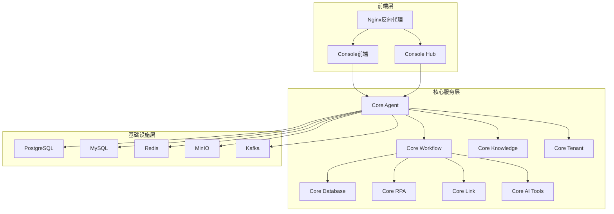
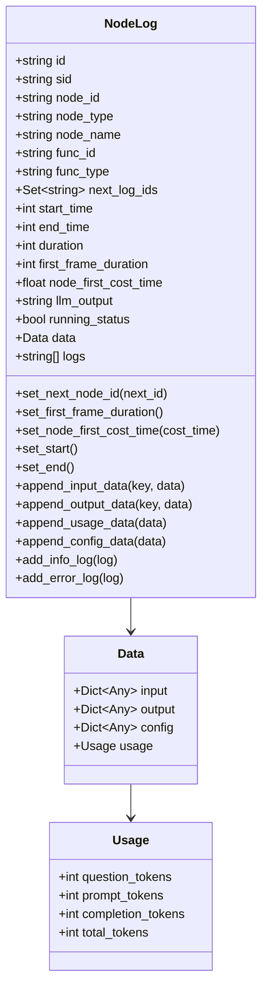
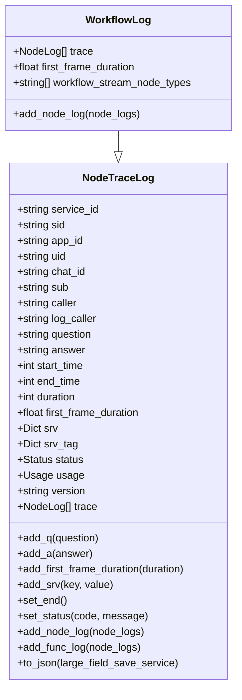
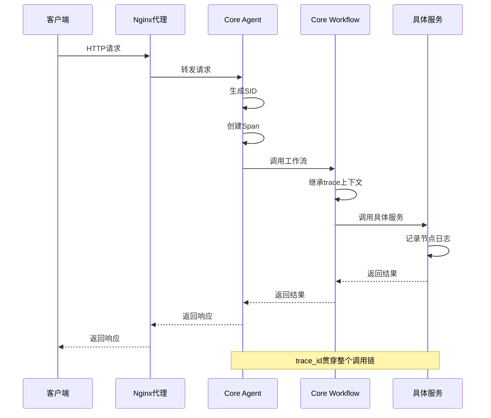
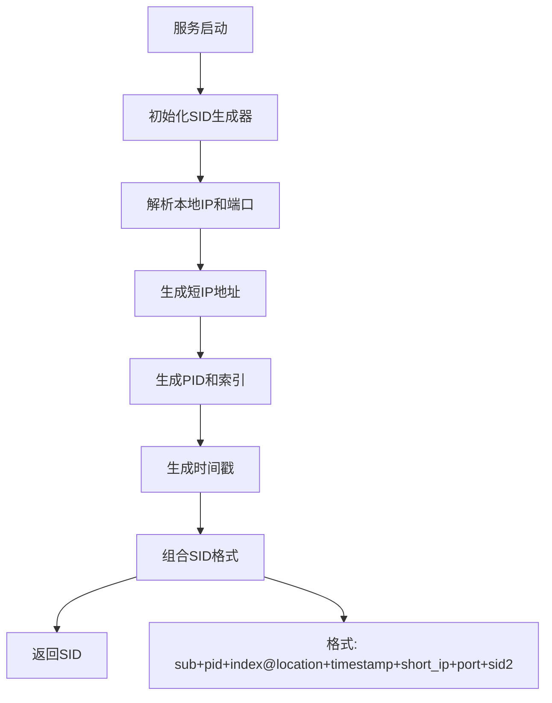
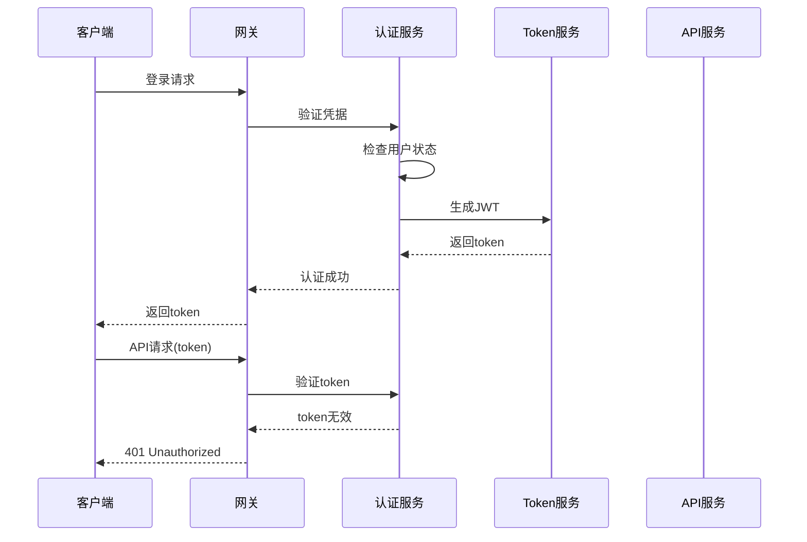
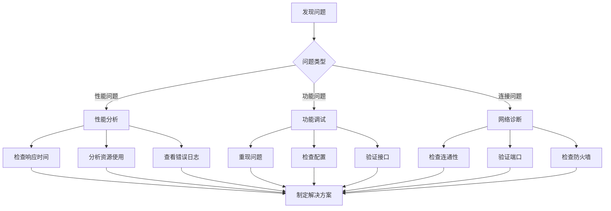

# 日志分析指南

<cite>
**本文档引用的文件**
- [node_log.py](file://core/common/otlp/log_trace/node_log.py)
- [workflow_log.py](file://core/common/otlp/log_trace/workflow_log.py)
- [node_trace_log.py](file://core/common/otlp/log_trace/node_trace_log.py)
- [base.py](file://core/common/otlp/log_trace/base.py)
- [span.py](file://core/common/otlp/trace/span.py)
- [trace.py](file://core/common/otlp/trace/trace.py)
- [sid.py](file://core/common/otlp/sid.py)
- [logger_service.py](file://core/common/service/log/logger_service.py)
- [nginx.conf](file://docker/astronAgent/nginx/nginx.conf)
- [docker-compose.yaml](file://docker/astronAgent/docker-compose.yaml)
</cite>

## 目录
1. [简介](#简介)
2. [项目结构概述](#项目结构概述)
3. [核心日志组件](#核心日志组件)
4. [分布式追踪架构](#分布式追踪架构)
5. [日志结构分析](#日志结构分析)
6. [命令行工具分析技巧](#命令行工具分析技巧)
7. [集中式日志平台集成](#集中式日志平台集成)
8. [典型问题分析案例](#典型问题分析案例)
9. [性能优化建议](#性能优化建议)
10. [故障排除指南](#故障排除指南)

## 简介

本指南基于astron-agent项目的日志分析体系，提供了从原始日志到问题诊断的完整分析流程。该项目采用OpenTelemetry标准构建了完整的分布式追踪系统，支持端到端的请求链路追踪和性能监控。

## 项目结构概述

astron-agent项目采用微服务架构，包含多个核心服务模块：



**图表来源**
- [docker-compose.yaml](file://docker/astronAgent/docker-compose.yaml#L1-L614)

## 核心日志组件

### 节点日志 (NodeLog)

节点日志记录单个处理节点的详细信息，包括输入输出、配置参数和性能指标。



**图表来源**
- [node_log.py](file://core/common/otlp/log_trace/node_log.py#L1-L158)
- [base.py](file://core/common/otlp/log_trace/base.py#L1-L9)

### 工作流日志 (WorkflowLog)

工作流日志聚合多个节点日志，提供整个工作流的执行轨迹。



**图表来源**
- [workflow_log.py](file://core/common/otlp/log_trace/workflow_log.py#L1-L29)
- [node_trace_log.py](file://core/common/otlp/log_trace/node_trace_log.py#L1-L128)

**章节来源**
- [node_log.py](file://core/common/otlp/log_trace/node_log.py#L1-L158)
- [workflow_log.py](file://core/common/otlp/log_trace/workflow_log.py#L1-L29)
- [node_trace_log.py](file://core/common/otlp/log_trace/node_trace_log.py#L1-L128)

## 分布式追踪架构

### OpenTelemetry集成

项目采用OpenTelemetry标准实现分布式追踪，支持trace_id关联和跨服务调用追踪。



**图表来源**
- [span.py](file://core/common/otlp/trace/span.py#L1-L277)
- [trace.py](file://core/common/otlp/trace/trace.py#L1-L127)

### SID生成机制

服务标识符(SID)用于唯一标识每个服务实例，支持分布式环境下的请求追踪。



**图表来源**
- [sid.py](file://core/common/otlp/sid.py#L1-L51)

**章节来源**
- [span.py](file://core/common/otlp/trace/span.py#L1-L277)
- [trace.py](file://core/common/otlp/trace/trace.py#L1-L127)
- [sid.py](file://core/common/otlp/sid.py#L1-L51)

## 日志结构分析

### 日志级别定义

系统定义了完整的日志级别体系：

| 级别 | 描述 | 使用场景 |
|------|------|----------|
| DEBUG | 调试信息 | 开发阶段详细调试 |
| INFO | 一般信息 | 正常操作记录 |
| WARN | 警告信息 | 潜在问题提醒 |
| ERROR | 错误信息 | 异常情况记录 |

### 日志字段详解

#### 节点日志字段

| 字段名 | 类型 | 描述 | 示例值 |
|--------|------|------|--------|
| id | string | 节点唯一标识 | "abc123def456" |
| sid | string | 服务标识符 | "agent123456@bj20241201" |
| node_id | string | 节点ID | "node:chat:123" |
| node_type | string | 节点类型 | "chat" |
| node_name | string | 节点名称 | "聊天节点" |
| start_time | int | 开始时间戳(ms) | 1701234567890 |
| end_time | int | 结束时间戳(ms) | 1701234568900 |
| duration | int | 执行时长(ms) | 1010 |
| first_frame_duration | int | 首帧耗时(ms) | 500 |
| running_status | bool | 运行状态 | true |

#### 工作流日志字段

| 字段名 | 类型 | 描述 | 示例值 |
|--------|------|------|--------|
| service_id | string | 服务ID | "service:workflow:123" |
| app_id | string | 应用ID | "app:spark:123" |
| uid | string | 用户ID | "user:123456" |
| chat_id | string | 会话ID | "chat:abcdef123" |
| question | string | 用户问题 | "今天的天气怎么样？" |
| answer | string | 系统回答 | "今天晴转多云..." |
| first_frame_duration | float | 首响时间 | 1.234 |
| usage | Usage | 使用统计 | {"total_tokens": 150, "prompt_tokens": 100} |

**章节来源**
- [node_log.py](file://core/common/otlp/log_trace/node_log.py#L1-L158)
- [node_trace_log.py](file://core/common/otlp/log_trace/node_trace_log.py#L1-L128)
- [base.py](file://core/common/otlp/log_trace/base.py#L1-L9)

## 命令行工具分析技巧

### Nginx访问日志分析

#### 基础过滤技巧

使用grep快速筛选特定类型的请求：

```bash
# 筛选错误请求(状态码>=400)
grep -E '\[ERROR\]|status [45][0-9]{2}' /var/log/nginx/access.log

# 筛选特定API路径
grep '/api/' /var/log/nginx/access.log

# 筛选慢请求(响应时间>1秒)
awk '$NF > 1000' /var/log/nginx/access.log
```

#### 高频请求识别

```bash
# 统计最频繁的URL路径
awk '{print $7}' /var/log/nginx/access.log | sort | uniq -c | sort -nr | head -10

# 统计HTTP方法分布
awk '{print $6}' /var/log/nginx/access.log | tr -d '"' | sort | uniq -c | sort -nr

# 统计客户端IP访问频率
awk '{print $1}' /var/log/nginx/access.log | sort | uniq -c | sort -nr | head -10
```

#### 性能分析

```bash
# 提取响应时间和请求URI
awk '{print $NF, $7}' /var/log/nginx/access.log | while read time uri; do
    echo "$uri $time ms"
done

# 找出最慢的10个请求
awk '{print $NF, $7}' /var/log/nginx/access.log | sort -nr | head -10

# 统计不同状态码的数量
awk '{print $9}' /var/log/nginx/access.log | sort | uniq -c | sort -nr
```

### 日志格式解析

Nginx日志格式配置示例：

```nginx
log_format main '$remote_addr - $remote_user [$time_local] "$request" '
                '$status $body_bytes_sent "$http_referer" '
                '"$http_user_agent" "$http_x_forwarded_for"';
```

对应的字段含义：
- `$remote_addr`: 客户端IP
- `$remote_user`: 认证用户名
- `$time_local`: 请求时间
- `$request`: 完整请求行
- `$status`: HTTP状态码
- `$body_bytes_sent`: 发送字节数
- `$http_referer`: 引用页面
- `$http_user_agent`: 用户代理
- `$http_x_forwarded_for`: 代理链信息

### 大规模日志处理

对于生产环境的大量日志文件，推荐使用以下策略：

```bash
# 使用zcat处理压缩日志
zcat /var/log/nginx/access.log.*.gz | grep 'error' | head -100

# 分块处理避免内存溢出
split -l 100000 access.log access_part_
for file in access_part_*; do
    grep 'ERROR' "$file" >> errors.log
done

# 并行处理多个日志文件
find /var/log/nginx -name "*.log" -exec grep -l 'timeout' {} \; | \
xargs -P 4 -I {} sh -c 'grep "ERROR" {} > {}.errors'
```

**章节来源**
- [nginx.conf](file://docker/astronAgent/nginx/nginx.conf#L1-L31)

## 集中式日志平台集成

### ELK Stack配置

#### Elasticsearch索引配置

```yaml
# 日志索引模板
PUT _index_template/astron_agent_logs
{
  "index_patterns": ["astron-agent-*"],
  "template": {
    "settings": {
      "number_of_shards": 3,
      "number_of_replicas": 1,
      "refresh_interval": "30s"
    },
    "mappings": {
      "properties": {
        "@timestamp": {
          "type": "date"
        },
        "service_id": {
          "type": "keyword"
        },
        "trace_id": {
          "type": "keyword"
        },
        "span_id": {
          "type": "keyword"
        },
        "level": {
          "type": "keyword"
        },
        "message": {
          "type": "text",
          "analyzer": "ik_max_word"
        },
        "duration": {
          "type": "long"
        },
        "status_code": {
          "type": "integer"
        }
      }
    }
  }
}
```

#### Logstash管道配置

```ruby
input {
  file {
    path => "/var/log/astron-agent/*.log"
    codec => "json"
  }
}

filter {
  # 解析时间戳
  date {
    match => ["@timestamp", "ISO8601"]
  }
  
  # 提取trace信息
  grok {
    match => {
      "message" => "%{TIMESTAMP_ISO8601:timestamp} %{LOGLEVEL:level} \[%{DATA:service}\] %{GREEDYDATA:message}"
    }
  }
  
  # 计算响应时间
  ruby {
    code => "
      if event.get('[response_time]') =~ /\\d+/
        event.set('duration', event.get('[response_time]').to_i)
      end
    "
  }
}

output {
  elasticsearch {
    hosts => ["elasticsearch:9200"]
    index => "astron-agent-%{+YYYY.MM.dd}"
  }
}
```

### Loki配置

#### Promtail配置

```yaml
server:
  http_listen_port: 9080
  grpc_listen_port: 0

positions:
  filename: /tmp/positions.yaml

clients:
  - url: http://loki:3100/loki/api/v1/push

scrape_configs:
- job_name: astron-agent
  static_configs:
  - targets:
      - localhost
    labels:
      job: astron-agent
      __path__: /var/log/astron-agent/*.log
      service: astron-agent
  
- job_name: nginx-access
  static_configs:
  - targets:
      - localhost
    labels:
      job: nginx-access
      __path__: /var/log/nginx/access.log
      service: nginx
```

#### 查询语法示例

```promql
# 查找所有错误日志
{job="astron-agent", level="ERROR"}

# 按服务分组统计错误数量
count by (service) ({job="astron-agent", level="ERROR"})

# 查找响应时间超过1秒的请求
{job="astron-agent"} |~ "(?i)slow.*response.*time.*>.*1000ms"

# 查找特定trace_id的所有日志
{trace_id="abc123def456"}
```

### Grafana仪表板配置

#### 关键指标面板

```json
{
  "title": "系统健康状况",
  "panels": [
    {
      "title": "请求成功率",
      "type": "stat",
      "targets": [
        {
          "expr": "100 * sum(rate(astron_agent_requests_total{status=~\"2..\"}[5m])) / sum(rate(astron_agent_requests_total[5m]))"
        }
      ]
    },
    {
      "title": "平均响应时间",
      "type": "stat",
      "targets": [
        {
          "expr": "histogram_quantile(0.95, sum(rate(astron_agent_request_duration_seconds_bucket[5m])) by (le))"
        }
      ]
    },
    {
      "title": "错误率趋势",
      "type": "graph",
      "targets": [
        {
          "expr": "rate(astron_agent_requests_total{status=~\"5..\"}[5m]) / rate(astron_agent_requests_total[5m]) * 100"
        }
      ]
    }
  ]
}
```

## 典型问题分析案例

### 超时问题诊断

#### 现象描述
用户反映系统响应缓慢，部分请求出现超时。

#### 分析步骤

1. **识别超时请求**
```bash
# 查找响应时间超过阈值的请求
awk '$NF > 5000' /var/log/nginx/access.log | head -20

# 查找带有超时错误的请求
grep -i 'timeout\|exceeded' /var/log/astron-agent/*.log
```

2. **追踪请求链路**
```bash
# 根据trace_id查找完整调用链
grep "trace_id: abc123def456" /var/log/astron-agent/*.log

# 分析各节点耗时
jq '.trace[] | {node_id, duration}' workflow_log.json
```

3. **定位瓶颈节点**
```python
# Python脚本分析节点耗时
import json

with open('workflow_log.json') as f:
    log = json.load(f)

# 找出耗时最长的节点
longest_nodes = sorted(
    log['trace'], 
    key=lambda x: x['duration'], 
    reverse=True
)[:5]

for node in longest_nodes:
    print(f"节点: {node['node_id']}, 耗时: {node['duration']}ms")
```

#### 解决方案
- 优化数据库查询
- 增加缓存层
- 调整并发限制
- 升级硬件资源

### 认证失败分析

#### 现象描述
用户无法登录系统，认证接口返回401错误。

#### 分析流程

1. **收集认证日志**
```bash
# 查找认证相关的错误
grep -E "(auth|login|token)" /var/log/nginx/access.log | \
grep -E "(401|403)"

# 分析认证服务日志
grep -i "auth" /var/log/astron-agent/*auth*.log
```

2. **验证认证流程**


3. **常见原因排查**
```bash
# 检查token过期时间
grep "token.*expired" /var/log/astron-agent/*auth*.log

# 检查密钥配置
grep -i "secret\|key" /var/log/astron-agent/*auth*.log

# 检查用户状态
grep -i "user.*inactive\|disabled" /var/log/astron-agent/*auth*.log
```

### 资源耗尽问题

#### 内存泄漏分析

1. **监控内存使用**
```bash
# 实时监控进程内存使用
watch -n 1 'ps aux | grep astron-agent | grep -v grep'

# 分析内存增长趋势
sar -r 1 60 | grep "astron-agent"
```

2. **日志分析**
```bash
# 查找内存警告
grep -i "memory\|heap\|out.*of.*memory" /var/log/astron-agent/*.log

# 分析GC日志
grep "GC" /var/log/astron-agent/gc.log
```

3. **解决方案**
```bash
# 重启服务前备份重要数据
tar -czf /backup/astron-agent-$(date +%Y%m%d).tar.gz /var/log/astron-agent/

# 重启服务
systemctl restart astron-agent

# 监控恢复情况
tail -f /var/log/astron-agent/service.log | grep -i "restart\|startup"
```

**章节来源**
- [node_log.py](file://core/common/otlp/log_trace/node_log.py#L1-L158)
- [span.py](file://core/common/otlp/trace/span.py#L1-L277)

## 性能优化建议

### 日志写入优化

1. **异步日志写入**
```python
# 使用异步日志处理器
import asyncio
from concurrent.futures import ThreadPoolExecutor

class AsyncLogger:
    def __init__(self):
        self.executor = ThreadPoolExecutor(max_workers=4)
    
    async def log_async(self, level, message):
        loop = asyncio.get_event_loop()
        await loop.run_in_executor(
            self.executor, 
            self.write_log, 
            level, 
            message
        )
    
    def write_log(self, level, message):
        # 同步写入逻辑
        pass
```

2. **批量处理**
```python
# 批量写入减少I/O开销
class BatchLogger:
    def __init__(self, batch_size=100, flush_interval=5):
        self.batch = []
        self.batch_size = batch_size
        self.flush_interval = flush_interval
        self.last_flush = time.time()
    
    def log(self, level, message):
        self.batch.append((level, message))
        
        if (len(self.batch) >= self.batch_size or 
            time.time() - self.last_flush > self.flush_interval):
            self.flush()
    
    def flush(self):
        if self.batch:
            # 批量写入
            self.write_batch(self.batch)
            self.batch.clear()
            self.last_flush = time.time()
```

### 存储优化

1. **日志轮转策略**
```bash
# 配置logrotate
cat > /etc/logrotate.d/astron-agent << EOF
/var/log/astron-agent/*.log {
    daily
    rotate 30
    compress
    delaycompress
    missingok
    notifempty
    copytruncate
    postrotate
        systemctl reload astron-agent
    endscript
}
EOF
```

2. **分级存储**
```python
# 不同级别的日志采用不同的存储策略
LOG_STORAGE_CONFIG = {
    'ERROR': {
        'storage_type': 'local',
        'retention_days': 30,
        'compression': True
    },
    'WARNING': {
        'storage_type': 'local',
        'retention_days': 7,
        'compression': True
    },
    'INFO': {
        'storage_type': 'archive',
        'retention_days': 90,
        'compression': True
    }
}
```

### 监控告警

1. **关键指标监控**
```python
# 关键性能指标监控
METRICS = {
    'request_rate': {
        'threshold': 1000,  # 每秒请求数
        'alert_level': 'WARNING'
    },
    'response_time': {
        'threshold': 1000,  # 响应时间(ms)
        'alert_level': 'ERROR'
    },
    'error_rate': {
        'threshold': 0.05,  # 错误率
        'alert_level': 'CRITICAL'
    }
}
```

2. **自动告警**
```python
# 自动告警系统
class AlertSystem:
    def __init__(self):
        self.alert_history = {}
    
    def check_thresholds(self, metrics):
        alerts = []
        
        for metric, value in metrics.items():
            config = METRICS.get(metric)
            if config and value > config['threshold']:
                alert = self.create_alert(metric, value, config['alert_level'])
                alerts.append(alert)
        
        return alerts
```

## 故障排除指南

### 常见问题诊断流程



### 故障恢复步骤

1. **紧急响应**
```bash
# 1. 快速评估影响范围
echo "=== 系统健康检查 ==="
systemctl status astron-agent
ps aux | grep astron-agent
netstat -tlnp | grep :17870

# 2. 收集关键信息
echo "=== 最近错误日志 ==="
tail -50 /var/log/astron-agent/error.log

echo "=== 系统资源 ==="
free -h
df -h
top -bn1 | head -20
```

2. **临时修复**
```bash
# 重启服务
systemctl restart astron-agent

# 清理缓存
redis-cli FLUSHALL
rm -rf /tmp/astron-agent-cache/*

# 清理日志
find /var/log/astron-agent -name "*.log" -mtime +7 -delete
```

3. **长期修复**
```bash
# 更新配置
cp /etc/astron-agent/config.template /etc/astron-agent/config.env

# 优化数据库
mysql -e "OPTIMIZE TABLE agent_requests, agent_responses"

# 更新依赖
pip install --upgrade -r requirements.txt
```

### 预防措施

1. **定期维护**
```bash
#!/bin/bash
# 日常维护脚本

# 清理旧日志
find /var/log/astron-agent -name "*.log.*" -mtime +30 -delete

# 检查磁盘空间
DISK_USAGE=$(df -h /var/log | tail -1 | awk '{print $5}' | sed 's/%//')
if [ $DISK_USAGE -gt 80 ]; then
    echo "警告：磁盘使用率过高 ($DISK_USAGE%)"
fi

# 检查服务状态
systemctl is-active astron-agent || systemctl start astron-agent
```

2. **监控告警**
```python
# 监控脚本
import psutil
import time

def monitor_system():
    while True:
        cpu_percent = psutil.cpu_percent()
        memory_percent = psutil.virtual_memory().percent
        
        if cpu_percent > 80:
            send_alert(f"CPU使用率过高: {cpu_percent}%")
        
        if memory_percent > 85:
            send_alert(f"内存使用率过高: {memory_percent}%")
        
        time.sleep(60)
```

**章节来源**
- [logger_service.py](file://core/common/service/log/logger_service.py#L1-L6)
- [node_log.py](file://core/common/otlp/log_trace/node_log.py#L1-L158)

## 结论

本指南提供了基于astron-agent项目的完整日志分析解决方案，涵盖了从基础的日志结构理解到高级的分布式追踪分析。通过合理运用这些工具和技术，可以有效地监控系统运行状态，快速定位和解决问题，确保系统的稳定性和高性能。

关键要点：
- 利用OpenTelemetry标准实现统一的分布式追踪
- 采用结构化日志格式便于自动化分析
- 结合命令行工具和集中式平台进行全方位监控
- 建立完善的告警和故障恢复机制

持续改进日志分析能力，将有助于提升系统的可维护性和用户体验。