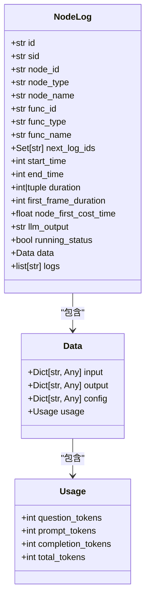
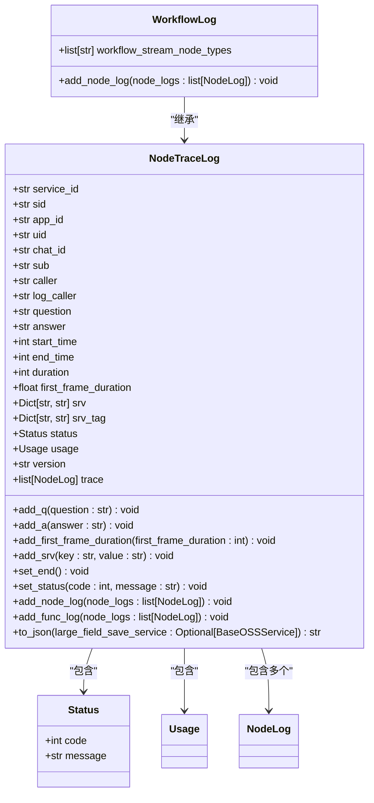
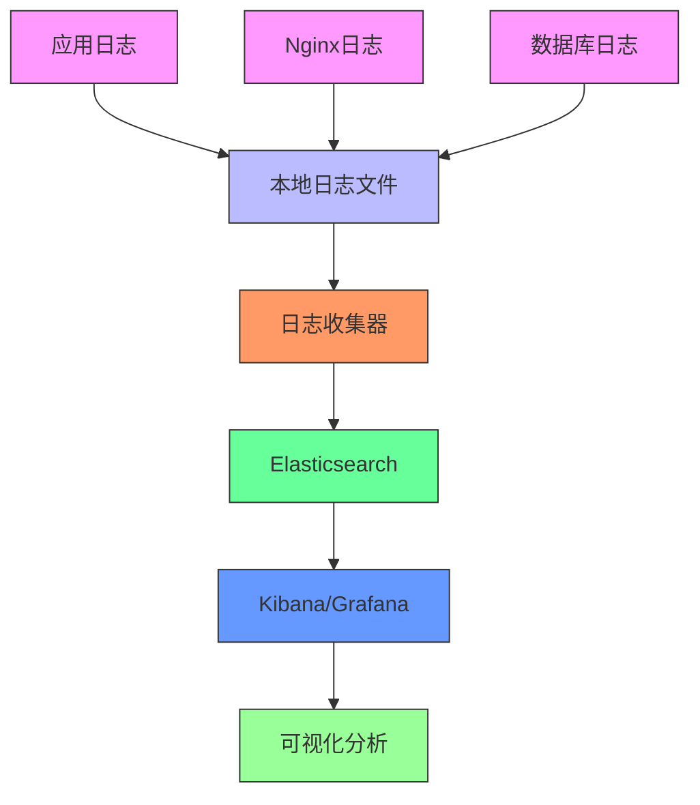

# 日志管理

<cite>
**本文档引用的文件**
- [nginx.conf](file://docker/ragflow/nginx/nginx.conf)
- [infinity_conf.toml](file://docker/ragflow/infinity_conf.toml)
- [node_log.py](file://core/common/otlp/log_trace/node_log.py)
- [workflow_log.py](file://core/common/otlp/log_trace/workflow_log.py)
- [node_trace_log.py](file://core/common/otlp/log_trace/node_trace_log.py)
- [base.py](file://core/common/otlp/log_trace/base.py)
- [logger.py](file://core/plugin/rpa/utils/log/logger.py)
- [ma-sdk.toml](file://core/common/metrology_auth/ma-sdk.toml)
</cite>

## 目录
1. [引言](#引言)
2. [日志收集与存储](#日志收集与存储)
3. [Nginx日志配置](#nginx日志配置)
4. [应用日志结构](#应用日志结构)
5. [日志轮转策略](#日志轮转策略)
6. [集中式日志管理](#集中式日志管理)
7. [日志分析最佳实践](#日志分析最佳实践)
8. [结论](#结论)

## 引言
本文档详细阐述了astron-agent项目的日志管理系统，涵盖了日志的收集、存储、分析和归档的完整生命周期。文档深入解析了Nginx访问日志和错误日志的配置，详细说明了Python应用中的日志结构和上下文信息，并提供了日志轮转和集中式管理的解决方案。

## 日志收集与存储
astron-agent项目采用了多层次的日志收集与存储策略，确保系统运行状态的可追溯性和问题排查的高效性。系统通过多种组件生成日志，包括Nginx反向代理服务器、Infinity向量数据库以及各个Python微服务。

日志存储遵循分层原则，不同类型的日志被存储在不同的位置和格式中。Nginx日志存储在`/var/log/nginx/`目录下，包括访问日志和错误日志。Infinity数据库的日志存储在`/var/infinity/log`目录下，而Python应用的日志则根据配置存储在指定路径。

**Section sources**
- [nginx.conf](file://docker/ragflow/nginx/nginx.conf)
- [infinity_conf.toml](file://docker/ragflow/infinity_conf.toml)
- [logger.py](file://core/plugin/rpa/utils/log/logger.py)

## Nginx日志配置
Nginx作为系统的反向代理和Web服务器，其日志配置对于监控HTTP请求和排查网络问题至关重要。项目中的Nginx配置文件定义了详细的访问日志格式和错误日志级别。

### 访问日志格式
Nginx的访问日志使用`log_format`指令定义了名为`main`的自定义格式，包含了丰富的请求信息：

```nginx
log_format  main  '$remote_addr - $remote_user [$time_local] "$request" '
                  '$status $body_bytes_sent "$http_referer" '
                  '"$http_user_agent" "$http_x_forwarded_for"';
```

该格式包含以下字段：
- `$remote_addr`: 客户端IP地址
- `$remote_user`: 认证用户（如果已认证）
- `$time_local`: 本地服务器时间
- `$request`: 请求的完整URL和HTTP方法
- `$status`: HTTP响应状态码
- `$body_bytes_sent`: 发送给客户端的字节数
- `$http_referer`: 引用页面
- `$http_user_agent`: 客户端用户代理
- `$http_x_forwarded_for`: X-Forwarded-For头信息

访问日志被配置为写入`/var/log/nginx/access.log`文件。

### 错误日志级别
Nginx的错误日志配置如下：
```nginx
error_log  /var/log/nginx/error.log notice;
```
这表示错误日志将写入`/var/log/nginx/error.log`文件，日志级别为`notice`。Nginx支持以下日志级别（按严重性递增）：
- `debug`: 调试信息
- `info`: 一般信息
- `notice`: 正常但重要的事件
- `warn`: 警告
- `error`: 错误
- `crit`: 严重错误
- `alert`: 需要立即处理的错误
- `emerg`: 系统不可用

`notice`级别会记录比`info`更严重的事件，但不会记录`debug`级别的详细信息，这在生产环境中是一个合理的平衡。

**Section sources**
- [nginx.conf](file://docker/ragflow/nginx/nginx.conf)

## 应用日志结构
Python应用中的日志结构设计精巧，包含了丰富的上下文信息，便于问题追踪和性能分析。系统使用`loguru`库进行日志管理，并定义了复杂的日志模型来记录请求的完整生命周期。

### NodeLog结构
`NodeLog`类定义了单个节点的日志结构，包含了执行时间、输入输出数据、使用统计等信息：



**Diagram sources**
- [node_log.py](file://core/common/otlp/log_trace/node_log.py)
- [base.py](file://core/common/otlp/log_trace/base.py)

### WorkflowLog结构
`WorkflowLog`类继承自`NodeTraceLog`，用于记录整个工作流的执行情况，包括多个节点的日志：



**Diagram sources**
- [workflow_log.py](file://core/common/otlp/log_trace/workflow_log.py)
- [node_trace_log.py](file://core/common/otlp/log_trace/node_trace_log.py)
- [base.py](file://core/common/otlp/log_trace/base.py)

### 上下文信息
日志系统记录了丰富的上下文信息，包括：
- **请求ID (sid)**: 用于追踪单个请求的完整生命周期
- **用户信息 (uid)**: 记录执行操作的用户ID
- **执行轨迹**: 通过`trace`字段记录工作流中各个节点的执行情况
- **性能指标**: 记录开始时间、结束时间、持续时间等性能数据
- **使用统计**: 记录大模型调用的token使用情况

这些信息共同构成了完整的请求追踪能力，使得开发者能够快速定位问题所在。

**Section sources**
- [node_log.py](file://core/common/otlp/log_trace/node_log.py)
- [workflow_log.py](file://core/common/otlp/log_trace/workflow_log.py)
- [node_trace_log.py](file://core/common/otlp/log_trace/node_trace_log.py)

## 日志轮转策略
为防止日志文件无限增长导致磁盘空间耗尽，系统实现了多种日志轮转策略。

### Nginx日志轮转
Nginx本身不提供日志轮转功能，需要依赖外部工具如`logrotate`。虽然配置文件中没有直接体现，但通常在Linux系统中会配置`logrotate`来管理Nginx日志的轮转和压缩。

### Python应用日志轮转
Python应用使用`loguru`库的内置功能实现日志轮转。在`logger.py`文件中，配置了基于文件大小的轮转策略：

```python
logger.add(
    sink=str(log_path_),
    level=log_level.upper(),
    format=log_format,
    rotation="10 MB",  # 基于文件大小的日志轮转
)
```

此配置表示当日志文件达到10MB时，会自动创建新的日志文件。这种基于大小的轮转策略可以有效控制单个日志文件的大小，便于管理和分析。

### Infinity数据库日志轮转
Infinity数据库的配置文件`infinity_conf.toml`中定义了详细的日志轮转策略：

```toml
[log]
log_filename             = "infinity.log"
log_dir                  = "/var/infinity/log"
log_to_stdout            = true
log_file_max_size        = "100MB"
log_file_rotate_count    = 10
log_level               = "trace"
```

该配置表明：
- 日志文件名为`infinity.log`
- 日志存储在`/var/infinity/log`目录
- 最大文件大小为100MB
- 保留10个旧的日志文件
- 日志级别为`trace`，记录最详细的日志信息

**Section sources**
- [logger.py](file://core/plugin/rpa/utils/log/logger.py)
- [infinity_conf.toml](file://docker/ragflow/infinity_conf.toml)

## 集中式日志管理
项目通过多种技术栈实现集中式日志管理，确保日志的统一收集、存储和分析。

### ELK/Loki栈集成
虽然代码中没有直接体现ELK或Loki的配置，但从`docker-compose`文件可以看出系统依赖Elasticsearch作为搜索和分析引擎：

```yaml
services:
  es01:
    container_name: ragflow-es-01
    image: elasticsearch:${STACK_VERSION}
    volumes:
      - esdata01:/usr/share/elasticsearch/data
    ports:
      - ${ES_PORT}:9200
```

Elasticsearch可以与Logstash和Kibana组成ELK栈，实现日志的集中收集、存储和可视化分析。或者与Loki和Grafana组成轻量级的日志解决方案。

### 日志聚合流程
系统的日志聚合流程如下：



**Diagram sources**
- [docker-compose-base.yml](file://docker/ragflow/docker-compose-base.yml)
- [nginx.conf](file://docker/ragflow/nginx/nginx.conf)
- [infinity_conf.toml](file://docker/ragflow/infinity_conf.toml)

### 其他日志配置
系统中还存在其他日志配置，如`ma-sdk.toml`中的日志设置：

```toml
[log]
level = "error"
file = "/log/server/ma-sdk2.log"
async = false
batch = 1
```

这表明计量认证服务的日志级别为`error`，仅记录错误级别的日志，输出到指定文件。

**Section sources**
- [ma-sdk.toml](file://core/common/metrology_auth/ma-sdk.toml)
- [docker-compose-base.yml](file://docker/ragflow/docker-compose-base.yml)

## 日志分析最佳实践
有效的日志分析是系统维护和故障排查的关键。以下是基于本项目特点的日志分析最佳实践。

### 使用grep快速定位问题
`grep`命令是日志分析的利器，可用于快速搜索特定模式：

```bash
# 搜索包含"ERROR"的日志行
grep "ERROR" /var/log/nginx/error.log

# 搜索特定请求ID的日志
grep "sid=abc123" /var/log/application.log

# 搜索500错误
grep " 500 " /var/log/nginx/access.log

# 统计各状态码的数量
grep -o " [0-9]\{3\} " /var/log/nginx/access.log | sort | uniq -c
```

### 使用awk分析日志模式
`awk`提供了强大的文本处理能力，适合分析结构化日志：

```bash
# 提取访问日志中的IP地址和请求路径
awk '{print $1, $7}' /var/log/nginx/access.log

# 统计每个IP的访问次数
awk '{ip[$1]++} END {for (i in ip) print i, ip[i]}' /var/log/nginx/access.log

# 找出响应时间最长的请求
awk '{if ($10 > max) {max=$10; line=$0}} END {print line}' /var/log/nginx/access.log
```

### 结构化日志分析
对于Python应用生成的结构化日志，可以使用JSON处理工具：

```bash
# 使用jq解析JSON日志
cat application.log | jq '. | select(.level == "ERROR")'

# 统计各日志级别的数量
cat application.log | jq -r '.level' | sort | uniq -c

# 提取特定请求的完整追踪信息
cat application.log | jq 'select(.sid == "abc123")'
```

### 监控关键指标
建立日志监控告警，关注以下关键指标：
- 错误日志增长率
- 5xx错误率
- 响应时间分布
- 特定异常的出现频率
- 系统资源使用情况

**Section sources**
- [node_log.py](file://core/common/otlp/log_trace/node_log.py)
- [nginx.conf](file://docker/ragflow/nginx/nginx.conf)

## 结论
astron-agent项目的日志管理系统设计全面，涵盖了从日志生成、收集、存储到分析的完整生命周期。通过Nginx、Infinity和Python应用的多层次日志记录，系统能够提供详细的运行时信息。日志轮转策略有效防止了磁盘空间耗尽的问题，而基于Elasticsearch的集中式日志管理方案为日志分析提供了强大的支持。结合grep、awk等命令行工具的最佳实践，可以高效地进行问题排查和系统监控。