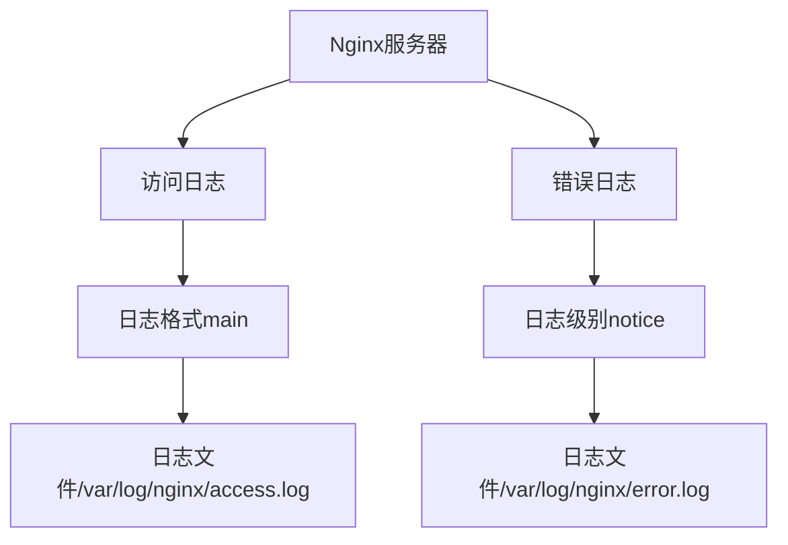
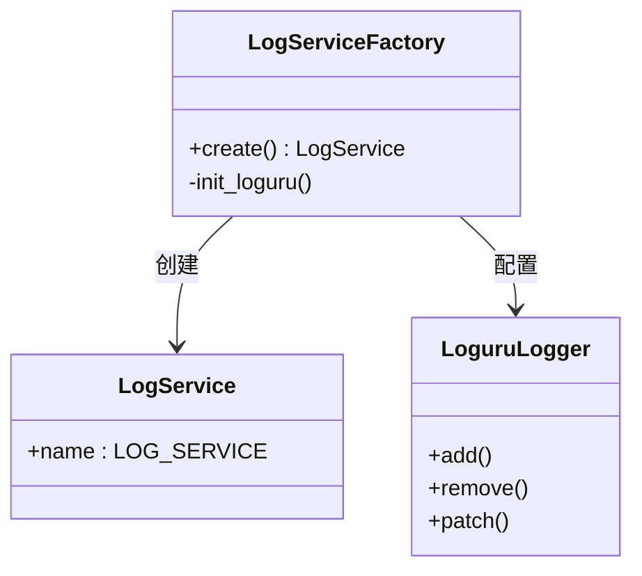
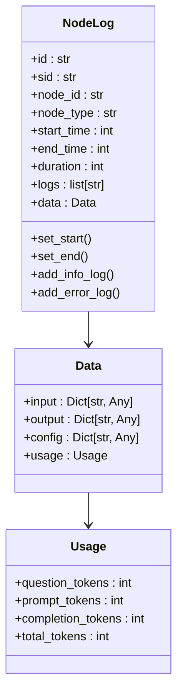
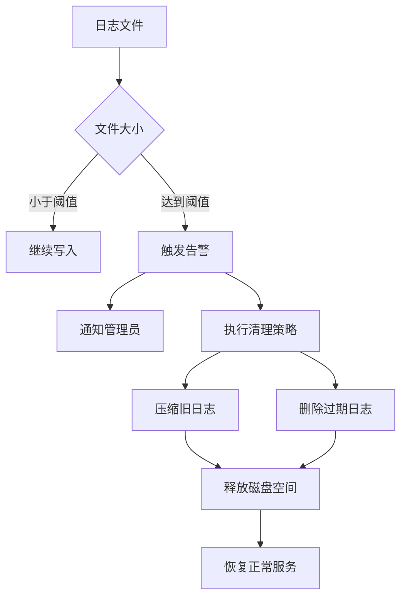
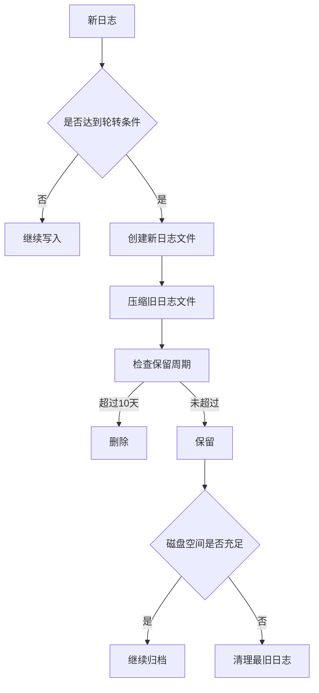
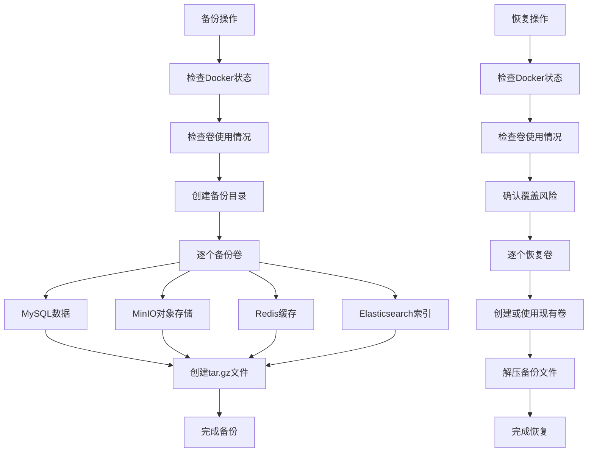

# 日志维护

<cite>
**本文档引用的文件**
- [nginx.conf](file://console/frontend/nginx.conf)
- [node_log.py](file://core/common/otlp/log_trace/node_log.py)
- [logger.py](file://core/common/service/log/factory.py)
- [logger.py](file://core/plugin/rpa/utils/log/logger.py)
- [infinity_conf.toml](file://docker/ragflow/infinity_conf.toml)
- [migration.sh](file://docker/ragflow/migration.sh)
</cite>

## 目录
1. [引言](#引言)
2. [Nginx日志轮转配置](#nginx日志轮转配置)
3. [Python应用日志配置](#python应用日志配置)
4. [日志缓存与异步写入机制](#日志缓存与异步写入机制)
5. [磁盘空间监控与告警](#磁盘空间监控与告警)
6. [日志归档与清理策略](#日志归档与清理策略)
7. [日志备份与恢复方案](#日志备份与恢复方案)
8. [结论](#结论)

## 引言
本文档旨在为astron-agent项目提供详细的日志维护操作指南，重点解决日志生命周期管理问题。通过分析项目中的日志配置和实现，我们将详细介绍如何设置日志轮转策略、实现高并发场景下的日志写入性能优化、监控磁盘空间使用情况、制定日志归档和清理策略，以及建立日志备份和恢复的应急方案。

## Nginx日志轮转配置

**Diagram sources**
- [nginx.conf](file://console/frontend/nginx.conf#L1-L34)

**Section sources**
- [nginx.conf](file://console/frontend/nginx.conf#L1-L34)

Nginx的配置文件中定义了访问日志和错误日志的存储位置及格式。在`nginx.conf`文件中，我们看到以下关键配置：

- 错误日志：`error_log /var/log/nginx/error.log notice;`，日志级别为notice
- 访问日志：`access_log /var/log/nginx/access.log main;`，使用名为"main"的自定义日志格式
- 日志格式"main"包含了客户端IP、用户、时间戳、请求信息、状态码、字节数、引用页和用户代理等详细信息

这些配置确保了Nginx服务器的访问和错误信息被完整记录，为后续的分析和故障排查提供了基础。

## Python应用日志配置

**Diagram sources**
- [logger.py](file://core/common/service/log/factory.py#L1-L48)

**Section sources**
- [logger.py](file://core/common/service/log/factory.py#L1-L48)
- [logger.py](file://core/plugin/rpa/utils/log/logger.py#L1-L57)

在Python应用中，日志配置主要通过`loguru`库实现。项目中存在多个日志配置实现，其中`LogServiceFactory`类提供了统一的日志服务创建机制：

- 日志文件路径：默认在当前目录下的`logs/app.log`
- 日志轮转：当文件大小达到100MB时进行轮转
- 日志保留：保留最近10天的日志文件
- 压缩策略：旧日志文件以zip格式压缩存储
- 日志级别：通过环境变量`LOG_LEVEL`配置，默认为ERROR级别
- 日志格式：包含日志级别、时间戳、文件名、函数名、行号和消息内容

此外，RPA插件中的日志配置也使用了`loguru`，但配置略有不同：
- 日志文件大小达到10MB时进行轮转
- 日志级别通过环境变量或参数配置，默认为INFO级别
- 日志文件存储在用户缓存目录下的`rpa-server.log`

## 日志缓存与异步写入机制

**Diagram sources**
- [node_log.py](file://core/common/otlp/log_trace/node_log.py#L1-L158)
- [base.py](file://core/common/otlp/log_trace/base.py#L1-L9)

**Section sources**
- [node_log.py](file://core/common/otlp/log_trace/node_log.py#L1-L158)

项目中的`NodeLog`类实现了日志缓存机制，用于在高并发场景下优化日志写入性能：

- 日志数据结构：`NodeLog`类包含节点ID、类型、执行时间、输入输出数据等信息
- 内存缓存：日志消息首先存储在内存中的`logs`列表里，避免频繁的磁盘I/O操作
- 批量写入：多个日志条目可以被批量处理和写入，提高写入效率
- 时间戳记录：精确记录日志的开始时间、结束时间和持续时间，便于性能分析
- 信息分类：支持INFO和ERROR级别的日志记录，便于问题排查

这种设计模式确保了在高并发请求下，日志系统不会成为性能瓶颈，同时保持了日志信息的完整性和准确性。

## 磁盘空间监控与告警

**Diagram sources**
- [infinity_conf.toml](file://docker/ragflow/infinity_conf.toml#L1-L56)

**Section sources**
- [infinity_conf.toml](file://docker/ragflow/infinity_conf.toml#L1-L56)

项目中的`infinity_conf.toml`配置文件展示了磁盘空间管理的配置：

- 日志文件最大大小：100MB (`log_file_max_size = "100MB"`)
- 日志保留数量：最多保留10个轮转文件 (`log_file_rotate_count = 10`)
- 日志级别：可配置为trace、debug、info、warning、error、critical六个级别

这些配置确保了单个日志文件不会无限增长，当达到指定大小时会自动轮转。同时，通过限制保留的文件数量，可以有效控制日志占用的总磁盘空间。

## 日志归档与清理策略

**Diagram sources**
- [logger.py](file://core/common/service/log/factory.py#L1-L48)

**Section sources**
- [logger.py](file://core/common/service/log/factory.py#L1-L48)

基于`LogServiceFactory`中的配置，项目实现了以下日志归档和清理策略：

- 轮转策略：当日志文件达到100MB时自动创建新文件
- 保留周期：保留最近10天的日志文件
- 压缩存储：旧日志文件以zip格式压缩，节省存储空间
- 合规性考虑：通过环境变量可灵活调整日志级别和存储路径，满足不同环境的合规要求

对于RPA插件，采用了更频繁的轮转策略（10MB），以适应可能产生大量日志的场景。

## 日志备份与恢复方案

**Diagram sources**
- [migration.sh](file://docker/ragflow/migration.sh#L1-L297)

**Section sources**
- [migration.sh](file://docker/ragflow/migration.sh#L1-L297)

项目中的`migration.sh`脚本提供了完整的日志备份和恢复方案：

- 备份操作：
  - 检查Docker服务是否正常运行
  - 确认没有容器正在使用目标卷
  - 创建备份目录
  - 依次备份MySQL、MinIO、Redis和Elasticsearch的Docker卷
  - 使用tar.gz格式压缩备份文件

- 恢复操作：
  - 检查Docker服务状态
  - 确认备份文件完整性
  - 提示用户现有数据将被覆盖的风险
  - 依次恢复各个卷的数据
  - 验证恢复结果

- 应急方案：
  - 在执行备份或恢复前，必须先停止相关容器
  - 提供了详细的错误处理和用户确认机制
  - 支持自定义备份目录名称
  - 提供了帮助信息和使用示例

该方案确保了关键审计信息的安全，即使在系统故障或数据损坏的情况下，也能快速恢复日志数据。

## 结论
本指南详细介绍了astron-agent项目的日志维护策略，涵盖了从日志配置、性能优化到备份恢复的完整生命周期管理。通过合理的日志轮转、缓存机制和磁盘空间监控，确保了系统在高并发场景下的稳定运行。同时，完善的备份和恢复方案为关键审计信息提供了安全保障。建议根据实际部署环境调整相关配置参数，以达到最佳的性能和可靠性平衡。