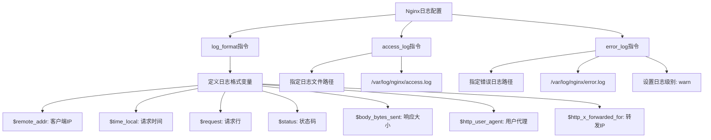
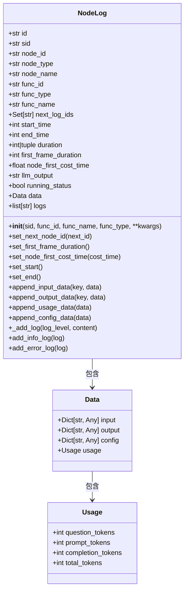

# 日志配置

<cite>
**本文档中引用的文件**  
- [nginx.conf](file://docker/astronAgent/nginx/nginx.conf)
- [node_log.py](file://core/common/otlp/log_trace/node_log.py)
- [workflow_log.py](file://core/common/otlp/log_trace/workflow_log.py)
- [logger.py](file://core/plugin/rpa/utils/log/logger.py)
- [settings.py](file://core/common/settings/settings.py)
- [config.env](file://core/agent/config.env.example)
</cite>

## 目录
1. [简介](#简介)
2. [Nginx日志配置](#nginx日志配置)
3. [Python应用日志结构](#python应用日志结构)
4. [日志级别与环境配置](#日志级别与环境配置)
5. [日志文件路径与权限](#日志文件路径与权限)
6. [最佳实践总结](#最佳实践总结)

## 简介
本文档详细介绍了astron-agent项目中的日志配置方案，涵盖Nginx访问日志和错误日志的配置方法，以及Python应用中自定义日志结构的设计。文档重点解析了如何通过`log_format`指令自定义Nginx日志格式，说明了`node_log.py`和`workflow_log.py`中定义的日志结构及其上下文信息注入机制，并提供了不同环境下的日志级别配置建议。

## Nginx日志配置

### Nginx日志格式配置
在Nginx配置中，`log_format`指令用于定义访问日志的格式。项目中使用了标准的`main`日志格式，包含了客户端IP、请求时间、请求行、状态码等关键信息。



**图示来源**  
- [nginx.conf](file://docker/astronAgent/nginx/nginx.conf#L10-L14)

**本节来源**  
- [nginx.conf](file://docker/astronAgent/nginx/nginx.conf#L10-L14)

### 自定义日志格式
通过`log_format`指令可以自定义日志格式以包含更多关键信息。当前配置已经包含了请求时间、客户端IP、请求方法、URI和状态码等信息：

```nginx
log_format main '$remote_addr - $remote_user [$time_local] "$request" '
                '$status $body_bytes_sent "$http_referer" '
                '"$http_user_agent" "$http_x_forwarded_for"';
```

此格式包含了以下关键字段：
- `$remote_addr`: 客户端IP地址
- `$time_local`: 请求本地时间
- `$request`: 请求行（包含请求方法、URI和HTTP版本）
- `$status`: HTTP状态码
- `$body_bytes_sent`: 发送给客户端的字节数
- `$http_user_agent`: 客户端用户代理字符串
- `$http_x_forwarded_for`: X-Forwarded-For头信息

### 访问日志与错误日志配置
Nginx配置中明确指定了访问日志和错误日志的路径及级别：

```nginx
access_log /var/log/nginx/access.log main;
error_log /var/log/nginx/error.log warn;
```

访问日志记录所有HTTP请求的详细信息，而错误日志则记录级别为`warn`及以上的错误信息，这有助于在生产环境中减少日志量，同时保留重要错误信息。

**本节来源**  
- [nginx.conf](file://docker/astronAgent/nginx/nginx.conf#L15-L16)

## Python应用日志结构

### NodeLog结构解析
`node_log.py`文件定义了`NodeLog`类，用于记录节点级别的执行日志。该类包含了丰富的上下文信息，如trace_id、span_id、节点执行时间等。



**图示来源**  
- [node_log.py](file://core/common/otlp/log_trace/node_log.py#L1-L157)

**本节来源**  
- [node_log.py](file://core/common/otlp/log_trace/node_log.py#L1-L157)

### 上下文信息注入机制
`NodeLog`类通过多种方式注入上下文信息：

1. **标识信息注入**：在初始化时注入`sid`（会话ID）、`func_id`、`func_name`等标识信息
2. **时间信息注入**：自动记录`start_time`和`end_time`，并计算`duration`
3. **性能指标注入**：通过`set_first_frame_duration()`方法记录首帧响应时间
4. **数据流信息注入**：通过`append_input_data()`和`append_output_data()`方法记录输入输出数据
5. **使用量信息注入**：通过`append_usage_data()`方法记录大模型的token使用情况

这些方法共同构成了完整的节点执行上下文，便于后续的性能分析和问题排查。

### WorkflowLog结构解析
`workflow_log.py`文件定义了`WorkflowLog`类，继承自`NodeTraceLog`，用于记录工作流级别的日志。该类特别关注工作流的首帧响应时间计算。

```python
class WorkflowLog(NodeTraceLog):
    workflow_stream_node_types: ClassVar[list] = ["message", "node-end"]

    def add_node_log(self, node_logs: list[NodeLog]) -> None:
        if not node_logs:
            return
        """
        遍历节点，获取首响时间
        规则：
            如果遍历到的第一个消息节点，设置首响时间为 (消息节点的开始时间 - 开始时间)
            如果遍历到第一个是
        """
        if self.first_frame_duration == -1:  # type: ignore[has-type]
            for i, node_log in enumerate(node_logs):
                node_type = node_log.node_id.split(":")[0]
                if node_type in self.workflow_stream_node_types:
                    self.first_frame_duration = node_log.start_time - self.start_time
                    break
        self.trace.extend(node_logs)
```

该类通过遍历节点日志，找到第一个消息类型节点，计算从工作流开始到消息节点开始的时间差作为首帧响应时间，这对于评估系统响应性能至关重要。

**本节来源**  
- [workflow_log.py](file://core/common/otlp/log_trace/workflow_log.py#L1-L28)

## 日志级别与环境配置

### 环境变量驱动的日志配置
项目通过环境变量来控制日志级别，实现了不同环境下的灵活配置。`logger.py`文件中的`set_log`函数实现了这一机制：

```python
def set_log(log_level: Optional[str] = None, log_path: Optional[str] = None) -> None:
    if os.getenv(const.LOG_LEVEL_KEY) in VALID_LOG_LEVELS and log_level is None:
        log_level = os.getenv(const.LOG_LEVEL_KEY)
    if log_level is None:
        log_level = "INFO"
    log_format = (
        "{level} | {time:YYYY-MM-DD HH:mm:ss} | {process} - {thread} "
        "| {file} - {function}: {line} {message}"
    )
```

该函数首先检查环境变量`LOG_LEVEL`，如果存在且有效，则使用环境变量的值；否则使用默认的`INFO`级别。这种设计使得在不同环境中可以通过设置环境变量来调整日志级别，而无需修改代码。

**本节来源**  
- [logger.py](file://core/plugin/rpa/utils/log/logger.py#L30-L45)

### 不同环境的日志级别建议
根据项目需求，建议采用以下日志级别配置策略：

| 环境 | 建议日志级别 | 说明 |
|------|-------------|------|
| 开发环境 | DEBUG | 启用最详细的日志记录，便于开发调试 |
| 测试环境 | INFO | 记录关键操作和状态变化，便于问题排查 |
| 生产环境 | WARN | 只记录警告及以上级别的日志，减少日志量 |

在生产环境中，过度的日志记录不仅会占用大量磁盘空间，还可能影响系统性能。因此，建议只记录警告和错误级别的日志，同时可以通过临时调整环境变量来启用更详细的日志记录以排查特定问题。

### 配置文件中的日志设置
项目中的`config.env`文件提供了日志配置的示例：

```env
# 日志级别设置
LOG_LEVEL=INFO
# 日志文件路径
LOG_PATH=/var/log/astron-agent/
# 日志文件大小限制
LOG_MAX_SIZE=10MB
# 日志文件保留数量
LOG_BACKUP_COUNT=5
```

这些配置项可以通过环境变量覆盖，实现了配置的灵活性。`settings.py`文件中的`ProjectSettings`类负责加载和管理这些配置。

**本节来源**  
- [config.env](file://core/agent/config.env.example#L1-L5)
- [settings.py](file://core/common/settings/settings.py#L1-L129)

## 日志文件路径与权限

### 日志文件路径配置
项目中的日志文件路径配置遵循以下原则：

1. **Nginx日志**：存储在`/var/log/nginx/`目录下，这是Nginx的标准日志路径
2. **应用日志**：通过`appdirs.user_cache_dir("rpa-server")`确定用户缓存目录，确保在不同操作系统上的兼容性
3. **Docker环境**：在Docker容器中，日志路径被映射到容器内的标准位置，便于日志收集

```python
if not log_path:
    log_path = appdirs.user_cache_dir("rpa-server")
log_path = f"{log_path}/rpa-server.log"
```

这种配置方式确保了日志文件存储在合适的用户目录中，避免了权限问题。

### 日志轮转配置
为了防止日志文件无限增长，项目配置了日志轮转机制：

```python
logger.add(
    sink=str(log_path_),
    level=log_level.upper(),
    format=log_format,
    rotation="10 MB",  # 基于文件大小的日志轮转
)
```

当日志文件达到10MB时，会自动创建新的日志文件，旧的日志文件会被保留。这种基于大小的轮转策略比基于时间的轮转更适合高流量的应用，因为它能更精确地控制磁盘空间使用。

### 权限设置最佳实践
日志文件的权限设置需要考虑以下因素：

1. **写入权限**：确保运行应用的用户有权限写入日志目录
2. **读取权限**：根据安全要求，限制对日志文件的读取权限
3. **目录创建**：在应用启动时自动创建日志目录，避免因目录不存在而导致日志记录失败

```python
log_path_.parent.mkdir(parents=True, exist_ok=True)
```

这段代码确保了日志目录的存在，即使父目录也不存在时也会递归创建，提高了应用的健壮性。

**本节来源**  
- [logger.py](file://core/plugin/rpa/utils/log/logger.py#L50-L55)

## 最佳实践总结

### Nginx日志配置最佳实践
1. **自定义日志格式**：根据分析需求定制`log_format`，包含所有关键信息字段
2. **合理设置日志级别**：生产环境中使用`warn`或`error`级别，减少日志量
3. **定期轮转日志**：配置logrotate工具定期压缩和归档日志文件
4. **监控日志磁盘使用**：设置监控告警，防止日志占用过多磁盘空间

### 应用日志结构最佳实践
1. **结构化日志**：使用`NodeLog`和`WorkflowLog`等结构化日志类，便于后续分析
2. **上下文注入**：确保每个日志条目都包含足够的上下文信息，如trace_id、span_id等
3. **性能指标记录**：记录关键性能指标，如响应时间、首帧时间等
4. **分级日志记录**：合理使用INFO、WARNING、ERROR等不同级别的日志

### 环境配置最佳实践
1. **环境变量驱动**：通过环境变量控制日志级别，实现不同环境的灵活配置
2. **默认值设置**：提供合理的默认值，确保在未配置环境变量时应用仍能正常运行
3. **配置热加载**：支持配置的热加载，无需重启应用即可生效
4. **配置文档化**：在`config.env.example`等文件中提供详细的配置说明

### 日志管理最佳实践
1. **集中化管理**：考虑使用ELK等日志集中管理方案，便于跨服务分析
2. **敏感信息过滤**：确保日志中不包含敏感信息，如密码、密钥等
3. **日志保留策略**：根据法规和业务需求制定合理的日志保留策略
4. **日志安全**：限制对日志文件的访问权限，防止未授权访问

**本节来源**  
- [nginx.conf](file://docker/astronAgent/nginx/nginx.conf)
- [node_log.py](file://core/common/otlp/log_trace/node_log.py)
- [workflow_log.py](file://core/common/otlp/log_trace/workflow_log.py)
- [logger.py](file://core/plugin/rpa/utils/log/logger.py)
- [settings.py](file://core/common/settings/settings.py)
- [config.env](file://core/agent/config.env.example)