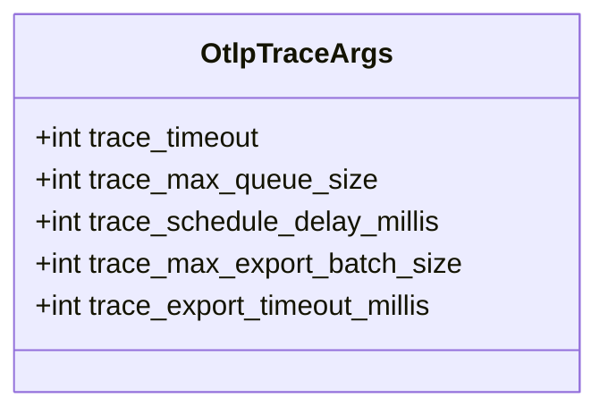
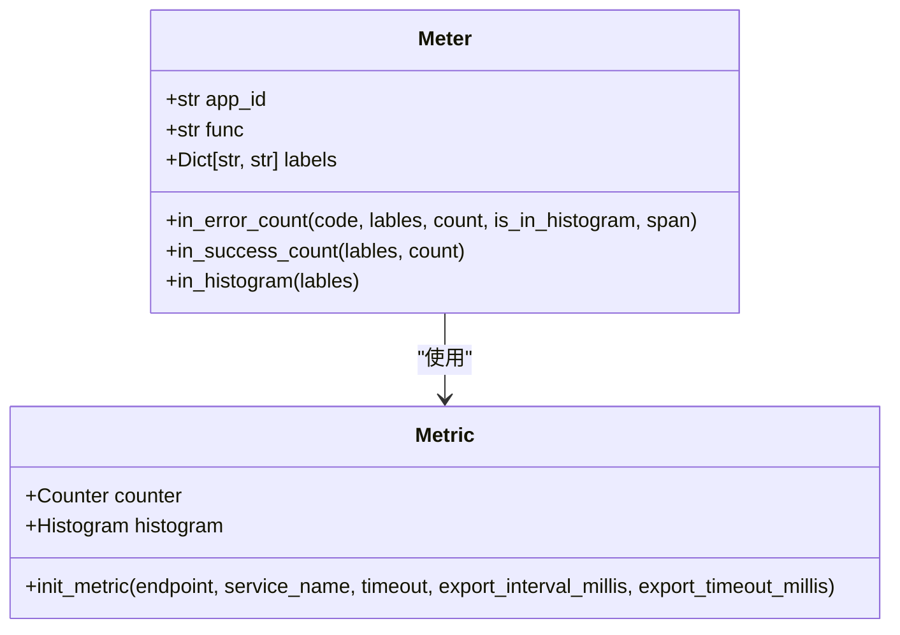
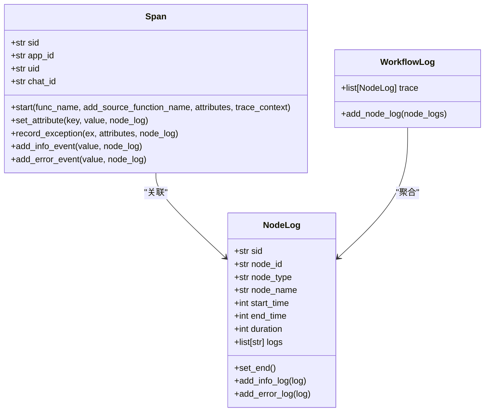

# 监控与维护

<cite>
**本文档引用的文件**  
- [trace.py](file://core/common/otlp/args/trace.py)
- [meter.py](file://core/common/otlp/metrics/meter.py)
- [metric.py](file://core/common/otlp/metrics/metric.py)
- [span.py](file://core/common/otlp/trace/span.py)
- [node_log.py](file://core/common/otlp/log_trace/node_log.py)
- [workflow_log.py](file://core/common/otlp/log_trace/workflow_log.py)
- [logger.py](file://core/plugin/rpa/utils/log/logger.py)
- [nginx.conf](file://docker/astronAgent/nginx/nginx.conf)
- [pyproject.toml](file://core/common/pyproject.toml)
- [docker-compose.yaml](file://docker/astronAgent/docker-compose.yaml)
</cite>

## 目录
1. [引言](#引言)
2. [基于OTLP的分布式追踪配置](#基于otlp的分布式追踪配置)
3. [监控指标与日志收集机制](#监控指标与日志收集机制)
4. [Nginx反向代理配置与访问日志分析](#nginx反向代理配置与访问日志分析)
5. [性能监控、错误告警与日志分析最佳实践](#性能监控错误告警与日志分析最佳实践)
6. [日常维护任务操作指南](#日常维护任务操作指南)
7. [依赖管理与安全更新](#依赖管理与安全更新)

## 引言
本指南旨在为astron-agent系统的稳定运行提供全面的监控与维护指导。文档详细说明了基于OTLP（OpenTelemetry Protocol）的分布式追踪配置方法，解释了核心监控指标和日志收集机制。同时，涵盖了Nginx反向代理的配置、性能监控、错误告警、日志分析的最佳实践，以及日常维护任务的操作指南。最后，文档还说明了如何通过`pyproject.toml`进行依赖管理、安全更新和版本升级。

**Section sources**
- [docker-compose.yaml](file://docker/astronAgent/docker-compose.yaml)

## 基于OTLP的分布式追踪配置
本系统采用OpenTelemetry (OTLP) 标准实现分布式追踪，以监控服务间的调用链路和性能。追踪配置主要通过环境变量和代码参数进行控制。

### OTLP追踪参数配置
在`core/common/otlp/args/trace.py`中定义了OTLP追踪的核心参数，这些参数可以通过环境变量在`docker-compose.yaml`中进行配置，以实现灵活调整。



**Diagram sources**
- [trace.py](file://core/common/otlp/args/trace.py)

**Section sources**
- [trace.py](file://core/common/otlp/args/trace.py)
- [docker-compose.yaml](file://docker/astronAgent/docker-compose.yaml)

### 环境变量配置
在`docker-compose.yaml`中，多个核心服务（如`core-agent`, `core-workflow`）都配置了OTLP相关的环境变量，这些变量直接映射到`OtlpTraceArgs`中的参数。

- `OTLP_ENDPOINT`: 指定OTLP后端服务的地址（如`127.0.0.1:4317`）。
- `OTLP_ENABLE`: 控制是否启用OTLP监控（`0`为禁用，非`0`为启用）。
- `OTLP_TRACE_TIMEOUT`: 追踪超时时间（毫秒）。
- `OTLP_TRACE_MAX_QUEUE_SIZE`: 追踪队列的最大大小。
- `OTLP_TRACE_SCHEDULE_DELAY_MILLIS`: 追踪调度延迟（毫秒）。
- `OTLP_TRACE_MAX_EXPORT_BATCH_SIZE`: 单次导出的最大追踪批处理大小。
- `OTLP_TRACE_EXPORT_TIMEOUT_MILLIS`: 追踪导出超时时间（毫秒）。

通过调整这些环境变量，可以在不影响代码的情况下，对追踪的性能和行为进行精细调优。

## 监控指标与日志收集机制
系统通过OpenTelemetry SDK收集丰富的监控指标，并结合结构化日志记录，实现全面的可观测性。

### 核心监控指标
系统定义了两类核心监控指标：计数器（Counter）和直方图（Histogram）。



**Diagram sources**
- [meter.py](file://core/common/otlp/metrics/meter.py)
- [metric.py](file://core/common/otlp/metrics/metric.py)

**Section sources**
- [meter.py](file://core/common/otlp/metrics/meter.py)
- [metric.py](file://core/common/otlp/metrics/metric.py)

#### 计数器 (Counter)
- **`server_request_total`**: 服务入口请求总数，用于统计成功和失败的请求数量。
- **`rely_server_request`**: 服务出口请求总数，用于统计对外部依赖的调用次数。

#### 直方图 (Histogram)
- **`server_request_time_microseconds`**: 服务入口请求耗时（微秒），用于分析服务性能和延迟分布。
- **`rely_server_request_time`**: 服务出口请求耗时，用于监控外部依赖的响应时间。

`Meter`类提供了`in_error_count`、`in_success_count`和`in_histogram`等方法，用于在代码中便捷地上报这些指标。

### 日志收集机制
系统采用分层的日志收集机制，将链路追踪与结构化日志紧密结合。



**Diagram sources**
- [span.py](file://core/common/otlp/trace/span.py)
- [node_log.py](file://core/common/otlp/log_trace/node_log.py)
- [workflow_log.py](file://core/common/otlp/log_trace/workflow_log.py)

**Section sources**
- [span.py](file://core/common/otlp/trace/span.py)
- [node_log.py](file://core/common/otlp/log_trace/node_log.py)
- [workflow_log.py](file://core/common/otlp/log_trace/workflow_log.py)

- **`Span`类**: 代表一个追踪片段，使用OpenTelemetry API记录方法调用、异常和自定义事件。它通过`sid`（会话ID）与`NodeLog`关联。
- **`NodeLog`类**: 代表一个节点的详细日志，包含输入、输出、配置、使用量和文本日志。当`Span`记录事件时，可以同时更新关联的`NodeLog`。
- **`WorkflowLog`类**: 作为`NodeLog`的容器，聚合整个工作流中所有节点的日志，形成完整的执行链路视图。

这种机制确保了日志与追踪的强关联，便于在出现问题时快速定位。

## Nginx反向代理配置与访问日志分析
Nginx作为系统的入口网关，负责流量路由、负载均衡和安全防护。

### Nginx配置详解
`docker/astronAgent/nginx/nginx.conf`文件定义了Nginx的核心配置。

```mermaid
graph TD
A[Nginx Server] --> B[静态资源缓存]
A --> C[SSE API代理]
A --> D[后端API代理]
A --> E[前端应用代理]
B --> F[location ~* \.(js|css|png...)]
C --> G[location /workflow/v1/chat/completions]
C --> H[location /console-api/chat-message/]
D --> I[location /console-api/]
E --> J[location /]
```

**Diagram sources**
- [nginx.conf](file://docker/astronAgent/nginx/nginx.conf)

**Section sources**
- [nginx.conf](file://docker/astronAgent/nginx/nginx.conf)

- **静态资源缓存**: 对JS、CSS、图片等静态资源设置一年的缓存有效期（`expires 1y`），并添加`Cache-Control: public, immutable`头，极大提升前端加载性能。
- **SSE (Server-Sent Events) 代理**: 针对`/workflow/v1/chat/completions`和`/console-api/chat-message/`等需要实时流式响应的API，配置了特殊的代理参数：
  - `proxy_buffering off`: 禁用缓冲，确保数据实时传输。
  - `proxy_set_header X-Accel-Buffering no`: 通知后端禁用加速缓冲。
  - `proxy_read_timeout 1800s`: 设置30分钟的长超时，以支持长时间的流式会话。
- **后端API代理**: 将`/console-api/`路径的请求代理到`console-hub`服务。
- **前端应用代理**: 默认将所有请求代理到`console-frontend`服务，实现单页应用的路由。
- **健康检查**: 提供`/nginx-health`端点，用于Docker健康检查。

### 访问日志分析
Nginx配置了名为`main`的自定义日志格式，记录了丰富的访问信息。

```
log_format main '$remote_addr - $remote_user [$time_local] "$request" '
                '$status $body_bytes_sent "$http_referer" '
                '"$http_user_agent" "$http_x_forwarded_for"';
```

该日志包含：
- `$remote_addr`: 客户端IP地址。
- `$time_local`: 请求时间。
- `$request`: 请求方法、URL和HTTP协议。
- `$status`: HTTP响应状态码。
- `$body_bytes_sent`: 发送给客户端的字节数。
- `$http_user_agent`: 客户端浏览器/应用信息。
- `$http_x_forwarded_for`: 代理链中的原始客户端IP。

通过分析此日志，可以监控流量模式、识别异常请求（如4xx/5xx错误）、排查安全问题和进行用户行为分析。

## 性能监控、错误告警与日志分析最佳实践
### 性能监控
1.  **核心指标监控**: 使用Prometheus等工具抓取`server_request_time_microseconds`直方图指标，绘制P50、P90、P99延迟曲线，及时发现性能瓶颈。
2.  **依赖监控**: 监控`rely_server_request_time`指标，确保外部服务（如数据库、AI模型）的响应时间在可接受范围内。
3.  **并发监控**: 通过`server_conc`等指标监控服务的并发处理能力，防止过载。

### 错误告警
1.  **错误率告警**: 当`server_request_total`中错误码（非0）的比例超过阈值（如1%）时触发告警。
2.  **异常日志告警**: 在日志系统中设置规则，对`NodeLog`中的`ERROR`级别日志进行告警，特别是包含特定关键词（如`Exception`, `Timeout`）的日志。
3.  **服务健康告警**: 结合Docker健康检查和Nginx健康端点，对服务的存活状态进行监控。

### 日志分析最佳实践
1.  **结构化日志**: 优先使用`NodeLog`的`append_input_data`、`append_output_data`等方法记录结构化数据，便于查询和分析。
2.  **上下文关联**: 确保`Span`和`NodeLog`都携带`sid`，以便在日志系统中通过`sid`一键查询整个会话的完整链路。
3.  **日志分级**: 合理使用`INFO`和`ERROR`日志级别，避免日志泛滥。
4.  **大日志处理**: 当日志内容过大时，系统会自动将其上传至OSS（对象存储）并记录链接，防止影响追踪性能。

## 日常维护任务操作指南
### 日志轮转
系统使用`loguru`库进行日志记录，并在`core/plugin/rpa/utils/log/logger.py`中配置了日志轮转。

```python
logger.add(
    sink=str(log_path_),
    level=log_level.upper(),
    format=log_format,
    rotation="10 MB",  # 基于文件大小进行轮转
)
```

这意味着当日志文件达到10MB时，会自动创建一个新的日志文件。运维人员应定期检查日志目录（如`/opt/core/logs/`），并根据磁盘空间情况，制定日志归档或清理策略。

**Section sources**
- [logger.py](file://core/plugin/rpa/utils/log/logger.py)

### 数据库备份
系统使用Docker Compose管理多个数据库（MySQL, PostgreSQL）。推荐使用`docker exec`命令结合数据库原生命令进行备份。

**MySQL备份示例**:
```bash
# 备份单个数据库
docker exec astron-agent-mysql mysqldump -u root -p${MYSQL_ROOT_PASSWORD} agent > agent_backup.sql

# 备份所有数据库
docker exec astron-agent-mysql mysqldump -u root -p${MYSQL_ROOT_PASSWORD} --all-databases > full_backup.sql
```

**PostgreSQL备份示例**:
```bash
# 备份数据库
docker exec astron-agent-postgres pg_dump -U spark sparkdb_manager > sparkdb_manager_backup.sql
```

建议将备份脚本加入crontab，实现自动化定时备份，并将备份文件存储在安全的外部位置。

**Section sources**
- [docker-compose.yaml](file://docker/astronAgent/docker-compose.yaml)

## 依赖管理与安全更新
### 依赖管理
项目使用`uv`作为Python包管理器，依赖关系在`pyproject.toml`文件中声明。

```toml
[project]
dependencies = [
    "opentelemetry-api>=1.25.0",
    "opentelemetry-exporter-otlp-proto-grpc>=1.25.0",
    "opentelemetry-proto>=1.25.0",
    "opentelemetry-sdk>=1.25.0",
    "loguru>=0.7.2",
    # ... 其他依赖
]
```

**Section sources**
- [pyproject.toml](file://core/common/pyproject.toml)

### 安全更新与版本升级
1.  **检查依赖**: 定期运行`uv pip list --outdated`检查是否有过时的依赖包。
2.  **评估更新**: 查看新版本的变更日志（Changelog），评估其对系统的影响，特别是主版本号的变更。
3.  **测试更新**: 在测试环境中，使用`uv pip install -U <package-name>`更新指定包，并进行全面的功能和性能测试。
4.  **生产部署**: 测试通过后，在`pyproject.toml`中更新依赖版本号，然后重新构建Docker镜像并部署到生产环境。
5.  **监控**: 更新后，密切监控系统监控指标和错误日志，确保更新没有引入新的问题。

通过遵循此流程，可以确保系统依赖的安全性和稳定性，同时享受新版本带来的性能改进和安全修复。