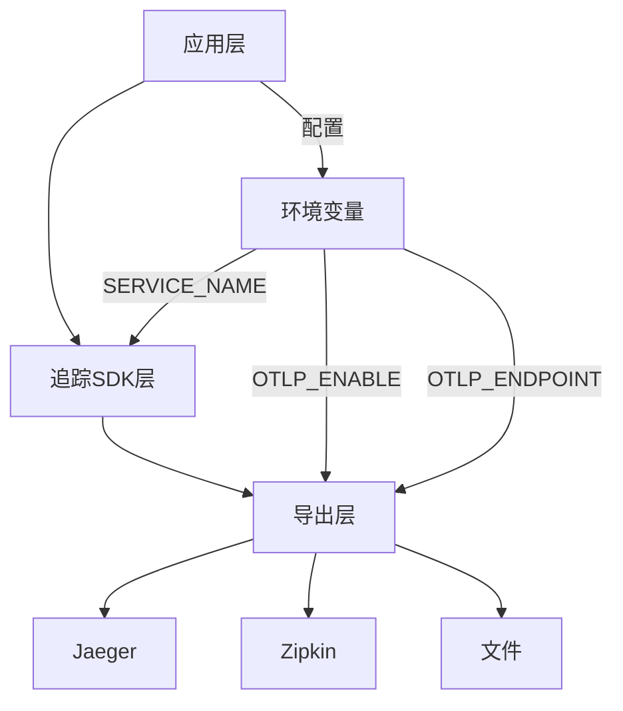
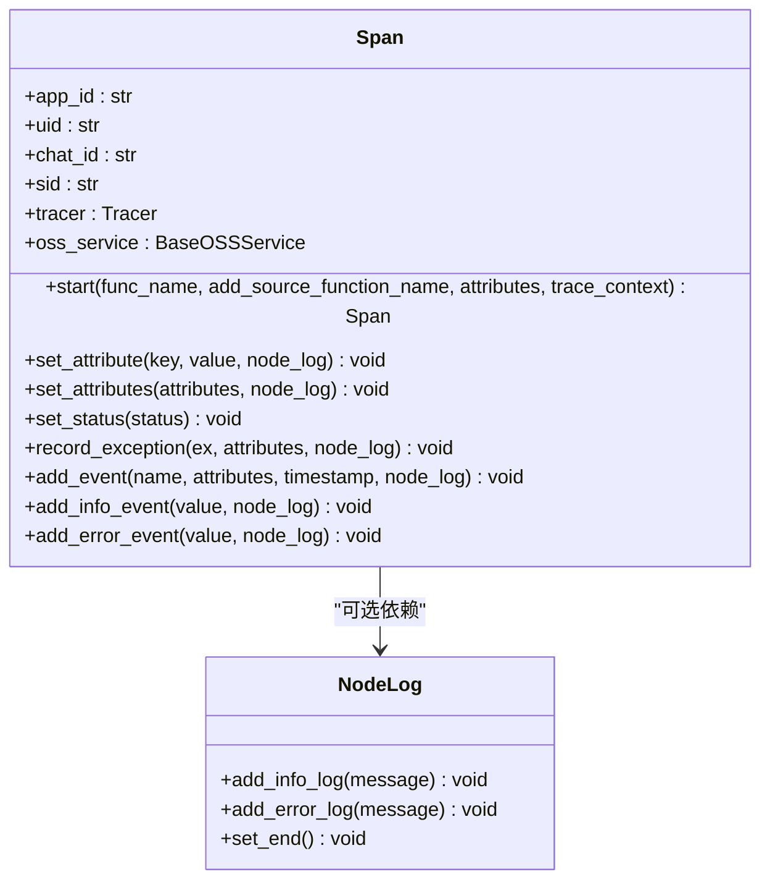
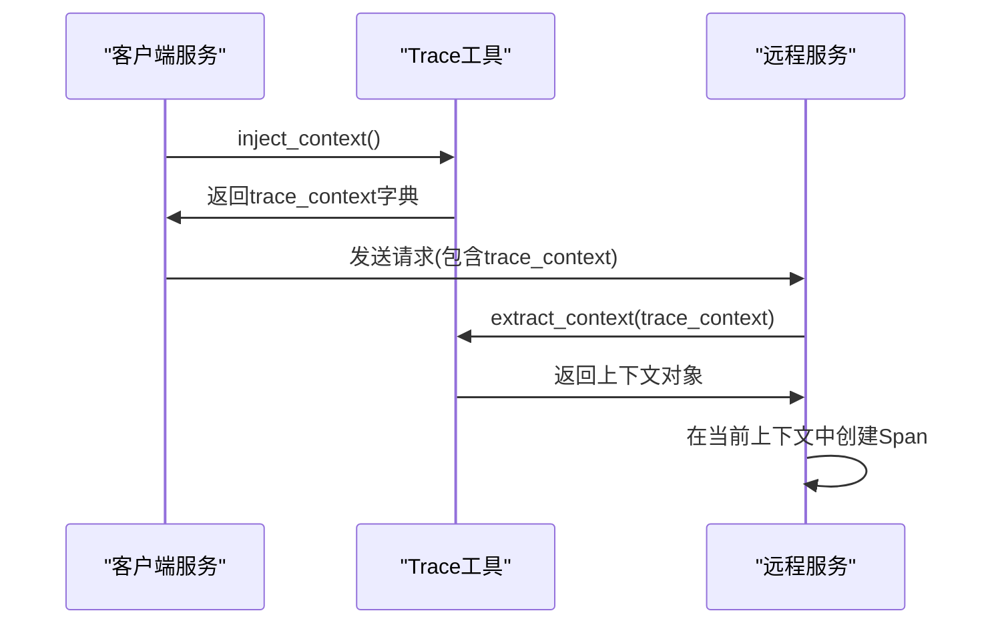
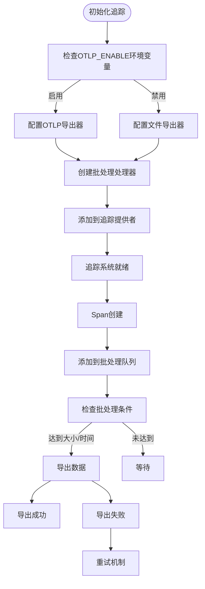
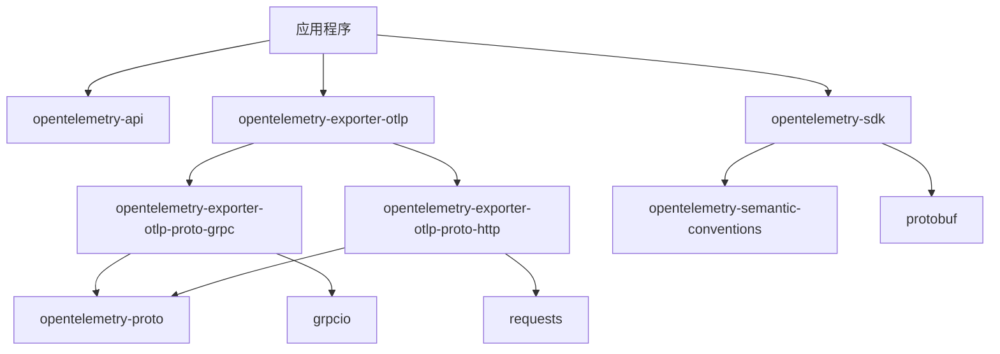

# 分布式追踪

<cite>
**本文档中引用的文件**   
- [span.py](file://core/common/otlp/trace/span.py)
- [trace.py](file://core/common/otlp/trace/trace.py)
- [sid.py](file://core/common/otlp/sid.py)
- [base.py](file://core/common/otlp/args/base.py)
- [sid.py](file://core/common/otlp/args/sid.py)
- [middleware.py](file://core/agent/infra/config/middleware.py)
- [initialize.py](file://core/common/initialize/initialize.py)
- [__init__.py](file://core/workflow/extensions/otlp/__init__.py)
</cite>

## 目录
1. [简介](#简介)
2. [核心组件](#核心组件)
3. [架构概述](#架构概述)
4. [详细组件分析](#详细组件分析)
5. [依赖分析](#依赖分析)
6. [性能考虑](#性能考虑)
7. [故障排除指南](#故障排除指南)
8. [结论](#结论)

## 简介
本文档详细介绍了astron-agent项目中基于OTLP的分布式追踪系统实现。该系统利用OpenTelemetry协议（OTLP）实现跨微服务的追踪数据采集、处理和导出。文档重点分析了Span创建、上下文传播和数据导出机制，说明了如何在微服务间传递追踪上下文。同时，文档还涵盖了追踪数据的采集流程、采样策略配置、与Jaeger和Zipkin等后端的集成，以及在不同环境中的启用和配置步骤。

## 核心组件
本系统的核心组件包括Span管理、追踪上下文传播、数据导出器和SID生成器。`Span`类负责创建和管理追踪跨度，支持属性设置、状态更新和异常记录。`Trace`类提供了上下文注入和提取功能，确保追踪信息在服务间正确传递。系统使用OTLP gRPC和HTTP协议导出追踪数据，并支持文件导出作为调试选项。SID生成器为每个追踪生成唯一标识符，包含服务子系统、进程ID、时间戳和网络位置信息。

**Section sources**
- [span.py](file://core/common/otlp/trace/span.py#L1-L277)
- [trace.py](file://core/common/otlp/trace/trace.py#L1-L127)
- [sid.py](file://core/common/otlp/sid.py#L1-L51)

## 架构概述
系统采用分层架构，包括应用层、追踪SDK层和导出层。应用层通过中间件注入追踪逻辑，业务代码通过Span类添加追踪点。追踪SDK层由OpenTelemetry SDK实现，负责Span的创建、管理和上下文传播。导出层包含OTLP导出器，将追踪数据发送到后端系统如Jaeger或Zipkin。

**Diagram sources**
- [trace.py](file://core/common/otlp/trace/trace.py#L1-L127)
- [middleware.py](file://core/agent/infra/config/middleware.py#L1-L64)

## 详细组件分析

### Span管理分析
`Span`类是追踪系统的核心，提供了一种上下文管理器模式来创建和管理追踪跨度。通过`start`方法，可以在代码块中自动创建和结束Span，确保资源的正确释放。

#### 对象导向组件：

**Diagram sources**
- [span.py](file://core/common/otlp/trace/span.py#L1-L277)

### 上下文传播分析
追踪上下文传播通过`Trace`类的`inject_context`和`extract_context`方法实现。这些方法利用OpenTelemetry的propagate模块，在服务调用间传递追踪上下文。

#### API/服务组件：

**Diagram sources**
- [trace.py](file://core/common/otlp/trace/trace.py#L1-L127)

### 数据导出分析
数据导出流程包括初始化、批处理和传输三个阶段。系统使用`BatchSpanProcessor`对Span进行批处理，然后通过`OTLPSpanExporter`将数据导出到指定端点。

#### 复杂逻辑组件：

**Diagram sources**
- [trace.py](file://core/common/otlp/trace/trace.py#L1-L127)

**Section sources**
- [trace.py](file://core/common/otlp/trace/trace.py#L1-L127)
- [span.py](file://core/common/otlp/trace/span.py#L1-L277)

## 依赖分析
系统依赖于OpenTelemetry生态系统，包括核心API、SDK、OTLP导出器和协议定义。这些依赖通过uv.lock文件管理，确保版本一致性。

**Diagram sources**
- [uv.lock](file://core/agent/uv.lock#L910-L1008)
- [uv.lock](file://core/plugin/rpa/uv.lock#L549-L647)

**Section sources**
- [uv.lock](file://core/agent/uv.lock#L910-L1008)
- [uv.lock](file://core/plugin/rpa/uv.lock#L549-L647)

## 性能考虑
分布式追踪系统在提供可观测性的同时也会带来一定的性能开销。系统通过多种机制优化性能：

1. **批处理导出**：使用`BatchSpanProcessor`将多个Span批量导出，减少网络请求次数。
2. **异步处理**：导出操作在后台线程中执行，避免阻塞主业务逻辑。
3. **内存限制**：配置`max_queue_size`和`span_limit`参数，防止内存无限增长。
4. **条件启用**：通过`OTLP_ENABLE`环境变量控制追踪功能的启用，可在生产环境中根据需要开启。

在高负载场景下，建议调整以下参数：
- `max_queue_size`：增加队列大小以缓冲更多Span
- `schedule_delay_millis`：延长批处理间隔以减少导出频率
- `max_export_batch_size`：增加批处理大小以提高导出效率

**Section sources**
- [trace.py](file://core/common/otlp/trace/trace.py#L1-L127)

## 故障排除指南
当追踪系统出现问题时，可以按照以下步骤进行排查：

1. **检查环境变量**：确保`OTLP_ENABLE`设置为`true`，`OTLP_ENDPOINT`和`SERVICE_NAME`正确配置。
2. **验证网络连接**：确认应用能够访问OTLP端点（默认4317端口用于gRPC，4318用于HTTP）。
3. **查看日志输出**：系统会将追踪数据输出到文件导出器，可用于验证Span是否正确生成。
4. **检查依赖版本**：确保OpenTelemetry相关包版本兼容。

常见问题及解决方案：
- **追踪数据未显示**：检查`OTLP_ENABLE`环境变量是否启用，验证后端服务是否正常运行。
- **性能下降**：降低采样率或暂时禁用追踪功能，检查批处理参数配置。
- **内存占用过高**：减小`max_queue_size`和`span_limit`值，或增加导出频率。

**Section sources**
- [trace.py](file://core/common/otlp/trace/trace.py#L1-L127)
- [middleware.py](file://core/agent/infra/config/middleware.py#L1-L64)

## 结论
astron-agent的分布式追踪系统基于OpenTelemetry标准实现，提供了完整的端到端追踪能力。系统通过模块化设计，实现了Span管理、上下文传播和数据导出的核心功能。通过合理的配置，可以在开发、测试和生产环境中灵活启用追踪功能，为微服务架构提供强大的可观测性支持。未来可进一步优化采样策略，实现更精细的性能监控和成本控制。