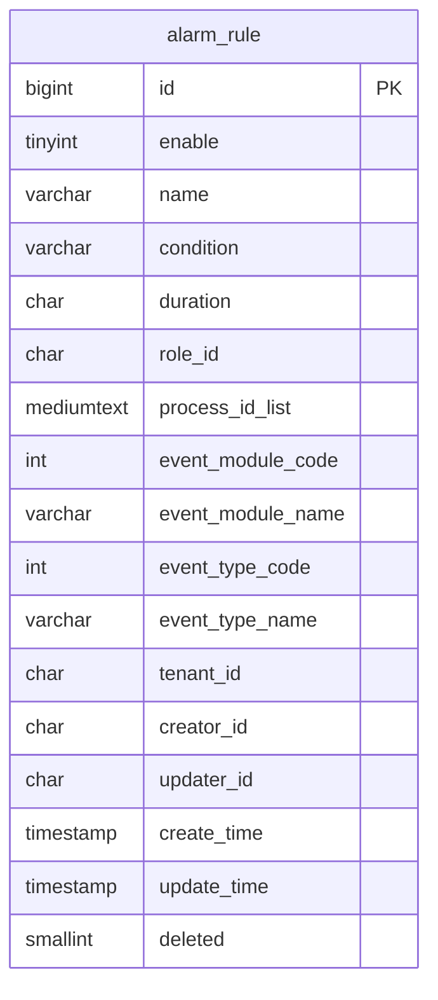
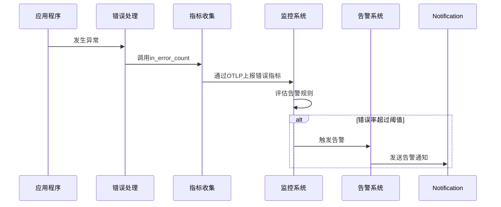
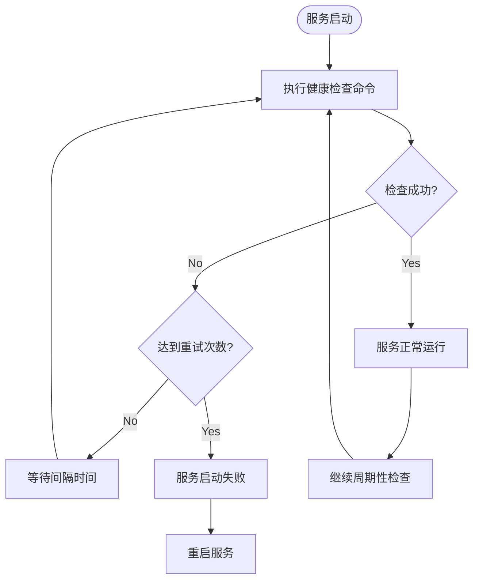

# 告警配置

<cite>
**本文档引用文件**  
- [docker-compose.yaml](file://docker/astronAgent/docker-compose.yaml)
- [schema.sql](file://docker/astronAgent/astronRPA/volumes/mysql/schema.sql)
- [config.toml](file://docker/astronAgent/config/tenant/config.toml)
- [metric.py](file://core/common/otlp/metrics/metric.py)
- [meter.py](file://core/common/otlp/metrics/meter.py)
- [base.py](file://core/common/exceptions/base.py)
</cite>

## 目录
1. [告警系统概述](#告警系统概述)
2. [基于监控指标的告警规则配置](#基于监控指标的告警规则配置)
3. [错误处理机制与告警集成](#错误处理机制与告警集成)
4. [Prometheus告警规则配置示例](#prometheus告警规则配置示例)
5. [告警通知渠道配置](#告警通知渠道配置)
6. [Docker服务资源配置与健康检查](#docker服务资源配置与健康检查)
7. [告警抑制与去重最佳实践](#告警抑制与去重最佳实践)

## 告警系统概述

astron-agent项目的告警系统基于OpenTelemetry（OTLP）监控框架实现，通过收集系统运行时的各类指标数据，结合预设的告警规则，实现对系统健康状况的实时监控和异常告警。系统通过MySQL数据库中的`alarm_rule`表存储告警规则配置，支持基于错误率、响应时间、系统资源等多维度指标的告警触发。

告警系统的核心组件包括指标收集、错误处理、告警规则管理和通知分发。指标收集通过OTLP协议实现，错误处理机制与告警系统深度集成，确保异常情况能够及时触发告警。告警规则支持灵活配置，包括告警条件、持续时间、通知策略等。

**Section sources**
- [schema.sql](file://docker/astronAgent/astronRPA/volumes/mysql/schema.sql#L10-L36)
- [docker-compose.yaml](file://docker/astronAgent/docker-compose.yaml#L0-L613)

## 基于监控指标的告警规则配置

告警规则的配置基于MySQL数据库中的`alarm_rule`表，该表定义了告警规则的各项属性。告警规则支持基于多种监控指标的配置，包括错误率、响应时间、系统资源使用率等。

告警规则的主要配置项包括：
- **enable**: 布尔值，表示告警规则是否启用
- **name**: 告警规则名称
- **condition**: 告警条件，以JSON字符串形式存储，包含时间、次数等条件
- **duration**: 告警持续时间，格式为HH:MM:SS-HH:MM:SS
- **event_module_name**: 事件模块名称
- **event_type_name**: 事件类型名称

告警规则通过监控系统收集的指标数据进行评估，当满足预设条件时触发告警。系统支持对不同模块和事件类型的告警规则进行分类管理，便于运维人员根据业务需求进行配置。



**Diagram sources**
- [schema.sql](file://docker/astronAgent/astronRPA/volumes/mysql/schema.sql#L10-L36)

**Section sources**
- [schema.sql](file://docker/astronAgent/astronRPA/volumes/mysql/schema.sql#L10-L36)

## 错误处理机制与告警集成

系统的错误处理机制与告警系统深度集成，通过OpenTelemetry的指标收集功能实现错误率的监控和告警。错误处理的核心实现在`core/common/otlp/metrics/meter.py`文件中，通过`Meter`类提供错误计数和耗时记录功能。

当系统发生异常时，错误处理机制会记录错误码和错误次数，并通过OTLP协议上报给监控系统。`in_error_count`方法用于记录错误次数，同时可以选择是否上报耗时指标。错误处理机制还支持为不同的错误类型设置标签，便于后续的告警规则配置和问题分析。

错误处理与告警的集成流程如下：
1. 系统发生异常时，调用`in_error_count`方法记录错误
2. 错误信息通过OTLP协议上报给监控后端
3. 监控系统根据预设的告警规则评估错误率
4. 当错误率达到阈值时，触发告警并发送通知



**Diagram sources**
- [meter.py](file://core/common/otlp/metrics/meter.py#L0-L131)
- [metric.py](file://core/common/otlp/metrics/metric.py#L0-L82)

**Section sources**
- [meter.py](file://core/common/otlp/metrics/meter.py#L0-L131)
- [base.py](file://core/common/exceptions/base.py#L0-L109)

## Prometheus告警规则配置示例

虽然项目中未直接包含Prometheus配置文件，但基于OTLP的监控架构可以与Prometheus集成。以下为基于项目监控指标的Prometheus告警规则配置示例：

```yaml
groups:
  - name: astron-agent-alerts
    rules:
      - alert: HighErrorRate
        expr: rate(server_request_total{ret!="0"}[5m]) / rate(server_request_total[5m]) > 0.1
        for: 10m
        labels:
          severity: critical
        annotations:
          summary: "高错误率告警"
          description: "服务错误率在过去5分钟内持续高于10%，当前错误率为{{ $value }}%"
          value: "{{ $value }}"
        group_by: [server_name, app_id]
      
      - alert: HighResponseTime
        expr: histogram_quantile(0.95, sum(rate(server_request_time_microseconds_bucket[5m])) by (le, server_name, app_id)) / 1000 > 1000
        for: 5m
        labels:
          severity: warning
        annotations:
          summary: "高响应时间告警"
          description: "服务95分位响应时间超过1秒，当前响应时间为{{ $value }}ms"
          value: "{{ $value }}"
        group_by: [server_name, app_id]
      
      - alert: ServiceDown
        expr: up == 0
        for: 1m
        labels:
          severity: critical
        annotations:
          summary: "服务不可用"
          description: "服务实例已停止上报心跳，可能已宕机"
        group_by: [instance, job]
```

上述配置示例中，告警规则基于以下指标：
- `server_request_total`: 服务请求总数，通过`ret`标签区分成功和失败请求
- `server_request_time_microseconds`: 服务请求耗时，以微秒为单位
- `up`: 服务健康状态指标

告警规则配置了不同的阈值、持续时间和分组策略，确保告警的准确性和可管理性。

**Section sources**
- [metric.py](file://core/common/otlp/metrics/metric.py#L0-L82)
- [meter.py](file://core/common/otlp/metrics/meter.py#L0-L131)

## 告警通知渠道配置

告警通知渠道的配置主要通过环境变量和外部系统集成实现。项目中的`docker-compose.yaml`文件定义了多个服务的环境变量，这些变量可用于配置告警通知的相关参数。

告警通知渠道的配置要点包括：
1. **邮件通知**: 通过配置SMTP服务器相关环境变量实现
2. **Slack通知**: 通过配置Slack Webhook URL实现
3. **其他通知渠道**: 通过集成外部通知服务实现

在`docker-compose.yaml`文件中，可以通过设置环境变量来配置通知渠道的认证信息和API端点。例如，可以设置`ALERT_EMAIL_SMTP_HOST`、`ALERT_EMAIL_USERNAME`等环境变量来配置邮件通知。

告警通知的分组策略通过Prometheus告警规则中的`group_by`字段实现，可以根据服务名称、应用ID等维度对告警进行分组，避免告警风暴。

**Section sources**
- [docker-compose.yaml](file://docker/astronAgent/docker-compose.yaml#L0-L613)

## Docker服务资源配置与健康检查

在`docker-compose.yaml`文件中，各个服务的资源配置和健康检查通过特定的配置项实现。这些配置对于确保服务的稳定运行和及时发现故障至关重要。

### 资源限制配置

服务的资源限制主要通过`deploy.resources`配置项实现，但当前配置文件中未显式设置资源限制。建议根据生产环境需求添加资源限制配置：

```yaml
services:
  core-agent:
    # ... 其他配置
    deploy:
      resources:
        limits:
          cpus: '2'
          memory: 4G
        reservations:
          cpus: '1'
          memory: 2G
```

### 健康检查配置

健康检查通过`healthcheck`配置项实现，用于监控服务的运行状态。项目中多个服务都配置了健康检查，例如：

- **PostgreSQL**: 使用`pg_isready`命令检查数据库状态
- **MySQL**: 使用`mysqladmin ping`命令检查数据库状态
- **Redis**: 使用`redis-cli ping`命令检查缓存状态
- **Nginx**: 使用`curl`命令检查HTTP端点状态

健康检查的配置参数包括：
- `test`: 健康检查命令
- `interval`: 检查间隔
- `timeout`: 超时时间
- `retries`: 重试次数
- `start_period`: 启动等待期

这些健康检查配置确保了服务在启动和运行过程中的稳定性，当服务出现故障时能够及时被发现和处理。



**Diagram sources**
- [docker-compose.yaml](file://docker/astronAgent/docker-compose.yaml#L0-L613)

**Section sources**
- [docker-compose.yaml](file://docker/astronAgent/docker-compose.yaml#L0-L613)

## 告警抑制与去重最佳实践

告警抑制和去重是告警管理中的重要环节，能够有效减少告警噪音，提高告警的准确性和可操作性。以下是基于项目架构的告警抑制与去重最佳实践：

### 告警抑制策略

1. **依赖服务抑制**: 当底层基础设施（如数据库、缓存）出现故障时，抑制上层应用服务的告警，避免告警风暴。
2. **维护窗口抑制**: 在计划内的维护窗口期间，临时抑制相关服务的告警。
3. **已知问题抑制**: 对于已知且正在处理的问题，设置临时抑制规则，避免重复告警。

### 告警去重策略

1. **基于标签分组**: 通过`group_by`配置项对告警进行合理分组，将相同原因的告警合并。
2. **告警持续时间**: 设置合理的`for`持续时间，避免瞬时波动触发告警。
3. **告警恢复通知**: 配置告警恢复通知，确保问题解决后能够及时知晓。

### 配置示例

```yaml
# 告警抑制规则示例
alerting:
  alertmanagers:
  - static_configs:
    - targets:
      - alertmanager:9093
    timeout: 10s
    api_version: v2

# 告警路由配置
route:
  group_by: ['alertname', 'service', 'app_id']
  group_wait: 30s
  group_interval: 5m
  repeat_interval: 3h
  receiver: default-receiver
  
  # 抑制规则
  inhibit_rules:
  - source_match:
      severity: 'critical'
    target_match:
      severity: 'warning'
    equal: ['alertname', 'service', 'app_id']
    
  # 特定服务的路由
  routes:
  - receiver: database-team
    matchers:
    - service=~"postgres|mysql"
    
  - receiver: frontend-team
    matchers:
    - service="nginx"
```

通过合理的告警抑制和去重配置，可以显著提高告警系统的有效性和运维效率。

**Section sources**
- [docker-compose.yaml](file://docker/astronAgent/docker-compose.yaml#L0-L613)
- [metric.py](file://core/common/otlp/metrics/metric.py#L0-L82)