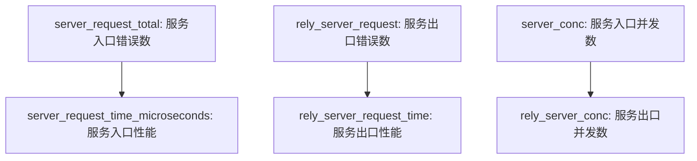
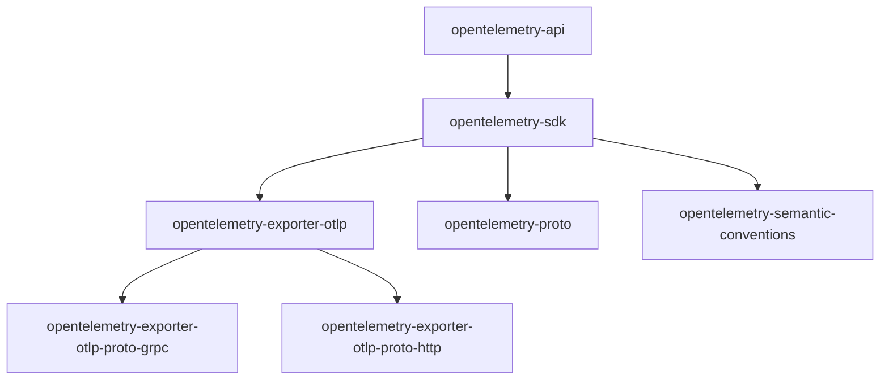
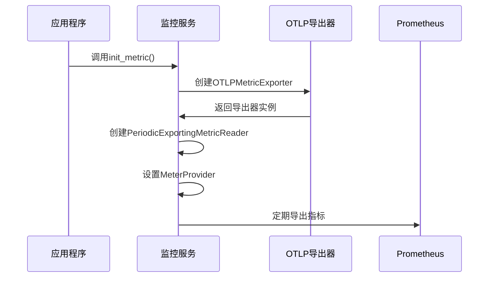
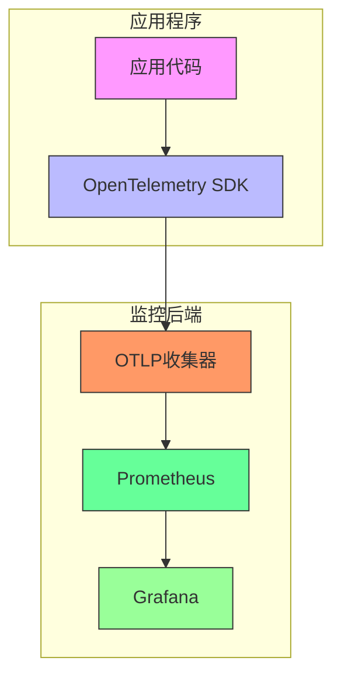

# 指标监控

<cite>
**本文档引用的文件**
- [metric.py](file://core/common/otlp/metrics/metric.py)
- [metric.py](file://core/workflow/extensions/otlp/metric/metric.py)
- [consts.py](file://core/common/otlp/metrics/consts.py)
- [consts.py](file://core/workflow/extensions/otlp/metric/consts.py)
- [metric.py](file://core/common/otlp/args/metric.py)
- [pyproject.toml](file://core/common/pyproject.toml)
- [pyproject.toml](file://core/agent/pyproject.toml)
- [pyproject.toml](file://core/workflow/pyproject.toml)
- [factory.py](file://core/common/service/otlp/metric/factory.py)
- [manager.py](file://core/workflow/extensions/middleware/otlp/manager.py)
</cite>

## 目录
1. [引言](#引言)
2. [监控指标定义](#监控指标定义)
3. [依赖管理](#依赖管理)
4. [Prometheus监控端点配置](#prometheus监控端点配置)
5. [Grafana集成](#grafana集成)
6. [超时监控配置](#超时监控配置)
7. [性能优化建议](#性能优化建议)
8. [结论](#结论)

## 引言
本项目采用OpenTelemetry标准实现全面的指标监控系统，用于采集和监控系统性能指标。监控系统覆盖了请求延迟、错误率、系统资源使用情况等关键性能指标，为系统稳定性提供数据支持。通过OTLP（OpenTelemetry Protocol）协议，系统能够将监控数据导出到各种后端监控系统，如Prometheus、Grafana等。

## 监控指标定义
系统定义了多种核心监控指标，用于全面评估系统性能和健康状况。

### 请求性能指标
系统定义了以下请求性能相关指标：



**Diagram sources**
- [consts.py](file://core/common/otlp/metrics/consts.py#L1-L17)

**Section sources**
- [consts.py](file://core/common/otlp/metrics/consts.py#L1-L17)
- [consts.py](file://core/workflow/extensions/otlp/metric/consts.py#L1-L24)

### 指标类型说明
| 指标名称 | 类型 | 描述 | 单位 |
|--------|-----|------|-----|
| server_request_total | 计数器 | 服务入口错误数 | 次 |
| server_request_time_microseconds | 直方图 | 服务入口性能 | 微秒 |
| rely_server_request | 计数器 | 服务出口错误数 | 次 |
| server_conc | 计数器 | 服务入口并发数 | 个 |
| rely_server_conc | 计数器 | 服务出口并发数 | 个 |
| server_appid_request_time | 直方图 | 应用级别服务入口性能 | 微秒 |

**Section sources**
- [consts.py](file://core/common/otlp/metrics/consts.py#L1-L17)

## 依赖管理
系统通过pyproject.toml文件管理监控相关的Python依赖包。

### 核心依赖包
系统依赖以下OpenTelemetry相关包：



**Diagram sources**
- [pyproject.toml](file://core/common/pyproject.toml#L1-L54)

**Section sources**
- [pyproject.toml](file://core/common/pyproject.toml#L1-L54)
- [pyproject.toml](file://core/agent/pyproject.toml#L1-L54)
- [pyproject.toml](file://core/workflow/pyproject.toml#L1-L54)

### 依赖版本管理
不同模块使用了不同版本的OpenTelemetry依赖：

| 模块 | opentelemetry-sdk版本 | opentelemetry-exporter-otlp版本 | 状态 |
|------|-------------------|-----------------------------|------|
| core/common | 1.27.0 | 1.27.0 | 稳定 |
| core/agent | 1.27.0 | 1.27.0 | 稳定 |
| core/workflow | 1.37.0 | 1.37.0 | 最新 |

**Section sources**
- [uv.lock](file://core/common/uv.lock#L950-L974)
- [uv.lock](file://core/agent/uv.lock#L910-L933)
- [uv.lock](file://core/plugin/rpa/uv.lock#L549-L572)

## Prometheus监控端点配置
系统通过OpenTelemetry SDK配置Prometheus监控端点，实现指标的采集和导出。

### 初始化配置
监控系统通过`init_metric`函数进行初始化配置：



**Diagram sources**
- [metric.py](file://core/common/otlp/metrics/metric.py#L21-L82)
- [metric.py](file://core/workflow/extensions/otlp/metric/metric.py#L31-L94)

**Section sources**
- [metric.py](file://core/common/otlp/metrics/metric.py#L21-L82)
- [metric.py](file://core/workflow/extensions/otlp/metric/metric.py#L31-L94)

### 配置参数
| 参数名称 | 默认值 | 描述 | 建议值 |
|--------|-------|------|-------|
| endpoint | 无 | OpenTelemetry收集器地址 | 172.30.209.27:4317 |
| timeout | 5000 | 服务端连接超时时间(毫秒) | 5000 |
| export_interval_millis | 1000 | SDK上报指标时间间隔(毫秒) | <30000 |
| export_timeout_millis | 5000 | 指标上报服务端超时时间(毫秒) | 5000 |

**Section sources**
- [metric.py](file://core/common/otlp/metrics/metric.py#L21-L82)

## Grafana集成
系统通过OpenTelemetry与Grafana集成，实现可视化监控。

### 集成架构


**Diagram sources**
- [metric.py](file://core/common/otlp/metrics/metric.py#L21-L82)

### 仪表板配置
系统支持以下Grafana仪表板配置：

1. **系统概览仪表板**
   - 总请求数
   - 错误率
   - 平均响应时间
   - 并发数

2. **性能分析仪表板**
   - P50/P90/P99延迟
   - 各接口性能对比
   - 时间序列分析

3. **错误监控仪表板**
   - 错误类型分布
   - 错误时间分布
   - 错误关联分析

**Section sources**
- [metric.py](file://core/common/otlp/metrics/metric.py#L21-L82)

## 超时监控配置
系统提供了详细的超时相关监控指标配置，用于优化系统性能。

### 超时参数配置
系统通过`OtlpMetricArgs`类定义超时相关参数：

```python
class OtlpMetricArgs(BaseOtlpArgs):
    metric_timeout: int = Field(default=0)
    metric_export_interval_millis: int = Field(default=0)
    metric_export_timeout_millis: int = Field(default=0)
```

**Section sources**
- [metric.py](file://core/common/otlp/args/metric.py#L1-L9)

### 超时监控策略
| 超时类型 | 配置参数 | 默认值 | 优化建议 |
|--------|--------|-------|--------|
| 连接超时 | timeout | 5000ms | 根据网络状况调整 |
| 导出间隔 | export_interval_millis | 1000ms | 建议<30000ms |
| 导出超时 | export_timeout_millis | 5000ms | 根据后端性能调整 |

**Section sources**
- [metric.py](file://core/common/otlp/args/metric.py#L1-L9)
- [metric.py](file://core/common/otlp/metrics/metric.py#L21-L82)

## 性能优化建议
基于监控数据，可以采取以下性能优化措施：

### 数据采集优化
1. **调整导出间隔**
   - 当前默认值：1000ms
   - 建议：根据系统负载调整，高负载系统可适当增加间隔

2. **批量导出配置**
   - 当前配置：max_export_batch_size=1000
   - 建议：根据网络带宽和后端处理能力调整

### 系统性能优化
1. **监控指标选择**
   - 仅启用必要的监控指标
   - 避免过度监控导致性能开销

2. **异步导出**
   - 使用PeriodicExportingMetricReader实现异步导出
   - 避免阻塞主业务流程

3. **环境变量控制**
   ```python
   enable_metrics = os.getenv("OTLP_ENABLE", "true").lower() in ("true", "1", "yes", "on")
   ```
   - 生产环境：启用监控
   - 开发环境：可根据需要关闭

**Section sources**
- [metric.py](file://core/common/otlp/metrics/metric.py#L21-L82)
- [metric.py](file://core/common/otlp/args/metric.py#L1-L9)

## 结论
本项目的指标监控系统基于OpenTelemetry标准构建，提供了全面的性能监控能力。系统通过标准化的指标定义、灵活的配置选项和完善的依赖管理，实现了对请求延迟、错误率、系统资源使用情况等关键性能指标的采集和监控。通过与Prometheus和Grafana的集成，系统能够提供直观的可视化监控界面，帮助开发和运维团队及时发现和解决性能问题。建议根据实际生产环境的需求，合理配置监控参数，平衡监控粒度和系统性能开销。