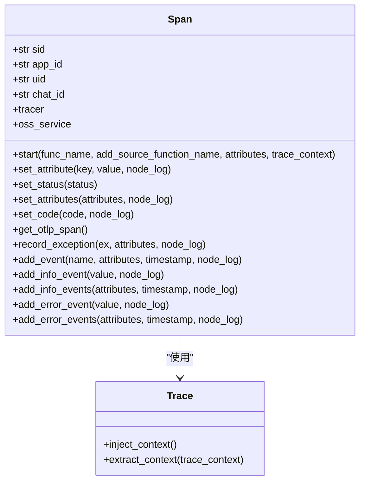
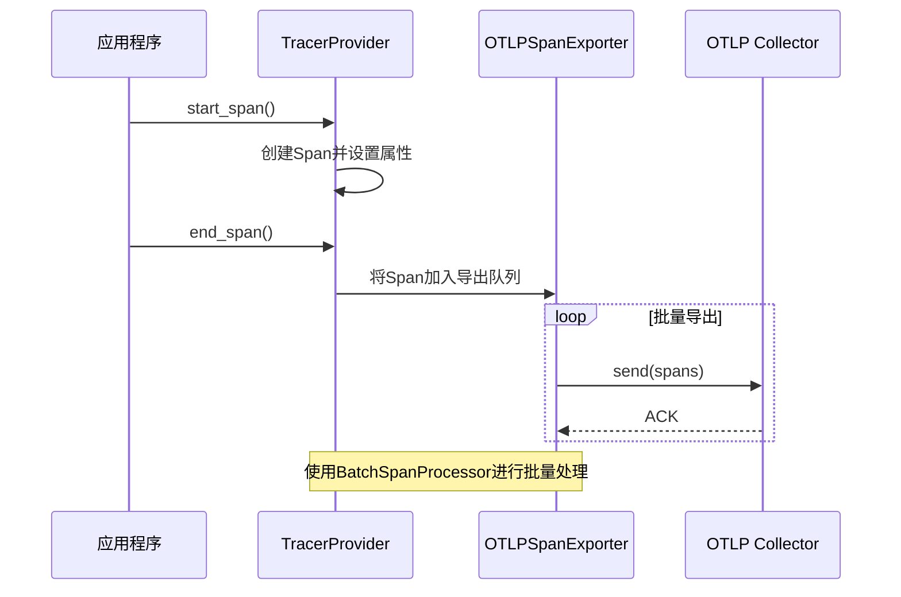
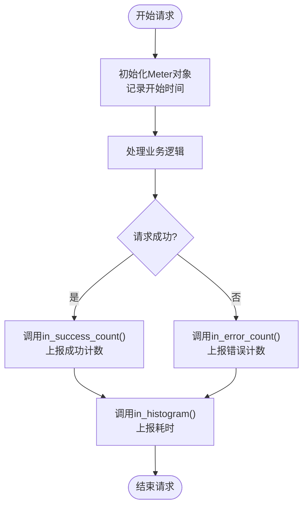
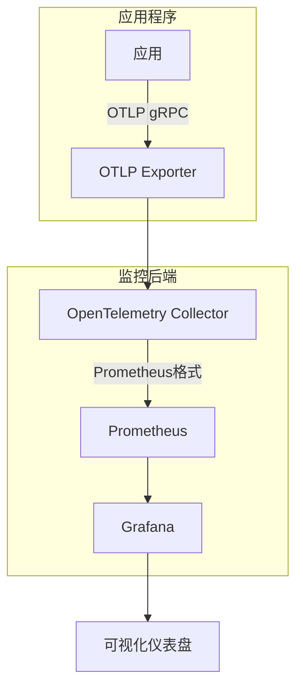

# 监控配置

<cite>
**本文档引用的文件**   
- [trace.py](file://core/common/otlp/trace/trace.py)
- [span.py](file://core/common/otlp/trace/span.py)
- [trace_args.py](file://core/common/otlp/args/trace.py)
- [meter.py](file://core/common/otlp/metrics/meter.py)
- [metric.py](file://core/common/otlp/metrics/metric.py)
- [consts.py](file://core/common/otlp/metrics/consts.py)
- [sid.py](file://core/common/otlp/sid.py)
- [ip.py](file://core/common/otlp/ip.py)
- [base.py](file://core/common/otlp/args/base.py)
- [pyproject.toml](file://core/agent/pyproject.toml)
- [docker-compose.yml](file://docker/ragflow/docker-compose.yml)
</cite>

## 目录
1. [引言](#引言)
2. [基于OTLP的分布式追踪系统](#基于otlp的分布式追踪系统)
3. [监控指标定义与采集](#监控指标定义与采集)
4. [环境配置与部署](#环境配置与部署)
5. [与Prometheus和Grafana集成](#与prometheus和grafana集成)
6. [采样率配置](#采样率配置)
7. [依赖管理](#依赖管理)
8. [结论](#结论)

## 引言

本监控配置文档详细阐述了astron-agent项目中基于OTLP（OpenTelemetry Protocol）的分布式追踪系统实现。系统通过OpenTelemetry SDK实现了全面的监控能力，包括分布式追踪、指标采集和日志记录。核心功能集中在`core/common/otlp`目录下，提供了从Span创建、上下文传播到数据导出的完整解决方案。监控系统设计用于在开发、测试和生产环境中提供一致的可观测性，帮助开发和运维团队快速诊断性能瓶颈和错误根源。

## 基于OTLP的分布式追踪系统

astron-agent项目实现了基于OTLP的分布式追踪系统，该系统是OpenTelemetry标准的实现，用于收集、处理和导出遥测数据。系统的核心是`trace.py`和`span.py`文件，它们共同构建了一个强大的追踪框架。

### Span的创建与管理

`Span`类是分布式追踪的基本单元，代表了代码中一个操作的执行。在`span.py`中，`Span`类的`start`方法是创建Span的入口点。该方法利用`opentelemetry`库的`start_as_current_span`上下文管理器来启动一个新的Span。在启动时，它会自动注入`sid`（会话ID）、`app_id`、`uid`（用户ID）和`chat_id`等关键业务上下文信息作为Span的属性，这极大地增强了追踪数据的可读性和可分析性。

**代码片段来源**
- [span.py](file://core/common/otlp/trace/span.py#L1-L277)
- [trace.py](file://core/common/otlp/trace/trace.py#L1-L127)

### 上下文传播机制

在分布式系统中，将一个请求的追踪上下文从一个服务传递到另一个服务至关重要。`trace.py`文件中的`Trace`类提供了`inject_context`和`extract_context`两个静态方法来实现这一功能。`inject_context`方法将当前的追踪上下文（如Trace ID和Span ID）注入到一个字典中，这个字典可以被序列化并通过HTTP头、消息队列等方式传递。`extract_context`方法则从接收到的上下文字典中提取信息，并恢复到当前的执行上下文中，从而确保了跨服务调用的追踪链路完整性。

### 数据导出机制

追踪数据的导出由`init_trace`函数初始化。该函数配置了`TracerProvider`，并根据环境变量`OTLP_ENABLE`决定是否启用远程导出。当启用时，系统会创建一个`OTLPSpanExporter`，通过gRPC协议将数据发送到指定的OTLP收集器（如Jaeger或OpenTelemetry Collector）。为了保证系统的健壮性，即使远程导出失败，系统还会配置一个`FileSpanExporter`作为备用，将追踪数据记录到本地日志文件中，确保数据不会丢失。

**代码片段来源**
- [trace.py](file://core/common/otlp/trace/trace.py#L50-L127)
- [trace_args.py](file://core/common/otlp/args/trace.py#L1-L12)

## 监控指标定义与采集

除了分布式追踪，系统还实现了全面的监控指标采集，用于衡量系统的性能和健康状况。

### 指标定义

系统定义了多种关键监控指标，这些指标在`consts.py`文件中以常量形式声明。主要指标包括：
- **请求计数**：`SERVER_REQUEST_TOTAL`用于统计服务入口的总请求数，`RELY_SERVER_REQUEST`用于统计依赖服务的调用次数。
- **请求耗时**：`SERVER_REQUEST_TIME_MICROSECONDS`用于记录服务入口的请求处理时间，`RELY_SERVER_REQUEST_TIME`用于记录对外部依赖的调用耗时。
- **并发数**：`SERVER_CONC`和`RELY_SERVER_CONC`用于监控服务入口和出口的并发请求数。
- **错误率**：通过`SERVER_REQUEST_DESC`等描述性常量，系统可以将错误码与请求计数关联，从而计算错误率。

### 指标采集流程

指标的采集由`meter.py`文件中的`Meter`类负责。`Meter`类的设计非常灵活，它在初始化时记录开始时间，并通过`in_histogram`方法计算请求的总耗时。`in_error_count`和`in_success_count`方法用于上报请求的成功或失败次数。这些方法会将指标数据通过`metric.py`中初始化的`counter`和`histogram`对象上报。

**代码片段来源**
- [meter.py](file://core/common/otlp/metrics/meter.py#L1-L132)
- [metric.py](file://core/common/otlp/metrics/metric.py#L1-L83)
- [consts.py](file://core/common/otlp/metrics/consts.py#L1-L18)

## 环境配置与部署

监控系统的配置需要根据不同环境进行调整，以平衡监控的详细程度和系统性能开销。

### 配置参数

系统通过`BaseOtlpArgs`和`OtlpTraceArgs`等Pydantic模型来管理配置。关键配置参数包括：
- `otlp_endpoint`：OTLP收集器的地址。
- `otlp_service_name`：服务名称，用于在监控系统中标识服务。
- `otlp_dc`：数据中心标识。
- `trace_timeout`：导出超时时间。
- `trace_max_queue_size`：导出队列的最大大小。
- `trace_schedule_delay_millis`：批处理导出的调度延迟。

### 不同环境的配置策略

- **开发环境**：应启用所有监控功能，`OTLP_ENABLE`设置为`true`，采样率设置为100%，以便开发人员可以详细分析所有请求。
- **测试环境**：同样应启用所有监控，但可以适当调整采样率以减少数据量，同时确保关键路径的覆盖率。
- **生产环境**：为了最小化性能影响，通常会启用采样。`OTLP_ENABLE`保持为`true`，但通过配置采样率来控制上报的数据量。同时，应确保`FileSpanExporter`始终启用，作为数据丢失的最后防线。

## 与Prometheus和Grafana集成

虽然代码中没有直接集成Prometheus的客户端库，但通过OTLP协议，系统可以轻松地与Prometheus和Grafana集成。

### 集成方案

1.  **部署OpenTelemetry Collector**：在`docker/ragflow`目录下的`docker-compose.yml`文件中，可以看到服务是通过Docker部署的。可以在同一Docker网络中部署一个OpenTelemetry Collector。
2.  **配置Collector**：Collector可以配置为接收来自`OTLPSpanExporter`的gRPC数据。Collector可以将接收到的指标数据转换为Prometheus格式，并通过其内置的Prometheus接收器暴露出来。
3.  **配置Prometheus**：Prometheus的`scrape_configs`可以配置为从Collector的Prometheus端点抓取数据。
4.  **配置Grafana**：Grafana可以添加Prometheus作为数据源，并使用PromQL查询语句创建丰富的仪表盘，可视化请求延迟、错误率和系统资源使用情况。

**代码片段来源**
- [docker-compose.yml](file://docker/ragflow/docker-compose.yml#L1-L73)

## 采样率配置

合理的采样率是平衡监控精度和系统性能的关键。虽然在提供的代码片段中没有直接的采样率配置，但OpenTelemetry SDK支持多种采样策略。

### 采样策略

- **AlwaysOn**：对所有请求进行采样，适用于开发和测试环境。
- **AlwaysOff**：不采样任何请求，仅用于调试。
- **TraceIdRatioBased**：基于Trace ID的比率进行采样，例如设置为0.1表示采样10%的请求。这是生产环境最常用的策略。
- **ParentBased**：如果父Span被采样，则子Span也必须被采样；如果父Span未被采样，则使用其他策略（如比率采样）决定。

### 配置方法

采样率通常在初始化`TracerProvider`时通过`Sampler`参数配置。例如，可以创建一个`TraceIdRatioBased`采样器，并将其传递给`TracerProvider`的构造函数。这个配置可以作为`init_trace`函数的一个可选参数，或者通过环境变量（如`OTLP_SAMPLING_RATIO`）来动态设置。

## 依赖管理

项目的Python依赖包通过`pyproject.toml`文件进行管理，这是一个现代的Python打包和依赖管理标准。

### 监控相关依赖

在`core/agent/pyproject.toml`文件中，可以找到与监控相关的依赖项。这些依赖项包括：
- `opentelemetry-sdk`：OpenTelemetry的核心SDK。
- `opentelemetry-exporter-otlp-proto-grpc`：用于通过gRPC协议导出OTLP数据的导出器。
- `opentelemetry-proto`：OTLP协议的protobuf定义。
- `opentelemetry-semantic-conventions`：OpenTelemetry语义约定，确保指标和追踪数据的标准化。

这些依赖项确保了项目能够使用最新的OpenTelemetry功能，并与各种监控后端兼容。

**代码片段来源**
- [pyproject.toml](file://core/agent/pyproject.toml)

## 结论

astron-agent项目通过`core/common/otlp`模块实现了一个功能完整、设计良好的基于OTLP的监控系统。该系统通过`Span`和`Meter`类提供了强大的分布式追踪和指标采集能力。通过`init_trace`和`init_metric`函数，系统可以灵活地配置数据导出目标和行为。虽然代码中没有直接集成Prometheus，但通过OTLP协议和OpenTelemetry Collector，可以无缝地与Prometheus和Grafana等主流监控平台集成。通过合理配置采样率和环境参数，该监控系统能够在保证系统性能的同时，为开发和运维团队提供宝贵的可观测性数据。