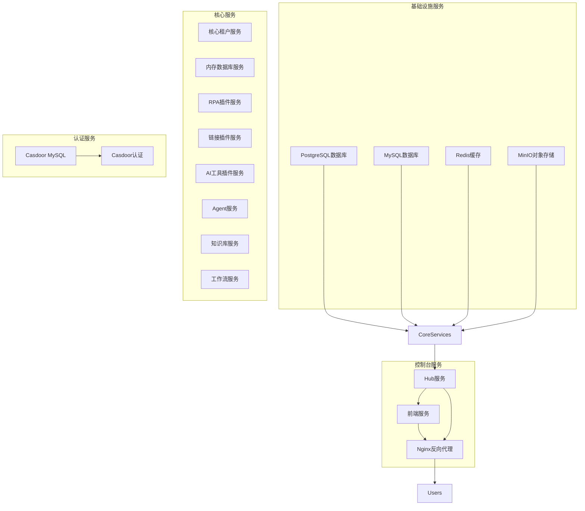
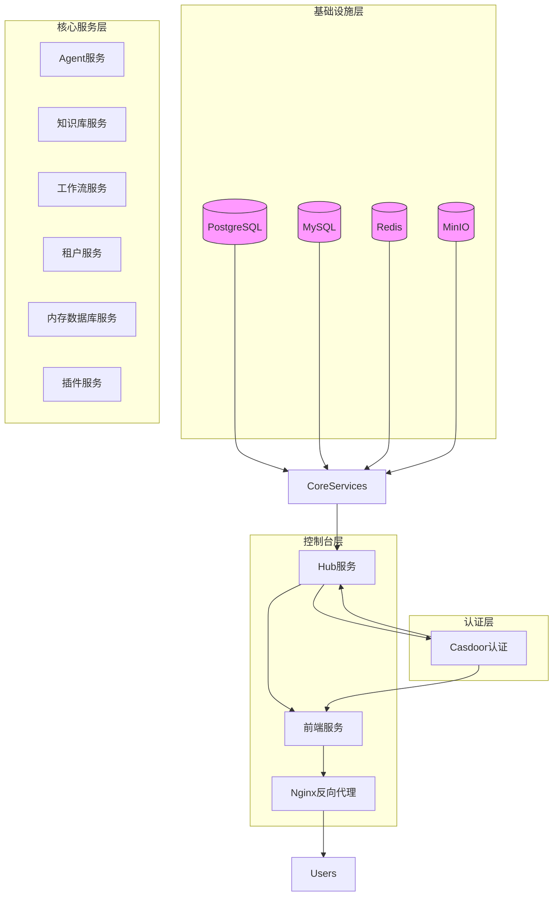
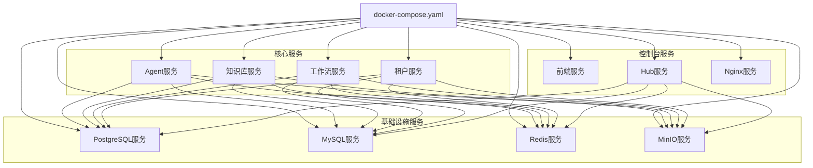
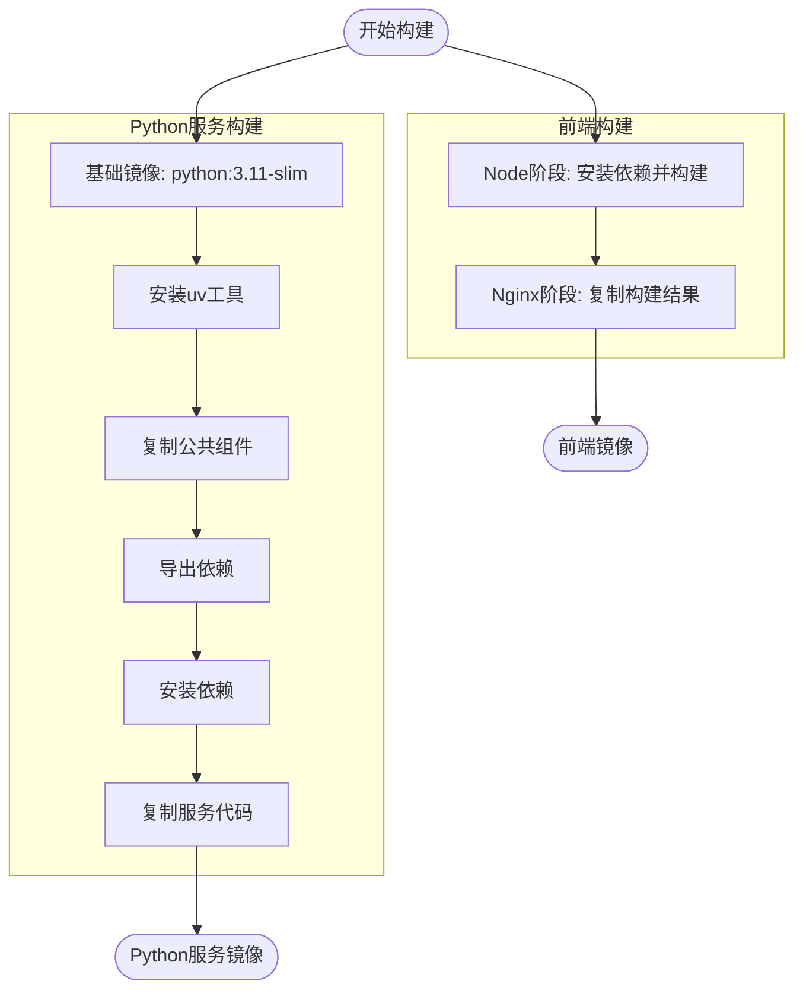
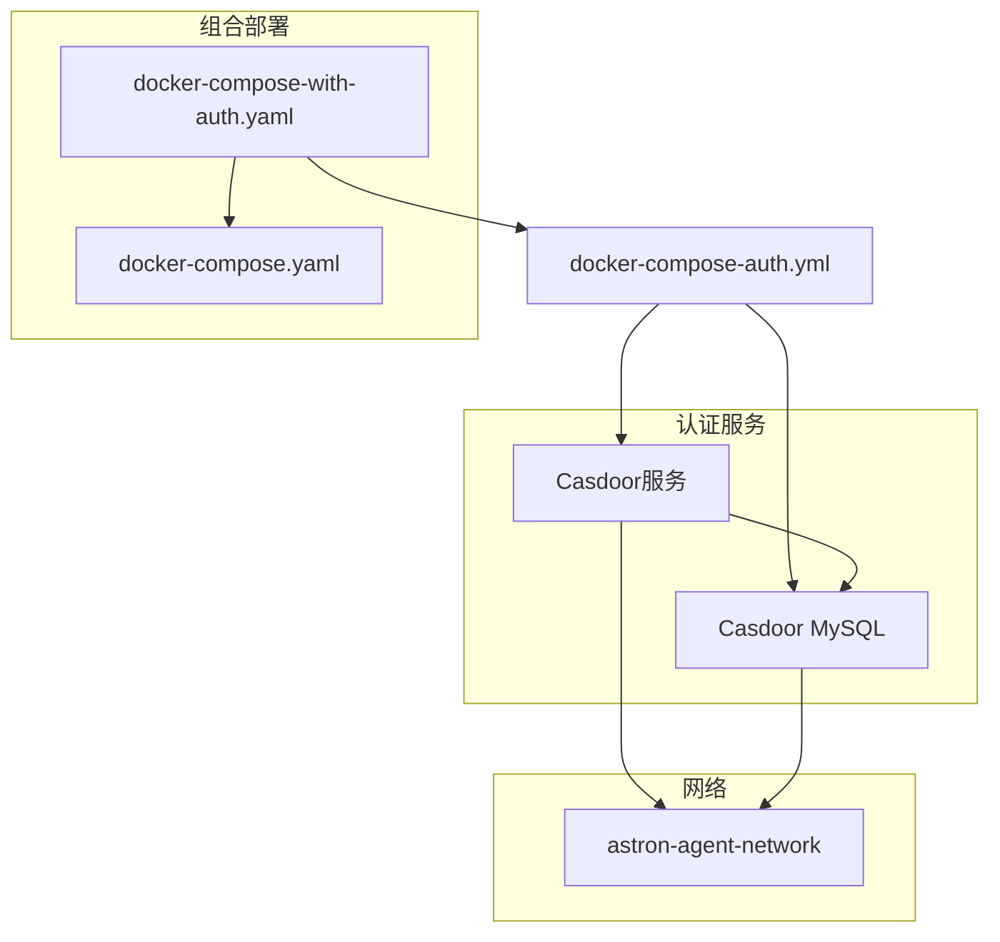
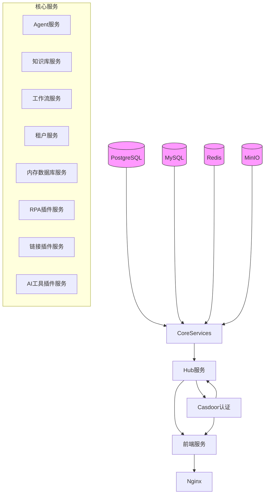

# 部署指南

<cite>
**本文档引用的文件**
- [docker-compose.yaml](file://docker/astronAgent/docker-compose.yaml)
- [Dockerfile](file://console/frontend/Dockerfile)
- [Dockerfile](file://core/agent/Dockerfile)
- [Dockerfile](file://core/knowledge/Dockerfile)
- [Dockerfile](file://core/memory/database/Dockerfile)
- [nginx.conf](file://console/frontend/nginx.conf)
- [docker-entrypoint.sh](file://console/frontend/docker-entrypoint.sh)
- [docker-compose-with-auth.yaml](file://docker/astronAgent/docker-compose-with-auth.yaml)
- [config.toml](file://docker/astronAgent/config/tenant/config.toml)
- [config.env.example](file://core/agent/config.env.example)
- [docker-compose-auth.yml](file://docker/astronAgent/docker-compose-auth.yml)
- [.env.production](file://console/frontend/.env.production)
</cite>

## 目录
1. [简介](#简介)
2. [项目结构](#项目结构)
3. [核心组件](#核心组件)
4. [架构概述](#架构概述)
5. [详细组件分析](#详细组件分析)
6. [依赖分析](#依赖分析)
7. [性能考虑](#性能考虑)
8. [故障排除指南](#故障排除指南)
9. [结论](#结论)

## 简介
本部署指南详细介绍了如何在生产环境中部署astron-agent系统。文档涵盖了使用Docker Compose进行多服务编排的完整步骤，解释了docker-compose.yaml文件中的服务配置，描述了各个服务的Docker镜像构建过程，包括前端、Agent、Knowledge等服务的Dockerfile。同时，文档详细说明了Casdoor认证服务的部署和配置，提供了环境变量配置指南和网络设置建议，包含高可用部署方案、负载均衡配置和监控集成，并提供了常见问题的故障排除解决方案。

## 项目结构
astron-agent项目采用微服务架构，主要分为核心服务、控制台服务和基础设施服务三大模块。项目根目录下的docker/astronAgent目录包含了所有Docker相关的部署配置文件，其中docker-compose.yaml定义了主要的服务编排，而docker-compose-auth.yml则专门用于Casdoor认证服务的配置。核心服务分布在core目录下，包括agent、knowledge、memory/database等关键组件，每个组件都有独立的Dockerfile用于镜像构建。控制台服务位于console目录，包含前端和hub两个子服务，前端使用React框架构建，通过Nginx提供静态资源服务。

**图源**
- [docker-compose.yaml](file://docker/astronAgent/docker-compose.yaml#L1-L614)

**本节来源**
- [docker-compose.yaml](file://docker/astronAgent/docker-compose.yaml#L1-L614)
- [project_structure](file://#L1-L100)

## 核心组件
astron-agent系统的核心组件包括Agent服务、知识库服务、工作流服务和各种插件服务。Agent服务是系统的主要业务逻辑处理中心，负责协调各个组件的工作；知识库服务提供RAG（检索增强生成）功能，支持与RAGFlow等外部知识库系统的集成；工作流服务管理复杂的业务流程和自动化任务；插件服务则扩展了系统的基本功能，包括RPA（机器人流程自动化）、链接管理和AI工具集成。所有核心服务都通过Docker容器化部署，使用Python作为主要开发语言，并通过Redis、MySQL和PostgreSQL等基础设施服务进行数据存储和缓存。

**本节来源**
- [docker-compose.yaml](file://docker/astronAgent/docker-compose.yaml#L1-L614)
- [core/agent/Dockerfile](file://core/agent/Dockerfile#L1-L24)

## 架构概述
astron-agent系统采用基于微服务的分布式架构，通过Docker Compose进行服务编排。整个系统运行在一个名为astron-agent-network的Docker桥接网络中，确保所有服务之间的网络互通。系统架构分为四层：基础设施层提供数据库、缓存和对象存储服务；核心服务层包含业务逻辑处理的各种微服务；控制台层提供用户界面和API网关功能；认证层负责用户身份验证和授权管理。服务之间通过HTTP/REST API和环境变量进行通信，关键服务如数据库、Redis和MinIO都配置了健康检查，确保系统的高可用性。

**图源**
- [docker-compose.yaml](file://docker/astronAgent/docker-compose.yaml#L1-L614)

## 详细组件分析

### Docker Compose编排分析
astron-agent系统使用Docker Compose进行多服务编排，主要配置文件为docker-compose.yaml。该文件定义了基础设施服务（PostgreSQL、MySQL、Redis、MinIO）、核心服务（Agent、知识库、工作流等）和控制台服务（前端、Hub、Nginx）的容器配置。每个服务都通过环境变量进行配置，支持外部化配置管理。服务之间通过depends_on条件依赖确保启动顺序，所有关键服务都配置了健康检查，确保只有在依赖服务健康时才启动。

**图源**
- [docker-compose.yaml](file://docker/astronAgent/docker-compose.yaml#L1-L614)

**本节来源**
- [docker-compose.yaml](file://docker/astronAgent/docker-compose.yaml#L1-L614)

### Docker镜像构建分析
系统各个服务的Docker镜像构建遵循统一的模式，但根据服务特性有所调整。前端服务使用多阶段构建，第一阶段使用Node.js容器进行前端构建，第二阶段使用Nginx容器作为运行时环境。Python后端服务（如Agent、知识库等）基于python:3.11-slim基础镜像，使用uv工具进行依赖管理，通过COPY源码和配置文件到容器中完成构建。所有Dockerfile都优化了构建缓存，通过分步COPY依赖文件和源码来提高构建效率。

**图源**
- [console/frontend/Dockerfile](file://console/frontend/Dockerfile#L1-L81)
- [core/agent/Dockerfile](file://core/agent/Dockerfile#L1-L24)

**本节来源**
- [console/frontend/Dockerfile](file://console/frontend/Dockerfile#L1-L81)
- [core/agent/Dockerfile](file://core/agent/Dockerfile#L1-L24)
- [core/knowledge/Dockerfile](file://core/knowledge/Dockerfile#L1-L19)

### Casdoor认证服务分析
Casdoor认证服务通过独立的docker-compose-auth.yml文件进行配置，包含casdoor主服务和casdoor-mysql数据库两个容器。Casdoor服务使用casbin/casdoor:latest镜像，通过环境变量配置控制台域名和主机基础地址。casdoor-mysql数据库初始化时创建casdoor数据库，并配置专用的用户名和密码。两个服务都运行在astron-agent-network网络中，确保与其他服务的网络互通。通过docker-compose-with-auth.yaml文件，可以将认证服务与其他服务组合部署。

**图源**
- [docker-compose-auth.yml](file://docker/astronAgent/docker-compose-auth.yml#L1-L50)

**本节来源**
- [docker-compose-auth.yml](file://docker/astronAgent/docker-compose-auth.yml#L1-L50)
- [docker-compose-with-auth.yaml](file://docker/astronAgent/docker-compose-with-auth.yaml#L1-L15)

## 依赖分析
astron-agent系统的组件之间存在复杂的依赖关系。基础设施服务（PostgreSQL、MySQL、Redis、MinIO）是所有核心服务的基础依赖，每个核心服务都通过depends_on条件依赖这些基础设施服务的健康状态。控制台服务（Hub）依赖所有核心服务和基础设施服务，前端服务则依赖Hub服务和Nginx反向代理。认证服务（Casdoor）相对独立，但控制台的前端和Hub服务都需要与Casdoor进行集成以实现用户认证功能。这种依赖关系确保了服务按正确的顺序启动，并在依赖服务不可用时不会启动。

**图源**
- [docker-compose.yaml](file://docker/astronAgent/docker-compose.yaml#L1-L614)

**本节来源**
- [docker-compose.yaml](file://docker/astronAgent/docker-compose.yaml#L1-L614)
- [docker-compose-auth.yml](file://docker/astronAgent/docker-compose-auth.yml#L1-L50)

## 性能考虑
在生产环境中部署astron-agent系统时，需要考虑多个性能优化方面。首先，数据库配置应根据实际负载调整连接池大小，docker-compose.yaml中配置的maxOpenConns和maxIdleConns参数需要根据并发用户数进行优化。其次，Redis作为缓存层，其内存分配和持久化策略需要根据数据访问模式进行调整。对于高并发场景，建议增加Nginx的工作进程数和连接数限制。此外，Python后端服务的workers参数可以根据CPU核心数进行配置，以充分利用多核处理器的性能。监控系统应集成OTLP协议，实时收集和分析系统性能指标。

## 故障排除指南
部署astron-agent系统时可能遇到的常见问题包括：服务启动失败、数据库连接问题、认证集成问题和网络配置问题。对于服务启动失败，应首先检查依赖服务的健康状态，确保所有基础设施服务正常运行。数据库连接问题通常由环境变量配置错误或网络不通引起，需要验证数据库地址、端口、用户名和密码的正确性。认证集成问题可能与Casdoor的配置有关，需要检查CONSOLE_CASDOOR_URL、CONSOLE_CASDOOR_ID等环境变量的设置。网络配置问题可以通过检查Docker网络设置和端口映射来解决。建议启用详细的日志记录，以便快速定位和解决问题。

**本节来源**
- [docker-compose.yaml](file://docker/astronAgent/docker-compose.yaml#L1-L614)
- [config.env.example](file://core/agent/config.env.example#L1-L97)
- [.env.production](file://console/frontend/.env.production#L1-L20)

## 结论
本部署指南全面介绍了astron-agent系统在生产环境中的部署方法。通过Docker Compose的多服务编排，系统能够高效地管理复杂的微服务架构。各个服务的Docker镜像构建过程经过优化，确保了构建效率和运行性能。Casdoor认证服务的集成提供了安全的用户身份验证机制。通过合理的环境变量配置和网络设置，系统能够稳定运行并支持高可用部署。建议在实际部署时根据具体需求调整配置参数，并建立完善的监控和故障排除机制，以确保系统的可靠性和性能。