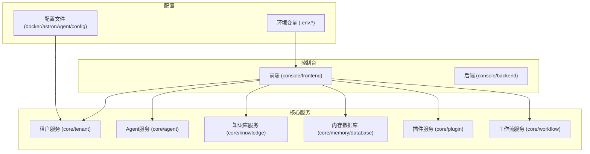
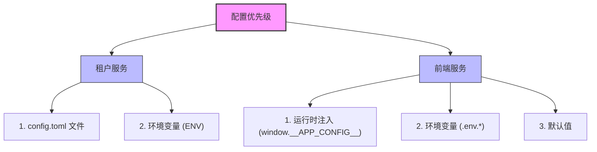
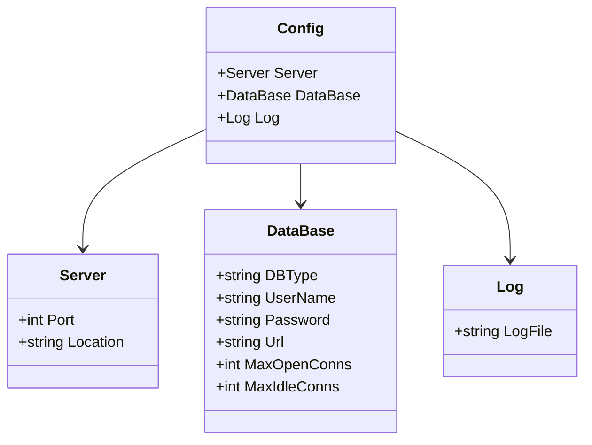
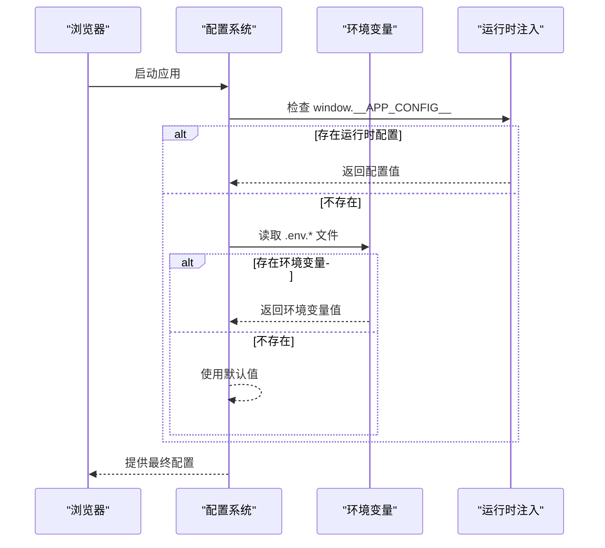
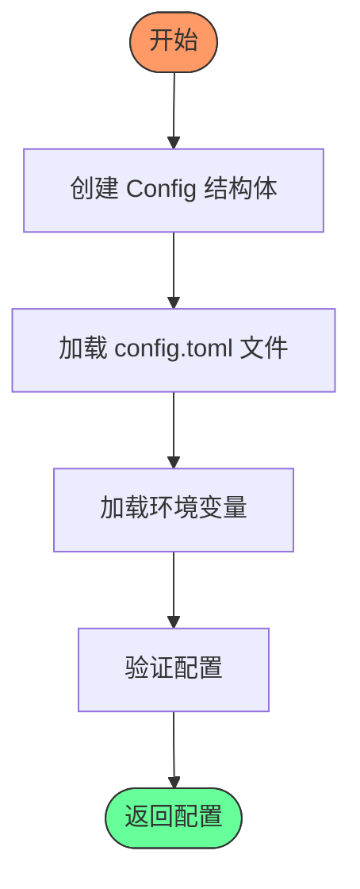
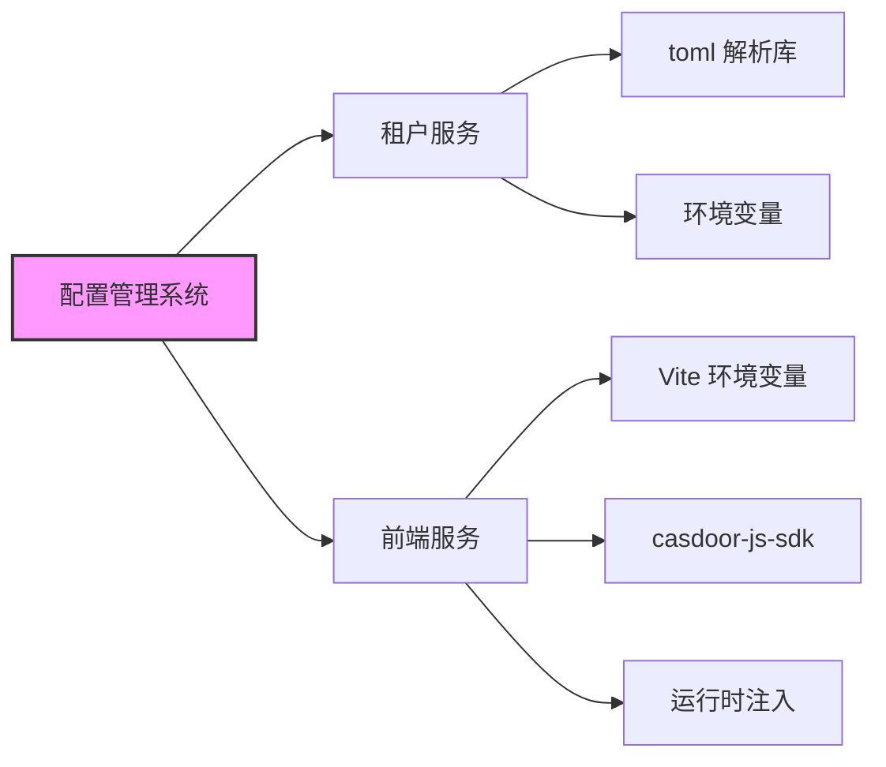

# 配置管理

<cite>
**本文档中引用的文件**  
- [config.toml](file://core/tenant/config.toml)
- [config.go](file://core/tenant/config/config.go)
- [env_loader.go](file://core/tenant/config/env_loader.go)
- [loader.go](file://core/tenant/config/loader.go)
- [.env.development](file://console/frontend/.env.development)
- [.env.production](file://console/frontend/.env.production)
- [.env.test](file://console/frontend/.env.test)
- [index.ts](file://console/frontend/src/config/index.ts)
- [casdoor.ts](file://console/frontend/src/config/casdoor.ts)
- [config.ts](file://console/frontend/src/constants/config.ts)
- [runtime-config.js](file://console/frontend/public/runtime-config.js)
- [settings.py](file://core/common/settings/settings.py)
- [base_settings.py](file://core/common/service/settings/base_settings.py)
</cite>

## 目录
1. [简介](#简介)
2. [项目结构](#项目结构)
3. [核心组件](#核心组件)
4. [架构概述](#架构概述)
5. [详细组件分析](#详细组件分析)
6. [依赖分析](#依赖分析)
7. [性能考虑](#性能考虑)
8. [故障排除指南](#故障排除指南)
9. [结论](#结论)
10. [附录](#附录)（如有必要）

## 简介
本文档旨在为 `astron-agent` 项目提供全面的配置管理指南。文档详细说明了租户服务的 `config.toml` 配置文件结构和关键参数含义，解释了 Agent 服务和前端服务的环境变量配置方法，描述了不同环境（开发、测试、生产）的配置差异和管理策略，提供了敏感信息（如数据库密码、API 密钥）的安全存储建议，并说明了配置文件的加载机制和优先级规则，帮助用户理解配置生效的完整流程。

## 项目结构
`astron-agent` 项目采用模块化设计，主要包含控制台（console）、核心服务（core）、Docker 配置和构建文件等部分。核心服务包括租户（tenant）、Agent、知识库（knowledge）、内存数据库（memory/database）、插件（plugin）和工作流（workflow）等模块。配置管理主要涉及租户服务的 `config.toml` 文件和前端服务的 `.env` 系列环境变量文件。

**图示来源**
- [config.toml](file://core/tenant/config.toml)
- [.env.development](file://console/frontend/.env.development)

**本节来源**
- [config.toml](file://core/tenant/config.toml)
- [.env.development](file://console/frontend/.env.development)

## 核心组件
本节分析配置管理系统中的核心组件，包括租户服务的配置加载器和前端服务的运行时配置机制。

**本节来源**
- [config.go](file://core/tenant/config/config.go)
- [env_loader.go](file://core/tenant/config/env_loader.go)
- [casdoor.ts](file://console/frontend/src/config/casdoor.ts)

## 架构概述
`astron-agent` 的配置管理采用分层优先级策略。对于租户服务，系统首先从本地 `config.toml` 文件加载配置，然后通过环境变量进行覆盖。前端服务则采用三重优先级：运行时注入的 `window.__APP_CONFIG__` > 环境变量 `.env.*` > 默认值。这种设计确保了配置的灵活性和安全性。

**图示来源**
- [config.go](file://core/tenant/config/config.go)
- [casdoor.ts](file://console/frontend/src/config/casdoor.ts)

## 详细组件分析
本节深入分析配置管理的关键组件，包括租户服务配置、前端环境变量配置和配置加载机制。

### 租户服务配置分析
租户服务使用 TOML 格式的 `config.toml` 文件进行配置，主要包含服务、数据库和日志三个部分。

#### 配置结构与关键参数
租户服务的 `config.toml` 文件定义了以下关键参数：

| 配置项 | 说明 | 示例值 |
|-------|------|-------|
| `service.port` | 服务监听端口 | 5052 |
| `service.location` | 服务位置标识 | "ss" |
| `database.dbType` | 数据库类型 | "mysql" |
| `database.username` | 数据库用户名 | "root" |
| `database.password` | 数据库密码 | "123456" |
| `database.url` | 数据库连接URL | "(localhost:3306)/tenant" |
| `database.maxOpenConns` | 最大打开连接数 | 10 |
| `database.maxIdleConns` | 最大空闲连接数 | 5 |
| `log.path` | 日志文件路径 | "./logs/app.log" |

**图示来源**
- [config.go](file://core/tenant/config/config.go)
- [config.toml](file://core/tenant/config.toml)

**本节来源**
- [config.go](file://core/tenant/config/config.go)
- [config.toml](file://core/tenant/config.toml)

### 前端服务配置分析
前端服务使用基于 Vite 的环境变量系统，通过 `.env` 文件管理不同环境的配置。

#### 环境变量配置方法
前端服务定义了多个环境变量文件：
- `.env.development`: 开发环境配置
- `.env.test`: 测试环境配置
- `.env.production`: 生产环境配置

这些文件中的变量通过 `import.meta.env` 在代码中访问。系统支持新旧两套变量名，以确保向后兼容性。

| 环境变量 | 说明 | 优先级 |
|---------|------|-------|
| `CONSOLE_CASDOOR_URL` | Casdoor 服务器URL | 高 |
| `VITE_CASDOOR_SERVER_URL` | Casdoor 服务器URL (旧) | 低 |
| `CONSOLE_CASDOOR_ID` | Casdoor 客户端ID | 高 |
| `VITE_CASDOOR_CLIENT_ID` | Casdoor 客户端ID (旧) | 低 |
| `VITE_BASE_URL` | 后端API基础URL | - |

**图示来源**
- [casdoor.ts](file://console/frontend/src/config/casdoor.ts)
- [.env.development](file://console/frontend/.env.development)

**本节来源**
- [casdoor.ts](file://console/frontend/src/config/casdoor.ts)
- [.env.development](file://console/frontend/.env.development)

### 配置加载机制分析
本节分析配置文件的加载机制和优先级规则。

#### 配置加载流程
租户服务的配置加载遵循以下流程：
1. 创建空的 `Config` 结构体
2. 使用 `LocalLoader` 从 `config.toml` 文件加载配置
3. 使用 `EnvLoader` 从环境变量加载配置（覆盖文件配置）
4. 验证配置的完整性

**图示来源**
- [config.go](file://core/tenant/config/config.go)
- [env_loader.go](file://core/tenant/config/env_loader.go)

**本节来源**
- [config.go](file://core/tenant/config/config.go)
- [env_loader.go](file://core/tenant/config/env_loader.go)

## 依赖分析
配置管理系统依赖于多个组件和库。租户服务依赖 `toml` 库解析配置文件，前端服务依赖 `casdoor-js-sdk` 进行身份验证。系统通过环境变量和配置文件实现组件间的松耦合。

**图示来源**
- [config.go](file://core/tenant/config/config.go)
- [casdoor.ts](file://console/frontend/src/config/casdoor.ts)

**本节来源**
- [config.go](file://core/tenant/config/config.go)
- [casdoor.ts](file://console/frontend/src/config/casdoor.ts)

## 性能考虑
配置管理对系统性能有重要影响。建议在生产环境中：
1. 避免频繁重新加载配置文件
2. 使用连接池管理数据库连接
3. 缓存已解析的配置
4. 减少运行时配置注入的复杂性

## 故障排除指南
当配置出现问题时，可参考以下步骤进行排查：
1. 检查配置文件语法是否正确
2. 确认环境变量名称拼写正确
3. 验证配置优先级是否符合预期
4. 检查文件权限是否允许读取

**本节来源**
- [config.go](file://core/tenant/config/config.go)
- [casdoor.ts](file://console/frontend/src/config/casdoor.ts)

## 结论
`astron-agent` 项目的配置管理系统设计合理，支持多环境部署和灵活的配置覆盖。通过结合配置文件和环境变量，系统实现了配置的灵活性和安全性。建议用户根据实际部署环境正确设置配置，并遵循安全最佳实践管理敏感信息。

## 附录
### 不同环境的配置差异
| 环境 | 配置特点 |
|------|---------|
| 开发 | 使用本地数据库，调试信息开启 |
| 测试 | 使用测试数据库，日志级别适中 |
| 生产 | 使用生产数据库，日志级别严格，敏感信息加密 |

### 敏感信息安全存储建议
1. 生产环境中避免在配置文件中明文存储密码
2. 使用环境变量或密钥管理服务存储敏感信息
3. 定期轮换API密钥和密码
4. 限制配置文件的访问权限